The UK economy is defined by a specific structural contradiction.

It excels at some things and consistently fails at others.

At the productivity layer, the UK is genuinely world-class. Its upstream knowledge production and value-creation capabilities remain exceptional. The country produces high-quality ideas, research, and institutions at a rate that far exceeds what its size would suggest.

One concrete example is **Artificial Intelligence**. The UK has exerted outsized influence on modern AI through foundational work in computation, mathematics, and theoretical machine learning.

> DeepMind sits at the core of Google’s AI strategy, leading major initiatives including Gemini and AI Studio.
>
> The productivity was real. The value creation was real. But the scaling and capture of that value happened elsewhere (Google).
{: .prompt-info }

This pattern is not unique to AI. It is representative. The UK is strong at creating productive capability, but weak at transmitting it into scaled, durable economic outcomes.

## A Simple Model: Productivity → Transmission → Outputs

A simple three-tiered model can be used to understand the UK productivity puzzle:

```mermaid
graph LR
    P[Productivity<br><i>Capability</i>] --> T{Transmission<br><i>Scaling & Allocation</i>}
    T -->|Success| O[Outputs<br><i>Growth & Wages</i>]
    T -.->|Failure| S[Stagnation]

    style P fill:#3d3d3d,stroke:#fff,stroke-width:2px
    style T fill:#b00b1e,stroke:#fff,stroke-width:2px
    style O fill:#3d3d3d,stroke:#fff,stroke-width:2px
```

Most analysis focuses on **Productivity** (the output of workers). But as [Andy Haldane](https://www.bankofengland.co.uk/-/media/boe/files/speech/2018/the-uks-productivity-problem-hub-no-spokes-speech-by-andy-haldane) and others have described, the UK is a "hub without spokes." It isn’t missing leading-edge knowledge production.

It is missing the **Transmission Layer** that translates this capability into widespread outputs.

## Transmission: Where the UK Breaks Down

The transmission layer is where force multipliers operate: taking local, firm-level productivity and scaling it across the economy.

In the **US**, transmission is explicitly designed around high-risk scaling. A dense venture capital ecosystem exists to fund extreme risk in exchange for extreme upside. As Peter Thiel puts it: 

>  The biggest secret in venture capital is that the best investment in a successful fund equals or outperforms the entire rest of the fund combined. _Source: From Zero to One: Notes on Startups, Or How to Build the Future_

In other words, the system is built to over-allocate resources to outliers.

In **Germany**, transmission relies on the *Mittelstand*: a "middle class" of technically specialised, capital-intensive firms with long investment horizons.

The UK has neither structure in sufficient depth. It has highly productive frontier firms—overwhelmingly concentrated in London—and a long tail of low-productivity firms elsewhere.

What it lacks is the thick middle layer of scalable businesses to connect them. This spatial skew creates a secondary transmission failure: it forces value creation to compete for the country’s scarcest resources—housing and transport capacity in the South East—driving up costs and choking off scale.

### Visualising the Skew

The geographic and structural nature of this problem is visible in the data:

_Figure 1: The UK's "Hub without Spokes" problem. While London competes with global frontiers, the rest of the UK is significantly poorer than its American and Western European peers. Source: [Burn-Murdoch in the FT](https://x.com/jburnmurdoch/status/1689950429403037697)._

_Figure 2: The "Missing Middle." The UK has a sharp drop-off between its top-tier frontier firms and the long tail of low-productivity businesses. Source: [ONS - Business Dynamism and Productivity Report, 2014](https://www.ons.gov.uk/economy/economicoutputandproductivity/productivitymeasures/bulletins/trendsinukbusinessdynamismandproductivity/2024)._

This concentration shows up clearly in firm-level data: the gap between mean and median productivity is large, indicating a small number of very productive firms and a sharp drop-off across the rest of the economy. In other words, the UK is good at creating productive firms, but weak at replicating and scaling them.

## Why Transmission Fails

Productivity does not scale automatically. It propagates through mechanisms that are structurally weak in the UK:

**1. Capital Investment** : The UK has persistently under-invested relative to OECD peers across both public and private capital, limiting capital deepening and scale.
>As [the Office for National Statistics (ONS)](https://www.ons.gov.uk/employmentandlabourmarket/peopleinwork/labourproductivity/articles/ukproductivityintroduction/januarytomarch2022) have pointed out, capital deepening is a crucial factor in UK labour productivity.

**2. Management Practices** : Weak diffusion of modern management, software, data, and organisational capability sustains a long tail of low-productivity firms.
> Research by [Bloom and Van Reenen](https://blogs.lse.ac.uk/businessreview/2022/05/20/improving-productivity-through-better-management-practices/) suggests management practices are a multiplier on technology-related productivity gains, while [Jonathan Haskel](https://www.productivity.ac.uk/research/accounting-for-the-slowdown-in-uk-innovation-and-productivity/) argues the UK productivity slowdown is specifically a slowdown in innovation linked to "intangible capital".

**3. Policy and Institutions** : Planning constraints, weak competitive pressure, and policy instability reduce reallocation and slow scaling, even when productive firms exist.
> This aligns with [John Fingleton's findings](https://www.gov.uk/government/publications/nuclear-regulatory-taskforce/nuclear-regulatory-review-2025-summary) that the British nuclear industry was killed largely by "a systemic regulatory failure" - a microcosm of the wider regulatory landscape.

These transmission failures show up most clearly in the cost and complexity of infrastructure.

The UK stands out internationally for the extraordinary cost of delivery. Major projects routinely cost multiples of comparable projects in peer economies. This is not primarily a technology problem; it is a policy one—driven by planning constraints, fragmented accountability, and risk aversion baked into delivery processes.

_Figure 1: The extraordinary cost of UK rail infrastructure delivery. Source: [transitcosts.com](https://transitcosts.com/what-does-the-data-say/)._

The result is a double bind. Infrastructure is both under-built and over-expensive to build, which makes scaling productive activity across regions materially harder than in peer economies.

_Figure 1: The extraordinary cost of London warehousing. Source: Savilles via [Bloomberg](https://www.bloomberg.com/news/articles/2023-08-21/warehouse-costs-rise-10-with-london-most-expensive-globally)._

## Outputs: Why Wages Disappoint

One of the most common economic mis-framings is to see wealth as a fixed quantity that needs to be distributed.

A more sophisticated discussion focuses on productivity. Markets tend to pay people for the value they are able to produce. If workers in the UK economy produce less value for their firms, their firms will produce less wealth, and wages will stagnate. In recent years, the UK economy is largely growing by adding more workers, rather than increasing productivity.

A true "levelling up" of the UK would mean dispersing the capital, practices, and institutions required to fix transmission, rather than just redistributing the outputs.

## Conclusion: Is the Economy Broken?

The UK has the ingredients to be a top-tier economy, but it is highly skewed towards the long-tail of productive firms and the wealthy South East.

We have seen over the last 20 years that this skew eventually affects everyone through bad policy. The temptation is to treat government spending as charity - mitigating the symptoms of stagnation - rather than targeting the underlying processes.

The most important next step is to spread economic literacy. We need to understand that we cannot solve a **Transmission Problem** with **Productivity Solutions** (more research) or **Output Solutions** (more welfare). We have to fix the spokes.
