> **TL;DR**
>
> Britain (1854) and Amazon (2002) demonstrate that surviving scale requires an **Operating System update**—a fundamental re-architecture of how value flows. Modern civil service reforms failed because they attempted to solve this architectural problem with a **Talent Solution**.
{: .prompt-info }

Britain was the first state to hit modern scale. It did so 50–70 years before anyone else.

{: style="display:block; margin-left:auto; margin-right:auto; width:50%" }
_Figure 1: The Scale Gap. By 1860, Britain’s per capita industrialisation (Black Line) was 3x that of the United States or Germany. It was operating at a scale that had no historical precedent. Data: Bairoch (1982)._

It was the Amazon.com of industrialisation: scaling explosively while still running on inherited, pre-industrial systems. That mismatch manifested as **administrative technical debt**: a state built for scale, governed by machinery that had never been designed for it.

Amazon experienced the exact same phenomenon in the late 1990s. It scaled explosively while running on a system architecture from its days as a bookstore. This manifested as technical debt: a business built for scale, using a system that hadn’t been optimised for it.

## The Model: Value vs. Embedding

In both Industrial Britain and early Amazon, value scaled faster than the system characteristics required to integrate it. When that happens, three predictable failures appear:

1.  **Fragmentation:** Components optimise locally. Incentives drift out of alignment.
2.  **Coordination Breakdown:** System-level outcomes require cross-component action, but no mechanism exists to coordinate it.
3.  **Unembedded Value:** Value exists in aggregate, but is not routable end-to-end.

We can visualise this failure mode:

```mermaid
flowchart TD
    A[Value Creation] --> B[Value Scaled]

    %% Successful embedding path
    B -->|Embedding keeps pace| C[Value Embedded]
    C --> G[Durable Institution]
    G --> H[Stable Performance at Scale]

    %% Failure / lag path
    B -->|Embedding lags| D[Embedding Lag]
    D --> E[Technical & Institutional Debt]
    E --> F[Failure Under Load]

    style C fill:#1a4d2e,stroke:#fff
    style G fill:#1a4d2e,stroke:#fff
    style H fill:#1a4d2e,stroke:#fff

    style D fill:#b00b1e,stroke:#fff
    style E fill:#b00b1e,stroke:#fff
    style F fill:#b00b1e,stroke:#fff
```



These are not separate problems. They are expressions of the same underlying issue: **The system lacks a holistic, end-to-end view of how value is supposed to flow.**

## Failure Under Load: Crimea vs. The Monolith

### Britain: The Crimean War (1853)
Britain had all the material ingredients for success: unprecedented economic and naval power. Yet the war exposed deep failures of coordination.

What made Crimea embarrassing was not that Britain failed to achieve its objectives, but that failure occurred in ways that should not have been possible for a modern power. Orders were ambiguous, authority fragmented, and logistics mismanaged.

> **The Charge of the Light Brigade**
>
> "Theirs not to make reply,
> Theirs not to reason why,
> Theirs but to do and die"
>
> Tennyson captured it perfectly: not a story of courage, but a portrait of a system that demanded obedience where judgement was required.
>
> The decision was made at the top, transmitted ambiguously, and executed without challenge. Bravery substituted for judgement. What failed was not character, but the system that translated intent into action.
{: .prompt-info }

### Amazon: The Monolith (c. 2002)
Amazon’s analogue to the Crimean War was the point at which rapid scale exposed systemic fragility. Despite strong talent and capital, Amazon experienced cascading failures from small changes and risk-averse paralysis around deployments.


_Figure 2: The Complexity Trap. Left: Amazon's "Death Star" (c. 2008)—a visual representation of service dependencies spiralling into unmanaged complexity. Right: Netflix's architecture—equally scaled, but structured through stricter service boundaries. The goal of an OS update is not to remove complexity, but to make it legible._

Crimea and Amazon’s early outages were the same failure: **Value scaled faster than coordination.**

## The Solution: The Operating System Update

Neither Britain nor Amazon needed a new mission. They needed an operating system update.

OS updates are cross-functional interventions that redefine how components interact. In both cases, the solution required top-down intervention, because the existing system (optimised for the old scale) could not evolve itself.

### 1. Britain: The Northcote-Trevelyan Patch
Britain’s update was formalised in the **Northcote-Trevelyan Report (1854)**. It redefined recruitment, permanence, and administrative norms.

It solved coordination failure by optimising for **Stability and Integrity**.
*   **New Value:** Neutral, competent administration.
*   **New Hierarchy:** Meritocratic entry, permanent careers, insulation from politics.
*   **New Procedure:** Rules and precedent over judgement and heroics.

For the 19th-century problem space, optimising for stability over outcomes was a feature. A rapidly expanding empire required reliability more than responsiveness.

### 2. Amazon: The Service-Oriented Architecture
Amazon’s update was the **Bezos API Mandate**. It redefined how teams were allowed to interact.

It solved coordination failure by optimising for **Adaptability and Ownership**.
*   **Value Misalignment:** Solved by defining value end-to-end (Customer Obsession).
*   **Fragmented Authority:** Solved by aligning authority with ownership of outcomes (Single-Threaded Leaders).
*   **Broken Feedback:** Solved by decoupling execution. Teams communicated via APIs, not meetings.

One of the clearest contemporary accounts of what this entails comes from an [internal Google memo written by Steve Yegge](https://gist.github.com/chitchcock/1281611), reflecting on his time at Amazon.

The memo—later known as the “Google Platforms Rant”—describes how Jeff Bezos enforced a service-oriented architecture not through consensus or culture, but through a blunt, system-wide mandate that redefined how teams were allowed to interact.

> **The Cost of Coordination**
>
> What makes Yegge's account valuable is its specificity: it shows that Amazon’s transformation required new interfaces, registries, monitoring, ownership boundaries, and escalation mechanisms.
>
> In other words, coordination was not wished into existence; it was engineered, enforced, and paid for up front.
{: .prompt-info }

This account complicates the Amazon narrative. Yegge notes that Amazon was often worse than its peers (specifically Google) on typical dimensions like hiring standards, internal tooling, and code quality.

What distinguished it was that it made one operating-system-level decision correctly and enforced it relentlessly: to embed coordination through **platform architecture** rather than culture or hierarchy.

Over time, this mattered more than hiring practices or managerial polish. In systems terms, Amazon won not by optimising every component, but by getting the **control plane** right.

### The Divergence
Britain optimised for **Organizational Character** (Neutrality, Competence). Amazon optimised for **System Outcomes** (Delivery, Speed).

The British system successfully produced a durable institution, but it created a system whose incentives were self-contained. As the external environment changed, the internal architecture exerted little pressure to adapt. Amazon’s architecture did the opposite: by wiring customer value end-to-end, it forced continuous reconfiguration.


_Figure 3: The value of the API Mandate. By decoupling its architecture, Amazon was able to layer entirely new business models (AWS, Third-Party Services, Ads) on top of its existing infrastructure._

## The Modern Debug: Why Dominic Cummings Failed

In recent years, the British state has shown signs of the same strain that led to Northcote-Trevelyan: coordination struggles, delivery failures, and weak feedback loops.

Dominic Cummings attempted to force an operating system update. He drew on startup metaphors, arguing the state needed to be rebuilt around speed, intelligence, and outcomes.

His failure is often attributed to politics or personality. But viewed through a systems lens, the failure was architectural.

Operating system updates can fail at three distinct layers. Cummings failed at all three.

**1. Authority (Who imposes constraints)**
: An OS update requires the ability to redefine system-wide rules. Bezos had unified, uncontested authority. Cummings had personal influence but no institutional "Root Access." He could disrupt, but he could not enforce new constraints across departments.

**2. Architecture (What replaces the old)**
: Cummings identified the problem (coordination failure) but framed the solution in terms of **Inputs** (High IQ, speed, data) rather than **System Design**.
: Hiring smart people improves local performance, but it does not produce a new OS. There was no coherent answer to how authority sits across boundaries or how feedback loops are structurally closed. Without a new architecture, the system defaulted to the old one.

**3. Legitimacy (Why the system accepts change)**
: Amazon derives legitimacy from **Performance**. The British State derives legitimacy from **Restraint**.
: Cummings attempted to impose a performance-based update without embedding it in a legitimacy-preserving framework. The system treated the disruption as a constitutional threat (a virus) rather than an upgrade.

```mermaid
%%{init: {
  "theme": "base",
  "themeVariables": {
    "background": "#ffffff",
    "primaryColor": "#f1f5f9",
    "primaryBorderColor": "#cbd5e1",
    "primaryTextColor": "#0f172a",
    "lineColor": "#64748b",
    "secondaryColor": "#e2e8f0",
    "tertiaryColor": "#f8fafc",
    "fontFamily": "Inter, system-ui, -apple-system, BlinkMacSystemFont, sans-serif",
    "fontSize": "14px"
  }
}}%%
timeline
    title Dominic Cummings: Civil Service OS Update Attempt

    2016 : Brexit referendum
         : Anti-establishment mandate emerges

    2019 : Entry into No.10
         : High informal authority
         : Explicit critique of Civil Service OS

    2020 : Aggressive disruption
         : Personnel churn
         : Norm-breaking behaviour
         : No replacement architecture embedded

    2020 : Loss of political capital
         : Authority collapses
         : Reform mandate evaporates

    2021 : System reverts
         : Existing OS absorbs shock
         : No durable structural change

## Conclusion: Towards v2.0

The British civil service does not suffer from a lack of intelligence. It suffers from an operating system optimised for a previous problem space.

Northcote-Trevelyan was v1.0. It solved the **Patronage** problem by embedding neutrality and process. But the modern problem space requires end-to-end delivery, rapid coordination, and continuous learning.

Many reform efforts (like Cummings, or potentially DOGE in the US) misdiagnose this. They try to fix the system by injecting talent or bypassing process ("Running the state like a startup").

But startups don't succeed because they are chaotic; they succeed because their operating systems are coherent.

A genuine update for the state must reconcile **Performance** with **Legitimacy**.
*   **Value** must be defined end-to-end, not just procedurally.
*   **Authority** must be institutionalised, not personalised.
*   **Feedback** must be architectural, not heroic.

The question is not whether the state needs an update—it clearly does. The question is whether we can design one that enables speed without destroying the neutrality that makes the system stable.
