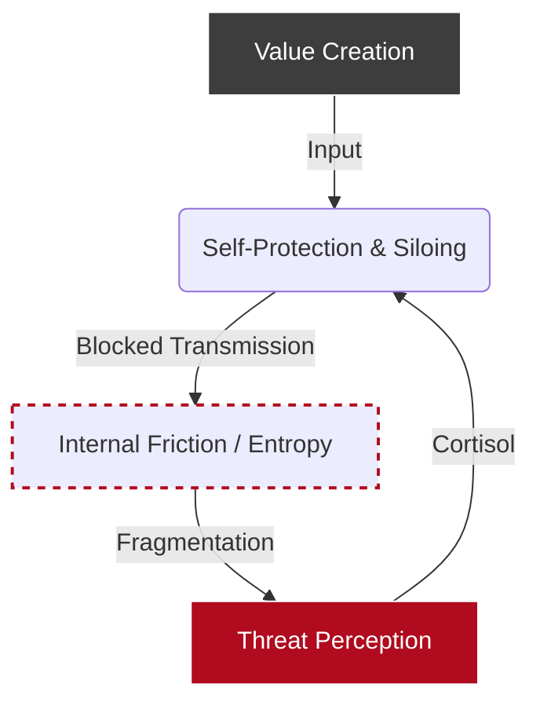
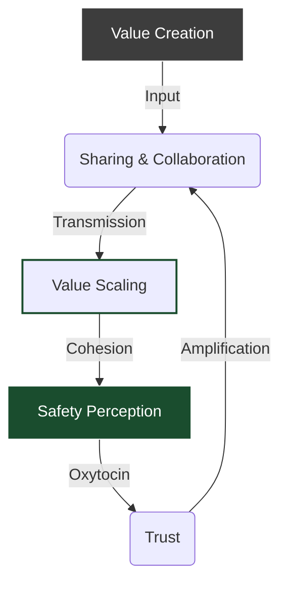

In *Leaders Eat Last*, Simon Sinek introduces a model of leadership based on a simple evolutionary premise: humans operate in one of two dominant **bio-social modes**.

From a systems perspective, this is not a moral distinction; it is a **resource allocation** distinction.
*   In **Danger Mode**, the brain reallocates resources to self-protection.
*   In **Safety Mode**, the brain allocates resources to collaboration and long-term planning.

We can visualize these as two distinct feedback loops.

### 1. The Danger Loop (Entropy)
In this state, the system is closed. Energy is consumed by internal friction (Siloing/Hoarding) rather than output.

### 2. The Safety Loop (Scaling)
In this state, the system is open. Trust acts as the transmission layer that allows **Value Creation** (Input) to become **Value Scaling** (Output).

For Sinek, these loops explain the difference between Servant Leadership and what we might call **Competitive Leadership**. One creates a foundation for value scaling; the other creates a foundation for internal politics.

## The "Naivety" or "Idealism" Objection

The default reaction to this argument in "serious" business circles is skepticism. It sounds naïve.

There is a prevailing business pessimism—downstream of the dot-com bubble and the 2008 financial crisis—that assumes business is inherently brutal. The lesson many absorbed is that margins are thin, competition is ruthless, and leaders must be "hard-nosed" to survive.

But Sinek argues that this "Realism" is actually an efficiency error.

## The Convergence: Sinek vs. Thiel

If Sinek feels too "soft" for the boardroom, it is worth looking at **Peter Thiel**. In *Zero to One*, Thiel makes a structurally identical argument from a hard-capitalist perspective.

Thiel argues that modern business is obsessed with competition. We focus on "beating the other guy" rather than creating something new.
*   **Thiel (External):** If you are fighting competitors, you are eroding margins. You should aim for **Monopoly**.
*   **Sinek (Internal):** If your people are fighting each other, they aren't fighting the problem. You should aim for a **Circle of Safety**.

Both are arguing that **Competition is Entropy**. It dissipates energy as heat (friction) rather than work (value).

Both link the prevalence of this type of thinking to the overrepresentation of Baby Boomers and Gen X among leaders, who lived through those economic crises, but who *overfitted* to those experiences as defining moments.

## Failure Modes of the Competitive Model

Though few identify openly as "Competitive Leaders," the model is pervasive. It relies on the belief that fear prevents complacency.

### 1. "Catfish Management"
There is a management concept (explicit in some Asian corporate cultures) of introducing a predator (a Catfish) into a tank to keep the fish active. In the West, this manifests as stack ranking or forced attrition.
*   **The System Failure:** It works to spike short-term activity (dopamine), but it destroys the communication layer. Nodes in the network stop sharing data because their neighbor is now a rival.

### 2. Goodhart’s Law (Metric Hacking)
> "When a measure becomes a target, it ceases to be a good measure."

In a fear-based environment, metrics become shields.
*   Sales teams close bad deals to hit quotas.
*   Technical teams patch symptoms rather than root causes to close tickets.

The dashboard looks green, but the underlying infrastructure rots. This was visible in recent tech layoffs: companies realized too late that they had fired the quiet people who were holding the legacy systems together, because their value wasn't captured in short-term metrics.

Metrics are a useful tool for simplifying complexity, but leaders should have a clear understanding of when **the map is not the territory**.

## The Biochemistry: A Note on Hardware

Sinek grounds his theory in biochemistry (Oxytocin vs. Cortisol). As someone with training in cognitive neuroscience, I find his model simplistic—neurochemistry is rarely so binary.

However, it is **directionally correct**.

Different environments trigger different biological sub-routines.
*   **Fear Environments:** Elevate cortisol. Motivation becomes dopamine-driven (short-term wins). The horizon of thinking shrinks to the immediate future.
*   **Trust Environments:** Activate social bonding. Motivation shifts to long-term stability.

You cannot "order" an employee to be innovative while their biology is stuck in a cortisol loop. It is a hardware constraint.

## Accountability as Debugging

The alternative to "Fear" is not "Permissiveness." This is the key failure mode of Servant Leadership.

In a Systems model, accountability is **Debugging**, not punishment.
When a person fails, a servant leader asks: *What is the root cause?*
1.  **Training Gap?** (Software issue)
2.  **Role Fit?** (Hardware issue)
3.  **Structural Blockage?** (Network issue)

Only after exploring these does separation become a legitimate outcome. This approach avoids triggering the "Danger Mode" defensive response in the rest of the team. It treats people as **Long-Term Investments** (CapEx) rather than disposable inputs (OpEx).

## Conclusion: The Middle Ground

I wouldn’t say *Leaders Eat Last* is my single foundational text. But it offers a valuable corrective to a culture fixated on short-term optimization.

These short-term optimization cycles are part of a structural dysfunction in the tech industry. They lead to unsustainable growth—manifesting as **enshittification**—and the systematic erosion of **consumer surplus** (the value users get vs the price they pay) before ending in sharp collapse and user exodus.

Where I land is a middle ground.
**Transactional tools** (metrics, goals, pay) are necessary—they provide the structure.
**Safety** is the foundation—it provides the **transmission layer** required to scale value between teams and across the organization.

Sinek cites JPMorgan Chase as an example of a firm that moved from collegial to transactional, only to find that while it worked in the short term, it created fragility under stress.

The lesson is simple: you can run a system on fear, but you are running it with high internal resistance. You might get speed, but you won't get durability.
