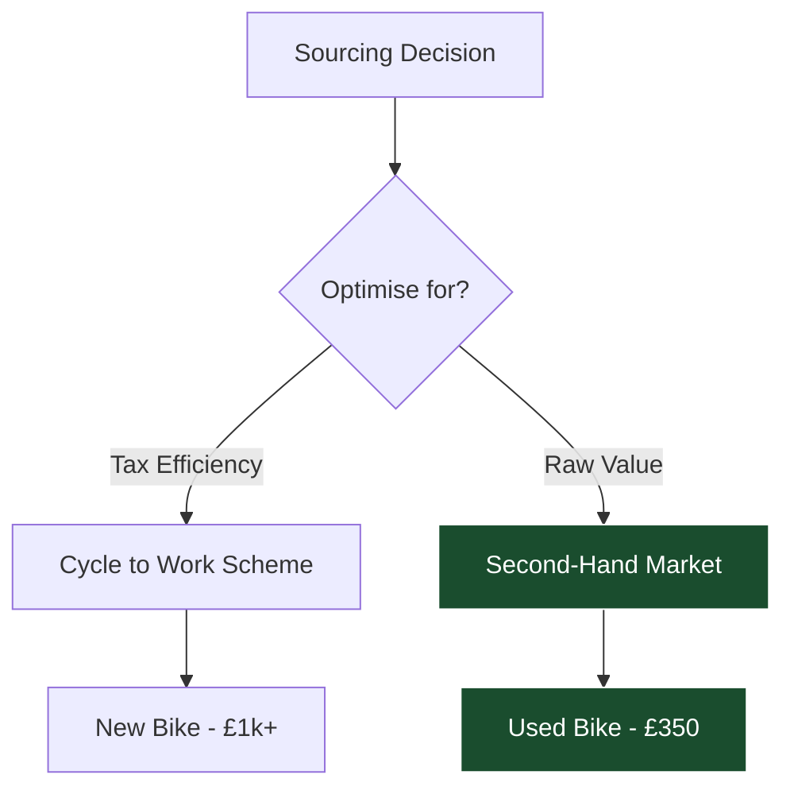

This is my new series: Zen and the Art of Bike Mechanics.

I have been blogging consistently for a few weeks now, mostly on high-level abstractions: value scaling, organizational architecture, and economic transmission, but also about poetry and meaning.

I have also been **Bullet Journaling** for about six months.

Bullet journaling is a tool for **Optimisation**. It handles iteration, tasks, and recurring threads. But it struggles with **Clarification**. It captures the "What," and the "How," but it rarely untangles the "Why."

Blogging forces a different mode. Messy ideas have to be shaped, ordered, and made to cohere. Writing stops being a record and becomes a mechanism for thinking.

## The Convergence of Systems and Craft

These strands—the Abstract and the Concrete; Perception and Meaning; Systems and Experience—are not in tension. They reinforce each other.

This has brought me back to Robert Pirsig’s *Zen and the Art of Motorcycle Maintenance*, a book I read a few years ago, now. What stuck with me wasn’t the metaphysics, but the **stance**: the idea that abstract understanding and hands-on engagement are not competing ways of knowing.

You don’t have to choose between systems thinking and direct experience. Competence lives in their integration.

That is the context for this new series. It looks like a tangent—learning to maintain a road bike—but it is actually a practical application of the integration between systems thinking and everyday experience. 

## The Project: Personal Infrastructure

A few months ago, I decided to overhaul my commute. I wanted to build a small, bounded system I could actually **own**.

The goal was self-sufficiency: understanding the machine, maintaining it, and fixing it when it breaks.
*   **Financial:** Reduce dependency on external services (Trains). _Save money._
*   **Capability:** Learn a skill with real-world consequences. _Build skills._
*   **Compounding:** Build a layer of mechanical understanding that future problems can attach to. _Grow competence._

Starting from zero is uncomfortable. Every squeak feels like a catastrophic failure. But this is where the steepest learning happens.

## The Procurement Strategy

The first decision was sourcing the asset. I treated this like a procurement problem.

**Option A: The Cycle to Work Scheme**
*   *Pros:* Tax efficiency (discount via salary sacrifice). Post-sales support.
*   *Cons:* Limited supply chain (new bikes only). High depreciation.

**Option B: The Second-Hand Market**
*   *Pros:* Value arbitrage. Bikes depreciate heavily; many high-end owners sell lightly used assets at a fraction of the cost.
*   *Cons:* No warranty. Information asymmetry (risk of hidden damage).

**The Decision Matrix:**

I chose **Option B**. The tax saving on a new bike is meaningful, but the depreciation curve of a new asset destroys that value quickly. The arbitrage opportunity in the second-hand market (buying from enthusiasts who ignore resale value) offered a better **Total Cost of Ownership**.

## The Asset: Durability over Weight

At 6'2", sizing narrows the field. I viewed the bike not as a monolithic object, but as **Platform + Consumables**.
*   **The Frame:** The long-lived asset. A platform for the other components.
*   **Components:** Consumables to be swapped out.

For a commuter bike in constant use in the UK, I optimised for **Durability** (Aluminium) over **Performance** (Carbon).

I acquired a second-hand **Vitus Razor XL** for **£350**. The seller was knowledgeable, the frame was sound, and the price point minimized my downside risk.

## The Economics of the System

To analyze the true ROI, we need to look at both the Financial Ledger and the Opportunity Cost Ledger.

### 1. The Financials (CapEx vs OpEx)

Financially, this is a clear win. I am converting a recurring OpEx into an upfront CapEx.

-   **Commute Cost (Train):** ~£10/day.
-   **Projected Usage:** 3 days/week.  
-   **Annual Savings:** ~£1,390/year.
-   **Upfront Cost:** £350 (Bike) + £150 (Tooling/Assets).

**Payback Period:** ~18 weeks.
**Current tally**: ~12 weeks.

Once the initial cost is absorbed, every ride is effectively profit. Even factoring in consumables (tyres, chains), the ROI rivals most financial instruments available to me.

### 2. The Opportunity Costs (The Hidden Tax)

However, focusing only on the financial gain is bad accounting. Money is essentially stored value that allows us to outsource value production. When I stop paying for the train, I stop outsourcing the travel need.

I have to absorb it myself by relying on my own **productive capabilities** to generate the value that fills this need. The time and effort I put towards generating this value (maintaining the bike and doing the cycling) could have been spent on something else.

-   **Attention Deficit (Reading Time):** On the train, my attention is free. I can read, write, or think. On the bike, my attention is consumed by survival (traffic, navigation). I lose ~5 hours of high-bandwidth reading time per week.
    
-   **Cognitive Load (Maintenance Energy):** There is a "Task Energy" tax. You cannot just walk out the door. You must check the weather, pack the bag, and maintain the machine. Doing maintenance yourself is initially inefficient; fixing a puncture might take 45 minutes the first time.

### 3. The Intangible Return

Why pay these opportunity costs? Because the alternative has its own hidden taxes. Public transport is efficient, but it is high-friction in a human sense—crowds, delays, lack of control.

Cycling replaces that external friction with a **self-directed rhythm**. The cost of "Preparation" is balanced by the gain of "Autonomy." I arrive at work having engaged with the world physically, rather than having been passively transported through it.

## The Anti-Fragility of Knowing

Beyond the financials, there is a risk management argument.

Modern life encourages us to treat technology as a **Black Box**. We push a button, and value comes out. We don't know how it works, and we don't care—until it breaks.

When a Black Box breaks, you are helpless. You are entirely dependent on an external supply chain (the bike shop, the mechanic, the appointment slot). You are **Fragile**.

By learning to maintain the system, you shift towards **Anti-Fragility**: a system property where each failure makes the system more capable and less fragile.
*   **Reduced Dependency:** If my chain snaps, it’s a 10-minute task, not a 3-day wait for a shop appointment. The system absorbs the shock.
*   **Bottom-Up Truth:** You cannot "spin" a mechanical failure. A crossed thread doesn't care about your job title or your rhetoric. It forces you to engage with reality at the molecular level.

This builds a layer of understanding that compounds. Learning to index a derailleur teaches you about cable tension; tension teaches you about material fatigue. You stop being a passive user and become an active operator.

## From Consumer to Steward: The Agency Shift

This leads to a deeper shift in my relationship with the infrastructure.

Most of modern life forces us into the role of **Consumer**. We rely on abstractions and "experts" to do things for us. We outsource the friction, but in doing so, we outsource the agency.

Maintenance is an act of **Stewardship**.

By taking responsibility for the system, I am moving from a passive user to an active owner. This is **Vertical Integration** at the personal level. Instead of buying "Transport-as-a-Service," I am in-housing the operations.

*   **Agency:** If the system fails, I have the authority and the capability to intervene. I am not waiting for a support ticket; I am turning a wrench.
*   **Stewardship:** I am not just extracting value from the bike until it breaks and is replaced. I am managing its lifecycle, fighting entropy, and maintaining its state.

This changes the psychological nature of the commute. It is no longer something that is *done to me* (by a train operator or a traffic jam); it is a system that I operate.

## Trade-offs and Friction

It is not a free lunch. There is a cost in **Cognitive Load**.
*   **Preparation:** You cannot read on a bike. You must pack, dress, and plan.
*   **Maintenance:** Things break. Fixing a puncture in the rain is "expensive" in terms of stress.

But there are intangible gains. I realized how much I disliked the lack of control on public transport. Cycling replaces that friction with a self-directed rhythm.

## Conclusion

This post is the setup. The rest of this series will be concrete: maintenance routines, specific failures, and the reality of building understanding by fixing what is in front of you.

It is an exercise in closing the loop between the **System** (the mechanics) and the **Operator** (me).
