There is a fracture in how we talk about education.

On one side, we have the economists and the technically minded. They look at the rising cost of schooling and ask a hard question about **Return on Investment (ROI)**.

The most provocative version of this argument comes from **Bryan Caplan** in *The Case Against Education*. Caplan argues that the education system is largely an engine of **Signaling**. It doesn't primarily build human capital; it certifies it. We spend years and thousands of pounds not to learn skills we will actually use, but to prove to employers that we are conscientious, conformist, and intelligent enough to jump through hoops. Many, like Thiel, share these views.

I am also sensitive to this view. When you look at the modern university system—bloated administrations, spiraling debt, and degree inflation—it is hard to argue that the institutional machinery is efficient at value creation.

In some regions, like the Anglosphere, these costs tend to be paid by the students, usually via **Student Debt**. The rules around this debt can differ between countries, but one questions whether Debt that doesn't increase Earning Potential is a good CapEx (Capital Expenditure).

{: style="display:block; margin-left:auto; margin-right:auto; width:50%" }
_Figure 1: In the Anglosphere, tuition fees are largely covered by students; in other Western countries they are paid for via tax. Source: OECD via Statistica via [Wikipedia](https://en.wikipedia.org/wiki/File:Statistics.jpeg)._

In other regions, Education is funded by tax, but _if anything_ that may make some taxpayers _even more_ concerned about the societal ROI for government spending.

{: style="display:block; margin-left:auto; margin-right:auto; width:150%" }
_Figure 2: Estimated expenditure on primary, second, and tertiary education across the OECD. Source: [OECD](https://oecdch.art/36603ad1d2)._

In this context, the "De Facto" mindset of the modern economy is rational: If you are going to spend money on education, you should focus on **ROI**. This leads immediately into a focus on **Hard Skills** (STEM), since this is the only sector that consistently delivers labor market utility (using meaningfully [increasing](https://www.cnbc.com/2023/10/20/more-students-pursue-stem-degrees-because-of-high-paying-careers.html) lifetime earning potential).

Otherwise, _skip university_. Or, so this argument goes.

Is **Classical Liberal Education** is functionally useless? It doesn't help you ship code, balance a ledger, or build a bridge. It appears to be an expensive luxury: your knowledge of Plato might be good for signaling your upper-middle class status, but is it actually *useful*?

### The Counter-Argument: Transformative Wisdom

On the other side, we have the argument I explored a previous [post]() via Jeffrey Brenzel (former Dean of Admissions at Yale).

Brenzel argues that the Canon offers **"Transformative Wisdom."** He suggests that reading the Classics isn't about acquiring facts (which have a shelf life), but about structuring the mind to handle complexity, judgement, and meaning. That the value we get from this stays with us throughout our lives (unlike knowledge of technical systems which may become redundant). He sees this as a foundational part of a University Education.

This leaves us with a tension.
*   **The Economist** implies that education should be efficient by mapping to immediate economic outputs.
*   **The Humanist** insists that classical liberal education is essential because it builds the human.

### The Resolution: A Systems Approach

I believe modeling these views as contradictory is a **Category Error**. We are trying to compare two different types of value without a unified model of value and how it is created.

Value Creation depends on the state of the system. We can view this as a distinction between **Throughput** and **Definition**.

1.  **Operating the System (Aligned):** When the system works, the connection between input and output is valid. The "Why" is settled. Value comes from **Throughput**: pushing more inputs through the machine to get more outputs (Efficiency, Velocity, Scale).
2.  **Architecting the System (Misaligned):** When the connection breaks, the "Why" is lost. Throughput becomes irrelevant. Value comes from **Definition**: debugging the logic and re-establishing the validity of the system (Redesign, Purpose).

I think we can use this model to understand why we need both STEM (The Tools) and the Canon (The Wisdom), and understand why they’re not opposing forces. Instead they are different layers of the **Civilisational Stack**.

## Emergent Complexity: The Democracy Case Study

To visualize this, let's look at a concrete system we all interact with: **Democracy**.

In my [bike maintenance post](), I described how a simple task (fixing a noise) revealed a hidden web of tight coupling (cable tension, indexing, limit screws). The **Emergent Complexity** forced me to deal with a different layer of the Bike Mechanics Stack.

However, as long as the bike worked, that complexity was invisible. I just pedalled.

Democracy works the same way.

Imagine someone moving to a Western democracy from a country with no democratic tradition. They arrive with no knowledge of the history, the philosophy, or the struggle that built the system. They have never read Locke, Montesquieu, or the Federalist Papers.

Yet, on election day, they can be a fully functional citizen.
*   They go to the polling station.
*   They mark a box.
*   They influence the outcome.

**The Interface vs. The Machine**
This user is operating at the **Interface Layer**. It is a "Black Box." You put an input in (Vote), and you get an output (Government).

But just like the bike, the simplicity is an illusion maintained by the system working correctly.

As soon as you try to *change* the system or *fix* a failure, Emergent Complexity hits you. You suddenly have to understand:
*   **The Mechanics:** First-Past-The-Post vs. Proportional Representation.
*   **The Constraints:** Districting and gerrymandering.
*   **The Dependencies:** How the Upper House checks the Lower House.

You realize that "Voting" is just the final button press on a machine built from centuries of architectural decisions.

### The Brexit Debug

Efficiency relies on a hidden assumption: **That the system is working within standard parameters.**

In certain system states, Emergent Complexity hits. The Interface stops working, and the Operator is forced to look at the wiring. When does this happen? Usually during Design, Major Transitions, or System Bugs and Breakdowns.

The clearest recent example is Brexit.

For forty years, the UK's relationship with the EU was a stable background process. For the average voter, it was invisible infrastructure. In 2016, the Operator was presented with a simple Interface: **A binary checkbox.** Leave or Remain.

The act of voting felt like a standard input. But unlike most Democratic user inputs, this decision had **write access** to the deeper layers of the British political system.

_Figure 3: One wonders if the results might have been different if this warning dialogue box had popped up._

The entire nation was forced to transition from **Operator** to **Architect**. Voting was no longer using the system: it was making system design decisions. Complexity had emerged, whether we were ready to deal with it or not.

### The Aristotelian Distinction

This maps back to the hierarchy of knowledge I explored earlier. Aristotle distinguished between:
1.  **The User (*Empeiria*):** Knows *that* the system works. They can operate the interface.
2.  **The Architect (*Architekton*):** Knows *why* the system works. They understand the structural functional components—the hidden gears of the constitution—that convert the input into the output.

Whether planned or not, the Architect perspective becomes relevant precisely when Emergent Complexity emerges (e.g. due to a System Bug or Breakdown).

## The Civilisational Stack

Emergent Complexity is the result of nested systems. When I tried to fix my derailleur system, the broader gear shifting system of my bike became emergent complexity to my perception. It was there all along, but it wasn't present to  my attention.

Understanding the nested system (n) from an architectural perspective requires knowledge of its parent system (n-1). In Extremely Complex Systems these nested layers of complexity can stack on top of each other.

In software architecture, the set of nested sub-systems that make up a platform is often called a **Stack**.

_Figure 4: The nested complexity of modern software. Source: ByteByteGo._

If we look at programming languages, we see that Higher-Level languages like Python and JavaScript are usually nested within Lower-Level languages like C# via libraries and compilers. Lower-Level languages are nested within machine code that speaks directly to the hardware.

Programmers at the lower level can use architectural knowledge of the hardware to optimize the efficiency and performance of the software.

**Civilisation can also be modelled as a stack of nested systems.**

The day-to-day system of democracy is nested in a parent system of institutions, processes, constitutions, and other layers. These other layers affect outcomes, and are reflective of the type of value that was embedded into the system by its architects.

In truth, the Civilisational Stack is far more complicated than this nested systems model, but this is sufficient for our purposes.

**1. Civilisational Problem Space**
: Fundamental constraints and pressures any society must operate within: biology, mortality, cognition, scarcity, violence, coordination, status, desire, fear, and meaning-seeking.

**2. Civilisational Solution Space (Conceptual Discovery)**
: The space in which models for coping with, understanding, and responding to constraints are developed: moral frameworks, political theories, cosmologies, notions of justice, authority, truth, personhood, and value. *(This is where the Canon primarily lives.)*

**3. Civilisational Architectural Space (Cultural Runtime)**
: Stabilised assumptions and defaults selected from the solution space and made implicit: norms, legitimacy structures, moral intuitions, expectations, time horizons, trust models, and “how things are done.”

**4. Disciplines & Paradigms (Epistemic Frameworks)**
: Formalised ways of carving reality into intelligible domains: medicine, law, economics, engineering, science, psychology. These define what counts as knowledge, evidence, success, and failure within a domain.

**5. Institutional Engineering Space (Implementation & Scaling)**
: Concrete systems that operationalise disciplines within cultural constraints: states, courts, hospitals, universities, markets, corporations, churches.

**6. Roles & Outputs (Operational Layer)**
: Professions, jobs, policies, technologies, goods, and services produced by institutions and disciplines interacting with reality.

**7. Lived Experience (Phenomenological Layer)**
: How the system is experienced by individuals: objects, identity, dignity, suffering, aspiration, alienation, belonging, meaning.

### Tracing the Stack: The AI Case Study

A classical liberal education in things like the Canon sits high up the stack (or is low-level in the programming language analogy).

In our societies, we tend to view STEM as the hard subjects, and often in the way we teach and study them, they are harder, but that doesn’t mean they’re more important or harder to generate.

To take an example, let’s trace **AI** through the civilisational stack.

Anyone can use an **LLM** like Chat-GPT or Gemini. It has a user-friendly interface that allows the user to leverage the value of the underlying technology directly. It doesn’t matter whether you understand how websites are deployed; it doesn’t matter if you understand software engineering; it doesn’t matter if you understand foundational computer science and mathematics; it doesn’t matter if you fundamentally accept or reject the scientific worldview; it doesn’t matter if you believe truth is possible.

You type something into the dialogue box and press enter and it works.

LLMs are downstream and nested in all those layers, but you don’t need to understand that. When are those layers needed? **System Design**, **System Bugs**, and **System Transitions**.

We can map the lineage of AI directly to the layers of the stack:

```mermaid
graph TD
    S1[Layer 1: Problem Space<br><i>Complex world</i>]
    S2[Layer 2: Conceptual Discovery<br><i>Socrates - Truth</i>]
    S3[Layer 3: Cultural Runtime<br><i>Aristotle - Logic/Math</i>]
    S4[Layer 4: Epistemic Frameworks<br><i>Turing - Computer Science</i>]
    S5[Layer 5: Institutional Scaling<br><i>Google / OpenAI</i>]
    S6[Layer 6: Operational Layer<br><i>Researchers / Engineers</i>]
    S7[Layer 7: User Layer<br><i>Gemini/ChatGPT GUI</i>]

    S1 --> S2 --> S3 --> S4 --> S5 --> S6 --> S7

    style S6 fill:#3d3d3d,stroke:#fff
    style S5 fill:#3d3d3d,stroke:#fff
    style S2 fill:#1a4d2e,stroke:#fff,color:#fff
    style S3 fill:#1a4d2e,stroke:#fff,color:#fff
```

A good computer scientist understands its grounding in logic, and a good logician understands its grounding in truth. When our systems of formal logic break down, the philosophical exploration of truth is the Emergent Complexity. Even that can break down sometimes, with us crashing back into the problem space of meaning and existence.

A computer scientist who understands math and logic understands the architecture of the field and the paradigm. It's not uncommon for modern universities to teach it without this, creating Operators, not Architects (in the abstract sense).

Understanding the architectural view of a paradigm of a system gives us a more holistic view of it. We see the constraints, trade-offs, and pros and cons for particular decisions or approaches. Rather than taking certain beliefs or practices as “Received Wisdom”, you’re more flexible and grounded.

## Conclusion: Why Read the Classics?

The Canon, then, preserves the thinking at the point of emergence of particular paradigms. By reading the Canon, you’re not only understanding history, you’re also being bootstrapped into the architectural view.

The reason that reading the Canon nurtures Transformational Wisdom is that the Canon is a catalogue of transformations of the deeper layers of our Civilisation: whether that’s mapping the problem space, generating new solutions, or formulating epistemic frameworks.

Civilisation or culture isn’t just something out there, it’s something in here. It shapes our identities, how we see the world and others, and the choices we make. It makes us sensitive to other perspectives, cultures, or opinions.

On a day-to-day basis, being educated at the **Operational Layer** is more likely to increase your _immediate_ earning potential. ML engineers working at Google or OpenAI are probably paid more than Turing was when he did his foundational work: that doesn’t mean that they are producing more value as such.

My claim is this: even those very engineers are likely to be better at being engineers, better people, and better citizens, by having a better understanding of the deeper layers they’re operating in.

What about the cost? The truth is, educationally, we live in a [post-scarcity](https://en.wikipedia.org/wiki/Post-scarcity) world: the vast majority of the classics are available as e-books completely free online. On YouTube, Coursera and other sites, you can find tier 1 lectures on almost any subject. Why aren't you grounding yourself?
