I’ve been writing a lot recently about [value transmission]() and [value scaling](), but I haven't defined the root term.

"Value" is intentionally vague. It captures economic activity, usefulness, and utility. But to engineer it, we need a sharper definition.

## The Unit of Value: The Pin Factory

The most basic model focuses on **Value Added** (the basis of VAT). This is the delta between the Input and the Output.

Take the classic example: Raw iron inputs are processed into **Pins**.
*   **Input:** Raw Iron (Low Utility).
*   **Process:** Manufacturing.
*   **Output:** A Pin (High Utility).

The worker creating the pin creates value because the buyer is willing to pay more for the pin than the raw iron. Crucially, the utility to the buyer is higher than the price they pay. This gap is **Consumer Surplus**.

This value is concrete. It changes material conditions. But it is also abstract, because it relies on a system to be realized.

**The Constraint of Diminishing Returns**
There are only so many pins an individual needs. If you produce 10,000 pins for one person, the value of the 10,000th pin is near zero. Most kinds of value hit diminishing returns immediately because the demand curve is limited.

It is only in a broader economic system, where millions of people need pins, that this concrete value can be scaled.

## The Core Distinction: Creation vs. Scaling

The critical strategic error companies (and nations) make is confusing **Production** with **Scaling**.

We can visualize this hierarchy using a Fishing Analogy:

```mermaid
graph TD
    L1[Level 1: Creation] -->|Give a Fish| R1(Consumption)
    L2[Level 2: Tooling] -->|Give a Rod| R2(Productivity)
    L3[Level 3: Linear Scaling] -->|Give Neighbor a Rod| R3(Volume)
    L4[Level 4: Geometric Scaling] -->|Build a Boat| R4(Surplus)

    style R4 fill:#1a4d2e,stroke:#fff,color:#fff
    style R3 fill:#3d3d3d,stroke:#fff
```

*   **Level 1 (Creation):** Give a man a fish, he eats for a day. (Consumption).
*   **Level 2 (Tooling):** Give a man a rod, he eats every day. (Productivity).
*   **Level 3 (Linear Scaling):** Give the man's neighbour a rod, they both eat every day. (Additive).
*   **Level 4 (Geometric Scaling):** Give a man a **Boat and Nets**, he catches a surplus.

The boat is not just a "better rod." Nor is it linearly adding more activity. It is a **Platform** that fundamentally changes the economics of the activity.

He catches a **Surplus**. He creates enough value not just to sustain himself, but to trade with neighbors, accumulate capital, and invest.

## The Physics of Leverage

In both companies and nations, the goal is to find the "Boat and Nets." We must move from Linear Scaling (hiring more people to do the same thing) to Geometric Scaling (changing the platform).

Where do these force multipliers live?

**1. Alignment as Gearing (Operating System)**
The most abstract multiplier is **Value Definition**. We can model an organization as an engine. If the engine is revving at 7,000 RPM (High Effort) but the transmission is in Neutral (Misalignment), the output is noise, not motion. Changing the operating system—redefining *what* we value—is like shifting gears.

**2. Management as Value Scaler (Intangible Capital)**
We often treat "Management" as overhead. But good management acts as the primary **Value Scaler** within an organization. It isn't just administration; it is the active placement of leverage. A manager scales value by promoting the right people into positions of leverage (putting the best pilot in the fastest plane) and ensuring alignment through structure.

**3. People as CapEx (Synergy)**
In accounting, employees are usually **OpEx** (Operating Expense). You pay them, they work.
But high-leverage hiring is **CapEx** (Capital Expenditure). When you hire the right person and embed them correctly, they don't just do work; they create **Synergies**. They act as a router for information or a catalyst for culture.

**4. Standardization (Protocol Leverage)**
Finally, there is the leverage of **Protocols**. The **Shipping Container** didn't make ships faster; it standardized the interface between truck and ship, removing friction. In org design, if you standardize the "Container" (APIs, documentation, language), you remove the transaction cost of collaboration.

## The Fractal Nature of Value

What makes these force multipliers powerful is that they are **Scale Invariant**. The physics of leverage apply whether you are optimizing a single life or a G7 economy.

### 1. The Nation (The UK)
As I explored in the [UK Transmission Problem](), the UK has high Production (DeepMind) but low Scaling. It lacks the **Transmission Layer**—the "Boat and Nets" of capital investment and management capability—required to turn raw ideas into broad economic surplus.

### 2. The Capability (The SAS)
David Stirling didn't scale the [SAS]() by simply adding more soldiers (Linear). He scaled it by changing the **Operating Model**.

*   He used **Selection** (People as CapEx) and **Autonomy** (Management as Technology) to create a unit where small inputs produced asymmetric outputs. Thus creating a **Specialised Capability** (The Pin Factory).
*   He designed an **Interface** with the Regular Army to protect the Leverage and ensure Alignment with the desired outcomes (The API).
*   He **Standardised** the type of problem and the playbook, rather than the solution, to turn the SAS into a blueprint for Special Forces that could be scaled geometrically.

### 3. The Individual (Competence)
On a physical level, my recent [bike maintenance project]() was an attempt to move from OpEx to CapEx. By buying tools and learning skills, I am trading upfront effort for long-term **Anti-Fragility**. I am building a personal "Boat" that reduces my dependency on the "Fishing Rods" of public transport.

But this applies equally to professional skills.

Certain capabilities—**Leadership, Strategic Judgement, Technical Depth, and Commercial Acumen**—create the grounding for **Leveraged Scaling** of individual contributors.

An individual who simply executes more tasks is Scaling Linearly (Level 2). But by **Aligning Value Creation** with organizational outcomes, **Interfacing** effectively across teams, and creating **Standards or Playbooks**, an individual can achieve Geometric Scaling (Level 4). They stop being a unit of production and become a node of leverage.

## Conclusion

Value Production creates subsistence. Value Scaling creates wealth.

Linear Scaling grows **Productive Capacity**, but Leveraged Scaling grows **Productivity** itself. It’s a Force Multiplier on our capabilities.

In terms of ROI, Individuals, Companies, and Nations should be focused on Leverage as core to their growth strategy. As much as Inputs matter, we should be obsessing over the Gearing, the Intangibles, and the Protocols (The Multipliers).

Investing in the Boat and Nets has a better ROI than buying more fishing rods.
