I’ve been thinking about **Leveraged Value Scaling**.

If it is so valuable, why is it so hard to engineer—and when it does happen, how does it actually work?

Answering this requires a high degree of abstraction, but we can ground it in real-world examples.

## Value Scaling vs. Leveraged Scaling

**Value Scaling** describes the ability of a system to reproduce value creation across contexts. A system has scaled when its way of creating value survives handoff—when it continues to work beyond the individual, team, or situation in which it first emerged.

**Leveraged Value Scaling** refers to a particular form of scaling in which reproduction produces *disproportionate* returns. The same or fewer inputs yield markedly greater outputs because the underlying **Execution Logic** has changed.

The system is not merely doing *more* of the same thing; it is doing a *different kind* of thing.

On this model, growth is not merely additive effort. It is the discovery and transmission of execution modes whose returns scale asymmetrically.

The puzzle: leveraged value can look like a bug to the current system, since it often appears misaligned with **Existing Doctrine**.

## The Empirical Puzzle: SAS and Amazon

This abstract point becomes clearer when viewed through concrete cases.

**1. The SAS (Special Air Service)**
In the North African campaign, the SAS generated **Asymmetric Outcomes**. With minimal capital and manpower, they imposed outsized strategic costs on the Axis forces (high ROI). David Stirling codified this **Execution Logic** into a **New Doctrine** that was **Reproducible**.

The challenge: the **Execution Logic** was so far outside of the **Existing Doctrine** that it could only scale under **Particular Conditions**.

**2. Amazon (The API Mandate)**
Amazon’s shift toward service-oriented architecture was enforced by the "Bezos API Mandate." But it is unlikely that the underlying **Execution Logic** originated at the top. More plausibly, service boundaries and APIs emerged as local solutions to operational pain at the frontline.

Bezos then codified this into a **New Doctrine** that was **Reproducible** across Amazon. This changed the behaviour of **Siloed Teams** by forcibly removing the **Existing Doctrine** in a top-down fashion.

This could only happen under **Particular Conditions** and did not happen at competitors like Google.

**The Common Pattern:**
In both cases, senior leadership played a decisive role—but that role was not to invent the **Asymmetric Value** from first principles. It was to **recognise, sponsor, and enforce** an **Execution Logic** that had already demonstrated its value close to reality.

The question is not whether leaders can mandate a **New Doctrine**. The question is why the new **Execution Logic** that gets mandated originates elsewhere, and why at first it is illegible to senior leaders.

## Why Leadership Cannot Order Asymmetric Value

Leadership roles in large systems are defined by **High Judgement** and **High Leverage**, but they face the structural constraints of **Low Bandwidth** and **Legibility Bias**.

**High Judgement** and **Leverage** mean that decisions made at this level can be propagated into **New Doctrine**. But leaders cannot be "everywhere at once," and the volume of information that can be processed is limited.

Information from the frontline needs to be filtered and processed to be legible at the **Decision Layer**. Metrics, data, and reports aggregate information at scale, but they can also encode the **Existing Doctrine** and the **Existing Value Definition**.

By contrast, the **Execution Layer** in large systems faces the opposite constraints. They sit at the interface between the **Existing Doctrine** and **Bottom Up Reality**. The doctrine guides them strategically, but gaps between the map and the territory are more immediately legible due to **Immediate Feedback Loops**.

*   **The Execution Layer** has high fidelity but low authority.
*   **The Decision Layer** has high authority but low fidelity.

This explains why mandates alone are insufficient. Authority can require compliance with a *known* pattern, but it cannot conjure a *new* one into existence.

## Legibility and Blindness

James C. Scott’s *Seeing Like a State* provides a useful lens here.

Large systems must simplify reality to act at scale. They rely on abstractions: categories, metrics, and schemas. These abstractions make action possible, but they necessarily prioritize **Legibility** over **Fidelity**.

As a result, only certain **Levers** are available to large systems, and they tend to prioritise **Stability** over **Variability**.

**New Execution Logics** that generate **Asymmetric Value** typically emerge *outside* **Established Schemas** and **Doctrine**. They do not look like improvements; they look like violations. The combination of **Variability** and **Immediate Feedback Loops** that leads to the evolution of **Asymmetric Value** can be illegible from a higher altitude.

The difficulty is not that leaders fail to recognize value, but that the systems through which they "see" are biased toward what is already nameable. When **Asymmetric Value** emerges, it has no immediate **Paths to Scaling**, and can be filtered out or punished.

## A Three-Layer Model of Organisational Systems

To understand how leveraged value scaling occasionally breaks through, we can model large organisations as three interacting layers.

```mermaid
graph TD
    subgraph "Decision Layer"
    A["Judgement & Authority<br>-<br>System Outcome Oriented"]
    end

    subgraph "Doctrinal Interpretation Layer"
    B["Legibility & Coherence<br>-<br>Continuity Oriented"]
    end

    subgraph "Execution Layer"
    C["Execution & Feedback<br/>-<br>Local Outcome Oriented"]
    end

    %% Upward Flow
    C -->|"Execution Reality<br/>(High-Fidelity Signal)"| B
    B -->|"Decision-Legible Abstractions"| A

    %% Downward Flow
    A -->|"Strategic Intent & Constraints"| B
    B -->|"Authorised Doctrine<br/>& Execution Logic"| C

    style B fill:#3d3d3d,stroke:#fff
    style A fill:#3d3d3d,stroke:#fff
    style C stroke:#1a4d2e,stroke-width:2px
```

The **Doctrinal Layer** embeds value that has previously been scaled across the system (**Institutional Capital**). It is optimised for continuity, not discovery.

When **Asymmetric Value** emerges, it may be legible within that existing value framework, or may be interpreted as a **Local Solution** rather than a **New Execution Logic**.

**Value Scaling** and **Asymmetric Outcomes** are not the primary concern of this layer, especially where they fit outside of **Existing Doctrine**. It may not be captured by existing metrics and targets which are focused towards existing **Value Creation** workflows.

## Reinterpreting the Cases

**Stirling and the SAS**
While on wounded leave in Cairo, David Stirling walked into High Command HQ and asked to see the commander of British forces in North Africa. The value he had discovered was not a gap in leadership judgment, but a **Doctrinal Gap**.

Irregular raiding did not fit existing doctrinal categories. It was neither conventional infantry nor standard commando operations. The system could not appreciate and legitimise the **Execution Logic** he was proposing at that level.

Stirling was a rare combination of **High Judgement** and **High Fidelity**. He was close enough to the **Bottom Up Reality** that he saw a gap in the **Existing Doctrine** which could lead to **Asymmetric Outcomes**, but he was strategic enough to know that this **New Execution Logic** would only be legible and sponsorable by the **Decision Layer**.

He understood that High Command, who were primarily concerned with **System Outcomes**, would have the **Risk Tolerance** to trial the **New Execution Logic** as long as it was codified and made legible as a **New Doctrine** that could be **Embedded in the Org** as a **Path to Scaling**. Crucially, the **Existing Doctrine Gap** was already legible to them, since the British strategy in North Africa was failing.

**Amazon and the API Mandate**
The **Existing Doctrine Gap** became clearly legible to Bezos in the 2000s, because Amazon faced continuous infrastructure problems as a result of their business scaling dramatically.

We don't know the full story, but we have to imagine that the **New Execution Logic** which would be embedded in the Service Oriented Architecture (SOA) probably emerged from **Bottom Up Reality**. Perhaps certain teams started providing their internal outputs through APIs, and it created **Asymmetric Value** for downstream value creation.

This type of **Asymmetric Value** often happens *outside* of the **Siloed Team** creating it. In other words, a **New Execution Logic** which immediately produces better **System-Level Outcomes** may still be illegible to the **Existing Doctrine**. However, given his system-wide **Doctrine Update**, one must assume the **System-Level Outcomes** at least were clearly legible to Bezos.

## OS Updates: How Value is Engineered

If the Doctrinal Layer cannot update itself, how do operating systems change? What is the **Execution Logic** for updating **Execution Logics** themselves?

They change through discrete interventions that bridge the gap between Execution and Authority.

```mermaid
sequenceDiagram
    participant Exec as Execution
    participant Doc as Doctrine
    participant Dec as Decision

    rect rgb(30, 30, 30)
    Note over Exec,Dec: Phase 1: The Gap
    end
    Exec->>Exec: 1. Discovers value (Improvisation)
    Note right of Exec: "This hack works."

    rect rgb(40, 40, 60)
    Note over Exec,Dec: Phase 2: Translation
    end
    Exec->>Doc: 2. Authorship
    Note right of Doc: Translates "Hack" -> "Methodology"

    rect rgb(30, 60, 30)
    Note over Exec,Dec: Phase 3: Scaling
    end
    Doc->>Dec: 3. Presentation of Legible Capability
    Dec->>Dec: 4. Sponsorship & Enforcement
    Dec->>Exec: 5. Creation of Vehicle (Unit/Team)
```

1.  **A System Gap:** A persistent mismatch between desired outcomes and current doctrine.
2.  **Bottom-Up Discovery:** New execution logic emerges at the frontline through improvisation.
3.  **Doctrinal Authorship:** Someone translates the tacit execution reality into a **Legible Doctrine**. This makes the capability "readable" to the system Decision Layer in terms of **System-Level Inputs**.
4.  **Sponsorship of Scale:** The Decision Layer uses its authority to sponsor scaling the **New Doctrine**.
5.  **Enforcement:** Mechanisms are put in place to embed the **New Doctrine** and protect from **Regression**.

## End-to-End Value

One of the recurring themes here is the alignment and legibility of the **Asymmetric Value** created by **New Execution Logic** by both the **Execution Layer** and the **Decision Layer**, but *not* the **Doctrinal Layer**.

Perhaps ironically, the cleanest signal that the Decision Layer has is **System-Level Outcomes**. The alignment between the Execution Layer and the Decision Layer occurs because they are both **Outcome Oriented**, meaning they are sensitive to **Alignment Gaps** between the **Doctrine** and the **Bottom Up Reality**.

The **Existing Doctrine** was the vehicle for previous value to be **Embedded in the Org**—but **the Map Is Not The Territory**, and it needs to be updated.

*   The **Existing Doctrine** of the British Army embedded **Attrition** as the **Execution Logic**. This **Doctrine** was **Embedding in the Org** lessons learned in trench warfare on the Western Front. There was a mismatch with the **Bottom Up Reality** of the **North African Desert** which afforded a **New Execution Logic** that produced **Asymmetric Value**.
*   The **Existing Doctrine** at Amazon was **Embedded in the Org** when they were a much smaller business. It simply was not prepared for the **Bottom Up Reality** that the business faced in the 2000s as it scaled exponentially.

The core point of the **New Doctrine** is that it needs to **Embed in the Org** an **Execution Logic** for **End-to-End Value** that can translate **System-Level Inputs** to **System-Level Outputs**.

## Conclusion: The Bridge

Leveraged value scaling is neither accidental nor fully designable. It emerges from the interaction between the Execution, Doctrine, and Decision Layers.

*   **Execution** discovers a **New Execution Logic**.
*   **Doctrine** is a **Path to Scaling** and **Embedding in the Org**.
*   **Decision** provides the **Judgement** and **Leverage** to codify a **New Doctrine**.

Individuals like David Stirling or Jeff Bezos are not exceptional because they single-handedly produced value. Nor are they only exceptional because they identified a gap and discovered a solution.

The real turns came from the scaling of asymmetric value: by codifying it into execution logic, embedding it in the org, and creating a new doctrine.
