Anyone who has tried yoga has probably experienced the same effect: a stretch lands in exactly the right place, often somewhere you didn’t even realise was tight. It’s not that anything new has been added; it’s that a capacity that had gone unused is suddenly brought back online.

Our modern lifestyle concentrates activity into narrow windows—gyms, runs, yoga sessions—precisely because our default mode is now sedentary. Exercise has become a **compensatory practice**: a way of restoring range of motion that everyday life no longer provides.

I’ve been finding something analogous while doing a [“read a poem a day” challenge]().

Most day-to-day thinking is organised around **How-questions**: how to optimise, how to execute, how to scale. Even many questions that appear to be “why” questions are really mechanistic ones in disguise.

Poetry, at least as I’ve been encountering it, operates in a different problem space. It’s concerned with **Orientation**. Not how something works, but why something matters.

Nietzsche was one of the first philosophers to name this distinction explicitly:

> “He who has a *why* to live can bear almost any *how*.”

The **How** concerns execution within a system. The **Why** concerns the meaning that makes participation in the system intelligible in the first place.

## Upstream vs. Downstream

In my [Civilizational Stack]() post, I looked at why modern societies rationally push people toward STEM subjects. These disciplines produce clear material outcomes and measurable ROI.

But structurally, STEM fields sit downstream. They are nested systems, built on top of broader conceptual foundations that they do not themselves interrogate.

In the stack, those foundations sit upstream:

*   **Layer 0: The Civilizational Problem Space.** The irreducible constraints any society must contend with: mortality, scarcity, violence, coordination.
*   **Layer 1: The Civilizational Solution Space.** The models, narratives, and value systems we develop to orient ourselves within those constraints.

Questions of orientation belong here.

```mermaid
graph TB
    subgraph "Downstream (Execution)"
    L3["Roles & Outputs"]
    L2["Disciplines (STEM)"]
    end

    subgraph "Upstream (Orientation)"
    L1["Layer 1: Solution Space<br>(Values, Truth, Personhood)"]
    L0["Layer 0: Problem Space<br>(Mortality, Scarcity, Cognition)"]
    end

    L0 --> L1
    L1 --> L2
    L2 --> L3

    style L0 fill:#1a4d2e,stroke:#fff,color:#fff
    style L1 fill:#1a4d2e,stroke:#fff,color:#fff
    style L2 fill:#3d3d3d,stroke:#fff
```



Eliot, Yeats, Keats, Williams, Oliver—they give very different answers, but they are all addressing the same upstream problem space: how meaning is encountered, where significance is located, and what makes a life intelligible from the inside.

## Nietzsche vs. Emerson

As I worked through these poems, I was reminded of a philosophical split that maps closely to the poetic one.

Both **Friedrich Nietzsche** and **Ralph Waldo Emerson** operate at this upstream layer, but they engage it in fundamentally different ways.

### 1. Nietzsche: The Deep Refactor
Nietzsche’s engagement is explicitly architectural. He treats inherited moral, religious, and metaphysical systems as load-bearing infrastructure.

His concern is that these systems have become structurally unstable. In software terms, Nietzsche is attempting a **Deep Refactor**. He believes European civilisation is running critical downstream systems—ethics, politics, psychology—on legacy cultural infrastructure whose stabilising conditions have eroded.

Nietzsche identifies that the West is built on **Implicit Primitives**: foundational assumptions that were never defined within the system itself, but upon which vast downstream structures depended.

> **The Implicit Primitives**
>
> *   **Morality:** Good/Evil, Guilt, Responsibility.
> *   **Self:** Free will, a unitary self, the primacy of intention.
> *   **Truth:** Truth as moral obligation, reason as privileged access.
> *   **Metaphysics:** Being over becoming, transcendence as grounding.
{: .prompt-tip }

It’s important to be clear that these were not arbitrary. They were responding to real civilisational pressures. But they were "inheritance without documentation."

Because these primitives were implicit, they were treated as axiomatic. Because they were axiomatic, they were never stress-tested. As civilisation scaled beyond the conditions that originally stabilised them, they accumulated enormous **Technical Debt**.

Nietzsche’s goal is not demolition; it is **Rescue**. He wants to refactor the upstream layers so the civilization doesn't collapse under the weight of its own abstractions.

### 2. Emerson: Immanence First
Emerson’s posture is different. He is not unconcerned with society or ethics, but he disagrees on what requires explicit grounding.

Emerson is historically associated with the Transcendentalist movement, but his orientation is better understood as **Immanence-First**.

Where Nietzsche treats inherited systems as infrastructure that must be stabilised, Emerson treats many of those same systems as derivative. He does not experience meaning as fundamentally in need of abstract grounding.

*   **Nietzsche:** Without the vertical anchor of Transcendence, the system collapses.
*   **Emerson:** Transcendence is not something that lifts meaning *out* of the world, but something that intensifies the world as it is encountered.

This explains why Emerson treats figures like Jesus not as metaphysical authorities, but as concrete exemplars. Culture and tradition matter, but primarily as pointers. They indicate possibilities of being rather than securing them.

### The Poetic Map
This distinction clarifies what I was noticing across the poetry.

*   **Nietzschean Poets (Eliot, Yeats):** Even when they resist tradition, they remain entangled with it. Meaning appears fragile. The work of the poem involves stabilising it through inherited forms (Eliot) or artificial structures (Yeats).
*   **Emersonian Poets (Williams, Oliver):** They feel closer to the immanence-first posture. They bypass inherited schemas not to deny them, but to re-enter experience directly. They do not need to save Western Civilization to find a red wheelbarrow meaningful.

## The Scaling Problem: When Immanence Fails

This leads to a structural question: *Why did Europe need Nietzsche’s heavy abstraction, while America could afford Emerson’s lightness?*

The answer is **Scale and Density**.

**In Europe**, Transcendence became load-bearing because it solved a coordination problem. As societies grew dense and historically layered, meaning could not be sustained purely through local practice. Transcendence provided a way to stabilise value and truth *above* the flux of daily life. It allowed strangers to coordinate under shared abstractions.

**In America**, the conditions were different.
The Frontier mattered architecturally. In a world where land was cheap, mobility was high, and institutions were thin, social coordination did not require heavy abstract grounding. Communities could dissolve and reform. Failure did not automatically cascade.

Under those conditions, Emerson’s immanence-first posture was highly effective. Transcendence could remain optional.

**But loads change.**

As American society has scaled, the conditions that made immanence sufficient have weakened. Institutions have thickened. Systems have become tightly coupled.

### The Stress Test: The Civil War
The first clear stress test of the American stack was the Civil War. Slavery was not merely a local moral disagreement that could be absorbed through pluralism. It was a **structural dependency**.

Once that dependency existed, certain questions could no longer remain local or experiential.
*   *What counts as a person?*
*   *What grounds law?*

At that point, Truth must function **above** individual perspective. It must become load-bearing infrastructure.

The Civil War is what happens when that shared grounding fails.

## Conclusion

The modern "Post-Truth" era is not primarily about lying. It is about the erosion of Truth’s role as a shared, transcendent ground.

When Truth no longer functions as something above perspective—something that can stabilise disagreement and legitimise institutions—coordination begins to fail. What once could be handled locally now produces systemic instability.

In that sense, Nietzsche’s question is no longer purely European. It has become American.

Emerson shows us how to find meaning in a red wheelbarrow. This is vital for the individual. It preserves the "Why" in a way that remains accessible regardless of the cultural weather.

But Nietzsche warns us that a civilization cannot run on wheelbarrows alone. It requires an architecture of abstract coordination.


_Figure 1: The Immanent vs. The Structural. The individual needs the immediate relief of the cup (Emerson), but the civilization requires the engineering of the aqueduct (Nietzsche) to survive at scale._

Poetry sits in the space between them—preserving access to immanent meaning while abstract systems strain under loads they were never designed to carry.

Poetry is a cup of water on a hot day: locally refreshing, but unscalable. The individual needs the cup, but the civilization needs the aqueduct.
```
