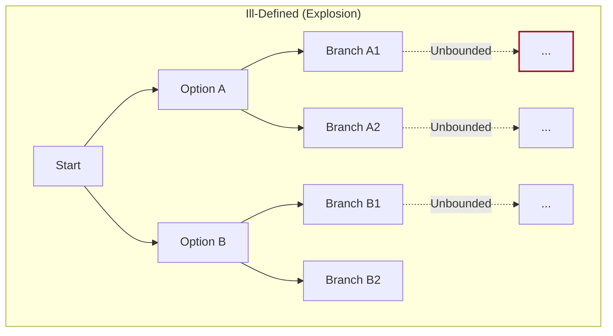
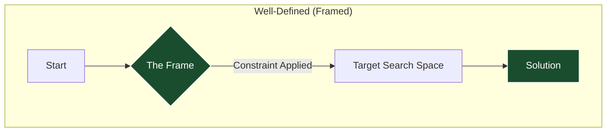

There are moments when a problem feels harder than it should. Not complex, exactly—just resistant, awkward, oddly shaped. Ambiguous.

I ran into this recently [fixing my bike](). I had a plausible solution (derailleur alignment), but the more I applied it, the less confident I became. The issue wasn’t effort or tools; it was orientation. I was solving *something*, but I didn’t yet understand what kind of problem I had.

That same pattern shows up constantly in organisations. A recurring issue bounces between teams. There’s back-and-forth, partial fixes, and long threads. Everyone is competent. Work is being done. But the problem keeps resurfacing.

What’s missing isn’t execution; it's **Clarity**.

## Ill-Defined Problems and Combinatorial Explosion

In cognitive science, problems are described as either [**Well-Defined** or **Ill-Defined**](https://en.wikiversity.org/wiki/Introduction_to_Ill-Structured_Problems).

1.  **Well-Defined:** Clear goal, known constraints, agreed success criteria. Progress is legible. Effort compounds.
2.  **Ill-Defined:** Ambiguous goal, shifting constraints, unclear success.

**The Computational Failure**
In computational terms, a well-defined problem has bounded complexity. An **Ill-Defined Problem** leads to **Combinatorial Explosion**.
Because the **Constraints** are unclear, the [**Search Space**](https://en.wikipedia.org/wiki/Optimization_problem) expands rather than contracts. Each attempt to "make progress" introduces new branches. Instead of converging, the system fans out.

We can visualize the difference in system load:

When you give a computer a task that hasn't been specified, it consumes resources, enters **Infinite Loops**, and crashes. **Ill-Defined Problems** in human systems behave the same way. Coordination costs rise faster than value creation.

## The Frame Problem: Determining Relevance

The deeper difficulty isn't just the **Size of the Search Space**; it is deciding what to consider at all.

In AI, this is the [**Frame Problem**](https://plato.stanford.edu/entries/frame-problem/): *How does a system determine which aspects of the environment are relevant to a task?*

There is no general procedure for relevance. To know what's relevant, you need to know the task. But in **Ill-Defined Situations**, the task itself is the variable.

Humans face this constantly. **Judgment Under Uncertainty** is an attempt to resolve the **Frame Problem** well enough to **Act**.

## Lateral Thinking as Search Space Reduction

This reframes Edward de Bono’s concept of [**Lateral Thinking**](https://en.wikipedia.org/wiki/Lateral_thinking).

It is not "creativity" in the abstract. It is a mechanism for **Reframing**—turning an ill-defined problem into a well-defined one.
*   It clarifies what is being optimized.
*   It makes constraints explicit.
*   **Crucially:** It rules out vast swaths of the Search Space that turn out not to matter.

A **Good Framing** collapses the **Search Space**. It turns an intractable problem ([NP-Hard](https://en.wikipedia.org/wiki/NP-hardness)) into a tractable one (Polynomial).

Once the frame is set, execution becomes cheap.

### Case Study: The SAS
The British Army viewed the North African campaign as **Attrition** (~1:1 trade of materiel and people). This was a high-cost, unbounded problem.
David Stirling reframed it as **System Disruption** (Destroy aircraft on the ground). This collapsed the search space. The problem went from "Defeat the Axis Army" to "Infiltrate Airfield X."

## The Attribution Trap: Why Framing is Invisible

There is a structural paradox with this kind of value creation.

Before the logic is articulated, the reframing looks weird. It doesn't fit the [Existing Doctrine]().
*   Stirling’s idea looked like a suicide mission. Maybe even insubordination.
*   Bezos’s [API Mandate]() looked like unnecessary bureaucracy.

**But once the framing propagates, it looks obvious.**

The moment a problem is successfully reframed, the *previous* confusion evaporates. The solution appears inevitable. The "Search Space" that was ruled out (the 99% of bad options) becomes invisible. The SAS became the blue-print for modern Special Forces.

This creates an **Attribution Error**:
1.  **Framing (Phase 1):** High Value, Low Visibility. It looks like "thinking" or "talking."
2.  **Execution (Phase 2):** Linear Value, High Visibility. It looks like "work" (shipping code, closing deals).

```mermaid
graph LR
    subgraph "Phase 1: The Invisible Work"
    A[Ambiguity] -->|Reframing| B[Clarity]
    end

    subgraph "Phase 2: The Visible Work"
    B -->|Execution| C[Output]
    C -->|Scale| D[Impact]
    end

    %% Attribution Lines
    B -.->|Value Created Here| V1[High Leverage]
    D -.->|Credit Assigned Here| V2[High Visibility]

    style B fill:#1a4d2e,stroke:#fff,color:#fff
    style D fill:#3d3d3d,stroke:#fff
```

## System Routing: The Triage Problem

We see this same problem arise in high-stakes operational settings, most notably in **Emergency Room Triage**.

A&E (or ER) is a setting where the input is high-variance and the signal is low.

-   **High Signal:** A patient arrives with a bone sticking out of their arm. The problem space is well-defined. The solution space is legible (Orthopedics).
    
-   **Low Signal:** A patient arrives with "generalized abdominal pain."
    

This is a dangerous ambiguity. The underlying cause could be trivial (indigestion) or catastrophic (ruptured appendix, aortic aneurysm).

The routing decision here is a **Single Point of Failure** for the entire system.  
If the Triage Nurse routes the patient to the wrong specialist, the cost is massive. Specialists are expensive computational nodes. If you send a stomach ache to a Neurologist, you waste the Neurologist's time (Opportunity Cost) and potentially kill the patient (Latency).

### The Generalist Judgment

To solve this, the person at the interface layer needs a specific kind of judgment. They don't need to be an expert in surgery (Execution), but they need to be an expert in relevance (Framing).

They need broad, lateral knowledge of all sub-domains to collapse the search space effectively.

In many organizations, we make the mistake of putting junior employees at the "Triage" layer (L1 Support, Junior PMs), assuming that "identifying the problem" is easier than "solving it."

This is a structural error. **Problem Definition is a Strategic Skill.**

### The Trap of Hindsight

The difficulty of this judgment is obscured by **Hindsight Bias**.

Once a problem has been framed correctly (e.g., "This is an aortic aneurysm"), the solution path becomes linear and obvious. The ambiguity vanishes.

This creates the attribution illusion. We look back at history—or a failed project—and say, "It was obvious what they should have done." We forget that before the frame was applied, the search space was near-infinite.

We see this in cognitive science puzzles like the **Candle Problem**.

-   **The Setup:** You are given a candle, a box of thumbtacks, and matches. You must attach the candle to the wall so it doesn't drip wax.
    
-   **The Block:** Most people try to tack the candle to the wall. They fail because they frame the box as a container for tacks.
    
-   **The Reframing:** You must reframe the box as a shelf. You empty the tacks, tack the box to the wall, and place the candle inside.
    

Once you see the solution, it is trivial. But until you break the frame ("The box is a container"), the solution is invisible.

This is the central tension of organizational value: **The act of framing makes the problem look easy, thereby devaluing the person who did the framing.**

### The Survivorship Bias of Solutions
Because we only see the path that *was* taken, we forget the cost of finding it.

When a team executes beautifully on a well-framed problem, they get the credit. When a team flails on an ill-framed problem, they get the blame. Rarely do we look upstream and ask: *Who defined the problem?*

Our brains are actually systematically bad at remembering how difficult certain problems were solve once we know the solution. This is called the [Hindsight Bias](https://en.wikipedia.org/wiki/Hindsight_bias).

If an organization consistently attributes success to execution rather than framing, it learns the wrong lesson. It invests in scaling delivery capacity (adding more engineers/salespeople) while under-investing in the upstream capability (Strategic Architectural Judgement).

The system gets better at exploiting known framings, but worse at producing new ones. It becomes highly efficient at solving the wrong problems.

## Conclusion

Effort only compounds once a problem has been framed. Before that point, execution resources can be largely wasted.

Lateral thinking isn't a stylistic preference; it is the practical mechanism by which systems cope with uncertainty. It turns ambiguity into structure, and structure into leverage.

The challenge for leadership is to recognize and invest in these capabilities *before* it becomes obvious. Organizations that win aren't just better at execution; they are better at accountability and fairly attributing where value is being produced and scaled.
