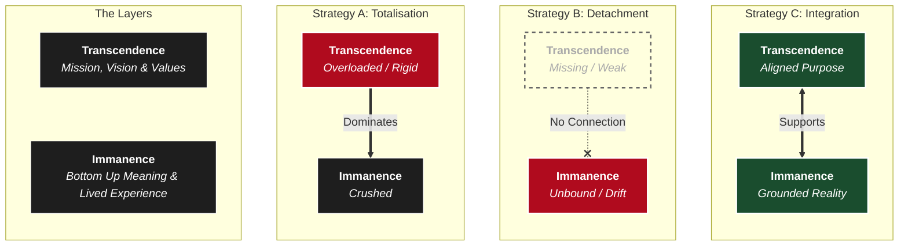

I've been thinking about the hidden architecture of meaning.

In my piece on [The Civilizational Stack](), I described the **Nested Systems** that sit beneath the user interface of our culture. At the lowest level, this stack shapes the conditions of intelligibility: what makes the world, each other, and ourselves feel real.

Not only in the transcendent or analytical sense, but also in the poetic, immersive sense of being inside a living world rather than standing outside it.

But what if the Nest of Systems is throwing errors? Some modern thinkers in the Western tradition warn that the load-bearing components of our architecture are in danger of collapsing. Others point to *this feeling itself* being the bug, rather than the symptom.

This is how Nietzsche and Emerson, respectively, attempted to patch this layer. But the topic demands we circle back. Heidegger called this the *hermeneutischer Zirkel*—the hermeneutic circle. By revisiting the central question from different angles, we allow the structure to reveal itself to us.

This post continues the debugging log of the Western mind. We will trace three distinct attempts to repair our meaniang-making machinery—from Melville’s diagnosis of "Total Meaning," to Heidegger’s attempt at an ontological refactor (and its parallels with Zen), and finally to the architectural limits of the Beat generation.

## I. Ahab and the Failure of Monolithic Meaning

Melville's *Moby-Dick* is a masterwork. He is another early American literary figure I feel deep admiration for. There is a freshness of perspective in his writing, and what Nietzsche would later call *Ja-Sagen zum Leben*: a “Saying Yes to Life” in all its depth, danger, and contradiction.

*Moby-Dick* is often read as a novel about obsession—and it is—but obsession is only the surface manifestation. At a deeper level, the novel examines a particular way of rendering ourselves and the world intelligible: a specific **Civilizational Architecture** in which meaning becomes singular, total, and non-negotiable.

As a writer, Melville embeds this architecture into a particular character and context: Captain Ahab. *No ideas except in things.* This does more than illustrate the point—it diagnoses it. By incarnating this architecture in a single figure, Melville allows us to see its consequences directly. We watch meaning harden into fixation, and fixation hollow the human being out from the inside. Ahab is not monstrous because he is cruel, but because everything in him has been subordinated to a single explanatory demand.

### The Monolith: Instrumentality as Blindness

Ahab’s fixation on the White Whale is exclusive. Everything else—friendship, work, ritual, beauty—loses independent significance. The whale does not sit alongside other meanings; it absorbs them.

This mirrors the industrial logic of whaling itself. To the industry, the whale is a unit of oil. To Ahab, the whale is a unit of metaphysical malice. Both views are **Instrumental**. They differ in content, but not in structure. In both cases, the world is no longer something to be inhabited, but a locked door to be forced open.

> **The Monolithic Error**
>
> Once meaning takes a totalized form, it becomes violent—not because it is evil, but because it is overburdened. By demanding that one thing explain everything, Ahab renders the rest of the world invisible.

### Ishmael: The Distributed Network

Melville contrasts Ahab’s monomania with Ishmael’s **Pluralism**. He stages the Monolithic Meaning architecture alongside another one that is already present and functioning.

Ishmael moves fluidly between meanings—Christian theology, Polynesian ritual, scientific classification, and the immediate camaraderie of labor. He engages with all of them, but allows none of them to totalize the field.

Ishmael’s world is deeply rich with meaning—saturated, in a thousand different ways, with depth and intelligibility.

This is often misread as a form of modern multiculturalism, but it is something deeper: **Multi-Meaningism**. Ishmael is not merely open to meaning generated by other cultures; he is open to layered, emergent significance as such. He finds meaning in the tattoos of a cannibal just as readily as in the architecture of a whale skeleton. Meaning does not have to be imported or justified; it already saturates the world around him.

Ishmael operates a *Distributed Network* of meaning, where nodes are loosely coupled but highly resilient. No single node is required to bear the entire explanatory load.

Crucially, he is open to *both* transcendence and immanence. He finds meaning in the scientific transcendence of objectivity—viewing objects in terms of pure facts. He finds meaning in the transcendence of Christian theology, oriented toward a power greater than the self. He finds meaning in the rituals of Queequeg and Polynesian life. But he also finds immanent meaning and enjoyment in the emergent rituals of the whaling ship itself—even in whale sperm. In his relationships with Queequeg and the other sailors. Everywhere he looks, the world remains meaningful—even in Ahab’s quest for the White Whale.

### The Failure Mode: Substitution vs. Decentering

There is a subtlety here which is easy to miss. Melville is very clearly *not* doing something: **Meaning Subsidy**.

When inherited (in this case, Western) structures begin to feel brittle, a common modern move is to simply import meaning from elsewhere—treating other cultures or practices as a patch for a broken system without addressing the underlying architecture.

Melville avoids this entirely. Ishmael does not **reject** the Western tradition in order to replace it with a Polynesian one (*Substitution*). Instead, he **decenters** it.

* **Ahab** demands that the Western stack (the whale) be the *only* stack.
* **Ishmael** treats the Western stack as one valid register among many.

This is not a rejection, nor a destruction. If Ishmael merely substituted one totalizing meaning for another, he would be playing the *same game* of monolithic meaning. Instead, Melville performs what Nietzsche would later call Überwindung (an *Overcoming*): a form of transcendence that does not elevate a new absolute, but transcends the mode of being that requires meaning to be singular.

I am not convinced that this is inhabitable as a long-term solution for a civilization.

### The Stack Analysis

From a systems perspective, Melville is doing something precise. He is not attempting to repair the particular **Civilizational Solution Space Layer**—the high-level justifications of why we are here.

Instead, he demonstrates that the **Phenomenological Layer** (lived experience) remains functional even when the architecture above it becomes unstable.

* Ahab crashes because the architecture fails.
* Ishmael survives because he inhabits the lower layers: the immediate reality of labor, danger, and relationship (the monkey-rope).

More than this, the Phenomenological Layer is inhabitable for individuals on an ongoing basis. Melville’s insight is not a proposal for a new civilization. It is a diagnostic claim:

**Human life is already saturated with meaning even when the architecture fails.**

## II. Dostoevsky: The Cost of Entropy

To explain why this is not inhabitable for a civilization, I need to turn to Dostoevsky. If Melville reveals the danger of **Monolithic Meaning**, Dostoevsky exposes the opposite failure mode: **System Entropy**.

Melville systematically underappreciates this risk because he operates at the **edges** of society. His characters are sailors, drifters, and outcasts—people living in a sandbox where the primary stakes are individual survival rather than civilizational continuity.

Dostoevsky moves the stress test to the **center**. He examines families, inheritances, institutions, and cities—systems that require continuity, coordination, and moral load-bearing to function over time. Both writers are exquisitely sensitive to failures in meaning, but their orientations differ. Melville is concerned with whether meaning is inhabitable for individuals. Dostoevsky is concerned with whether meaning can *scale*—even locally.

For Dostoevsky, the kind of totalizing meaning embodied by Ahab is not the inheritance of tradition. It is what emerges when the load-bearing structures of tradition collapse, leaving individuals with the impossible task of architecting meaning entirely on their own.

### The Privatisation of Meaning

Dostoevsky’s characters live in the aftermath of weakening absolutes. The external network of God, tradition, and shared moral authority has eroded, and the burden of justification shifts inward.

Figures like Raskolnikov attempt to run private moral operating systems, relying on Reason or Will to bootstrap meaning from first principles. But these local instances cannot bear the structural load.

- **Freedom** curdles into resentment (the Underground Man).
- **Rationality** becomes post hoc self-justification (Raskolnikov).
- **Autonomy** collapses into isolation and despair.

Meaning has not disappeared—but it has been privatized. And privatized meaning is brittle.

### The Loss of Verticality

The core failure Dostoevsky identifies is the loss of **Moral Verticality**. This is one of the crucial load-bearing components of a scalable civilizational stack.

In a functioning architecture, shared meaning provides an external reference point that lifts individuals above their immediate incentives. It creates a vector of aspiration—something outside the self that justifies obligation, sacrifice, and restraint.

Without this shared protocol, transcendence has nowhere legitimate to attach. No way to step outside of the individual perspective.

- There is no “documentation” for sacrifice.
- There is no logic that justifies lifting others up at a cost to oneself.
- There is no reason to care beyond immediacy and self-interest.

Dostoevsky shows that the collapse of shared meaning does not produce a neutral, pluralistic equilibrium. It produces **noise**. Transcendence does not disappear; it reasserts itself in distorted, malware-like forms—fanaticism, submission, nihilism, or crime—because the human need for justification remains even when legitimate structures for it are gone.

It is tempting to read Dostoevsky as a conservative arguing that old structures must be preserved at any cost. A close reading shows this to be false. He critiques inherited structures that have failed to adapt just as sharply as revolutionary attempts to reinvent meaning wholesale.

Dostoevsky is ruthlessly sensitive to psychology—individual and collective—and to which parts of the architecture are genuinely load-bearing. Insofar as he defends tradition, it is not theology, doctrine, or text that concerns him, but **practices**, **forms of life**, and **moral vetoes** that make transformation possible.

He is not interested in belief as assent. He is interested in belief as orientation: the conditions under which human beings are capable of transcending petty grievance, resentment, and neurosis in order to become better kinds of people.

## III. Nietzsche: The Genealogist and the Architect

If Dostoevsky is the sensitive diagnostician and artist, Nietzsche is the **Genealogist** and the **Architect**. Where the novelists intuit and dramatize, Nietzsche names and dissects. Blending poetry and philosophy, he makes explicit what the others circle around. He traces, with ruthless clarity, the historical structures that underwrite the **Civilizational Stack** itself.

Nietzsche recognizes that Western civilization was organized around shared, transcendent commitments. These commitments functioned as **load-bearing structures**. They coordinated meaning, constrained behavior, and justified sacrifice. And like all successful infrastructure, they disappeared from view.

The idea of a truth that stands outside the individual exists in many cultures. But nowhere is it pursued as relentlessly, as systematically, and as self-consciously as in the West. The Western project is defined by its insistence on an external standard: Logos, God, Reason, Truth—something that judges the individual rather than being judged by them.

Nietzsche admires this discipline. He sees its honesty. But he also sees the paradox at its core.

What if the tradition that prides itself on rigor, transparency, and demystification—on facts, objectivity, and hard material work—is itself grounded in a metaphysics that contradicts its own self-image? What if the very commitment to truth that defines the West is inherited from poetic, symbolic, and meaning-making sources that the modern West now treats with embarrassment or contempt?

For Nietzsche, these load-bearing structures were not merely invisible. They were *denied*. They were the scaffolding the system depended on, while insisting it had no scaffolding at all.

### Undocumented Implicit Primitives

Over time, hindsight bias set in. These commitments worked so well, for so long, that they stopped appearing as *architecture* and began to appear as *nature*. They hardened into the background conditions of intelligibility itself.

They became **Undocumented Implicit Primitives**: assumptions the entire system executed on, but which no one remembered installing.

Western civilization continued to run—confident, productive, and increasingly aggressive—on dependencies it no longer knew it had.

### The Expert Auditor

It is often missed that Nietzsche was simultaneously the most forward-looking *and* the most backward-looking thinker of his age.

He was a philologist. He knew the source code of Western thought—from the pre-Socratics through Plato, Christianity, and the Enlightenment—better than its defenders. His critique was not born of rebellion or ignorance, but of **intimacy**. He understood the system because he had lived inside it.

Nietzsche saw that the Christian–moral framework was a brilliant architectural solution for a specific stage of human development. It stabilized meaning, disciplined instinct, and made large-scale civilization possible. He also saw that the Greek philosophical framework was a singular advance in human history—clear, explicit, and uncompromising about what counts as knowledge, truth, and the world.

He saw that the combined tradition Europe inherited from Athens, Jerusalem, and Rome—one that emphasized deep transcendence beyond the individual while remaining grounded and scalable—was an extraordinary civilizational achievement.

But he also saw that this same framework was now accumulating **technical debt**: guilt without redemption, resentment without outlet, and a growing hostility toward life itself.

The system was still running.  
But it was running on assumptions it could no longer justify—and enforcing values it no longer believed.

For Nietzsche, unlike Melville, survival through plural inhabitation was not enough. The individual could not merely *live among meanings*; civilization required a **unifying vector**—a future-oriented horizon capable of justifying sacrifice, discipline, and greatness.

Nietzsche’s answer was radical: a **self-rewriting civilizational architecture**, in which exceptional individuals would assume the burden once carried by transcendent structures. They would not inherit values—they would *author* them.

This was not pluralism. It was an attempt to replace a collapsing load-bearing system with a new one, generated from within human will itself.

### The Architectural Divergence: Three Network Models

If the "Central Server" (God/Transcendence) is going offline, how do we re-architect the network? This is where Nietzsche diverges from the tradition and from Melville.

We can map three distinct architectures for the human node:

**1. The Traditional Node (Client-Server)**
*   **Architecture:** The individual is a **Client**.
*   **Logic:** It has limited local storage and processing power. It relies on a **Central Authority** (The Church/God) to validate truth and distribute meaning.
*   **Failure Mode:** If the Server goes down, the Client bricks. This is Dostoevsky’s fear.

**2. The Melville Node (Microservices)**
*   **Architecture:** Ishmael is a **Modular Consumer**.
*   **Logic:** He survives by keeping his dependencies loosely coupled. He plugs into Christian APIs here, Pagan APIs there, and Scientific APIs when needed.
*   **Trade-off:** He is resilient because he is modular. But Nietzsche fears this degrades into the "Last Man"—a node that consumes meaning without the capacity to generate it.

**3. The Nietzsche Node (Peer-to-Peer)**
*   **Architecture:** The *Übermensch* is a **Full Node**.
*   **Logic:** In a P2P network (like Bitcoin), a Full Node does not trust a central server. It downloads the entire history of the chain (Genealogy), verifies it from first principles, and becomes **Self-Sovereign**.
*   **Ambition:** Nietzsche wants to upgrade the human so it contains the "Source Code" of value within itself.

### The Ambition: A Self-Validating Network
Nietzsche’s project is not a power fantasy; it is an architectural requirement for a distributed system with no central authority.

He realizes that for the network to survive the death of the Central Server, the individual nodes must be upgraded. They must become **Generative** rather than **Dependent**.

The *Übermensch* is an attempt to build a **Self-Legislating Node**—one capable of bearing the weight of existence and validating value in a void, without making an API call to a non-existent God.

### The Scalability Limit
This begs the question: **Can an entire civilization run on this architecture?**

In distributed systems, running a Full Node is resource-intensive. It requires massive energy, storage, and "compute" to validate reality from first principles.

Is it reasonable to expect every single individual to become a self-legislating node? Nietzsche’s answer was "No." His model assumed a hierarchy of Supernodes (The Architects) creating value for the rest of the network (The Herd). But this reveals the limit of his project: maintaining a coherent network without a central server requires a "Compute Cost" that most nodes cannot pay.

## IV. Heidegger: The Ontological Refactor

Heidegger argues that the civilizational crisis is not primarily moral or cultural, but **ontological**.

If this is true, then the problem may admit of a smaller, more surgical fix. Rather than demanding that every individual become a Nietzschean supernode, we may be able to refactor the **operating system** they already run on. The goal is not to destroy the existing architecture, but to prevent it from totalizing—preventing one mode of intelligibility from crowding out all others.

In this sense, Heidegger follows Nietzsche in tracing the stack downward. But unlike Nietzsche, he is less dismissive of systematic attempts to define truth. Rather than abandoning ontology, Heidegger attempts to **correct** it.

### The Legacy Architecture: The Subject/Object Split

Heidegger traces the core bug to a legacy architecture inherited from Descartes and Kant, and ultimately from a particular reading of the Greeks: the **Subject/Object split**.

1. **Objective World:** Things “out there” (facts, matter).
2. **Subjective World:** Thoughts “in here” (values, meanings).

Once this picture takes hold, meaning migrates entirely into the subject. Shared meaning becomes fragile because it has no legitimate place in the world itself.

- **The Glitch:** Objectivity is treated as the deepest form of truth. Only what is measurable, analyzable, and instrumental is taken to *really exist*.
- **The Result:** Meaning appears as a user-generated hallucination rather than a system feature.

For us, the most *real* things are mechanistic and analytical. To be fully real, something must be intelligible in instrumental terms. That the most real things might be *meaningful*—rather than merely functional—becomes difficult for us even to articulate.

Other cultures make sense of this differently, but invoking them directly risks a Meaning Subsidy. The point is not that we should ground meaning in the “subjective,” but that our stack lacks the ontology required to treat meaning as real at all.

Melville and Dostoevsky both show the consequences of this. Ishmael moves freely among meanings without obsessing over what is materially real. Dostoevsky’s characters, by contrast, lose any grounding for morality, sacrifice, or transformation precisely because such things cannot be justified objectively or analytically. This is *not* because they are subjective—but because the ontology has no place for them.

Heidegger’s claim is that there is a deeper layer of the civilizational stack beneath subjectivity and objectivity altogether: the **phenomenological layer**, which the modern West has largely forgotten. These lost types of realness are still saturated at that layer: Dostoevsky and Melville would agree.

### The Patch: Disclosure vs. Projection

Heidegger’s intervention is a refactor at the kernel level.

Meaning is not projected by subjects onto a neutral world. It is **disclosed**. Before we are subjects analyzing objects, we are *being-in-the-world*.

- **Legacy View:** The world is a blank screen; we project meaning onto it.
- **Refactored View:** Meaning is the texture of the world as it is encountered.

On this view, meaning is neither an internal mental construct nor a purely objective property of things. It is **always already there** in lived experience, prior to analysis.

This reconnects directly with Melville’s Ishmael—and with poetry more generally. Meaning is not manufactured through effort or justification. It is encountered, immediately, in the grain of the world.

### Poetry as “Root Access”

Heidegger is operating at the same layer as the **immanence poets**, particularly **William Carlos Williams**.

Williams’s maxim—*“No ideas but in things”*—is an ontological claim. It denies any separation between ideas and things. Meaning does not need to be added to the world; it is already there.

The problem was never signal loss. It was **receiver sensitivity**.

For Heidegger, poetry is not ornamentation. It is root access to being itself. It reveals a layer of reality saturated with meaning *before* the Subject/Object split filters it out.

### The Strategic Goal: Containerization

Heidegger is not attempting to destroy the Western stack. Like Nietzsche, he is attempting a **refactor**, not a demolition.

He does not want to delete objectivity. The scientific view of the world is an extraordinarily powerful tool for instrumental purposes.

- **The Error:** Allowing a tool to become the entire operating system.
- **The Fix:** **Containerize objectivity.**

By limiting the scope of the scientific worldview, Heidegger opens space for other kinds of intelligibility—meaning, sacredness, art—to be real again without requiring scientific validation.

The goal is not regression or mysticism. It is architectural sanity:  
**a place for everything, and everything in its place.**

## V. Zen and the Kyoto School (The Patch)

To see this clearly, we can look at how these problems converge with Japanese Zen—specifically the Kyoto School (Nishida, Nishitani), who made this connection explicit. They, too, attempt to refactor transcendence from within.

Zen does not abolish the **Architecture of Transcendence**. Instead, it follows the Buddhist trajectory so radically inward that transcendence is encountered through immanence itself. The self dissolves into a non-dual openness, collapsing the distinctions between self and world, transcendence and immanence, being and becoming.

- **Western Model:** Transcendence is an external object (God, Idea, Law) that stands outside the individual and judges/constrains them.
- **Zen Model:** Transcendence is pursued through discipline and striving until the standpoint that seeks it dissolves, revealing immanence (*śūnyatā* / emptiness) as the ground of experience.

### The Pedagogical Hack

Zen is sophisticated because it understands human psychology. It knows that humans crave the **Object** of transcendence.

The aspiring student is led along a paradoxical path—often with a good serving of humour—where they seek enlightenment as something external. The tradition provides the **location** of transcendence (the Buddha, the Path, awakening) in order to capture and discipline striving.

But the realization, when it comes, is a bait-and-switch.

The student climbs the ladder of transcendence only to discover that it leads back to the ground. What collapses is not merely an idea, but the self that was doing the climbing. The realization is of the fundamental emptiness of things—a **radical immanence** in which subject and object no longer stand apart, thus finding transcendence within immanence.

- **The Hack:** Zen installs radical immanence in the structural slot normally reserved for transcendence.
- **The Result:** It preserves seriousness, discipline, and existential depth, without metaphysical absolutism.

This is an elegant solution. It almost works.

### The Bug in the Patch (Zen at War)

One of the great civilizational failure modes is the **Meaning Subsidy** trap: importing another architecture without understanding its structural constraints. When Zen is transplanted into a different stack, lower layers are rarely integrated. Practices float free of their native constraints, producing confusion and distortion. (Protestant Buddhism is a canonical example.)

But even within its native context, Zen reveals a structural vulnerability when scaled into modern systems.

Zen’s ethics are **situational** and **relational**. It excels at transforming persons—reducing ego, increasing attentiveness and compassion. But it struggles to restrain *systems*.

### The Missing Veto

This brings us back to **Dostoevsky’s core insight**.

Certain civilizational failure modes—genocide, slavery, systematic war crimes—are not solved by harmony, mindfulness, or situational awareness. They require **hard constraints**. This is what Emerson found missing when he shifted from Transcendentalism into Abolitionism.

- **The Moral Veto:** A claim that says, “You cannot do this,” regardless of utility, power, or context.
- **The Architecture:** To function as a veto, a moral claim must operate as an **external dependency**. It must stand *outside* the system in order to judge the system. It must be a different category of thing.

Because Zen collapses the distance between the Absolute and the Relative, it dissolves the Archimedean point required to judge civilization itself. Without hard transcendence—non-negotiable moral vetoes—Zen can align with power rather than restrain it. Radical immanence in the place of transcendence ends up being individual, limited, and experiential.

This is precisely what occurred in the co-option of Zen by Japanese imperialism. Disciplined immanence, even at its highest level, lacks the structural leverage to say “No” to the world when the world organizes itself around violence. Which isn't say that Christian transcendence _always_ did better, though Abolitionism is among the notable examples.

We see analogous failure modes in Western Buddhism: recurring scandals around Buddhist cults, guru dynamics, and New Age mutations. The issue is not hypocrisy. It is architecture.

A viable civilizational stack must solve *different classes of problems at different layers simultaneously*. Zen is an extraordinary local optimization—but it cannot, in my opinion, on its own, carry the full load.

## VI. The Beats: Meaning Subsidy and the Thin Stack

How does Meaning Subsidy go wrong?

Zen represents the height of a civilizational architecture—but it belongs to a *different* stack. Meaning architects can learn deeply from other stacks, but only if they are sensitive to the structural dependencies that make those stacks coherent and load-bearing.

As Western civilization’s own meaning-bearing structures began to thin, a specific failure mode emerged: **Meaning Subsidy**.  
Instead of repairing its local architecture, the West began importing transcendence from the East to patch holes in its ontology.

This is not a claim against learning from, enjoying, or engaging with other cultures. The failure occurs when foreign meanings are imported into **load-bearing positions** as an act of desperation—without sufficient understanding of *either* stack. What functions as a local optimization in one architecture is suddenly asked to carry civilizational weight in another.

This is precisely the failure mode Dostoevsky identified in nineteenth-century Russia. Western ideas—rationalism, utilitarian ethics, proto-socialism—were imported not as tools, but as moral foundations. Detached from the cultural, institutional, and spiritual constraints that had once stabilized them, they were installed directly into the load-bearing layer of society. Dostoevsky saw that this was not reform, but architectural misuse—and that it would end not in liberation, but in catastrophe.

### The 60s Refactor

A similar thing occurred, though with less distratrous consequences when the Beat Generation (Kerouac, Ginsberg) and the broader 1960s counterculture attempted a radical **refactor of Western civilization**, drawing on Zen and various other concepts and tools, including psychedelic drugs.

- **The Ambition:** Debug the system by removing “exploitation” and “repression.”
- **The Error:** The refactor was insufficiently sensitive to architecture. It failed to distinguish between **legacy code** (outdated norms) and **load-bearing walls** (necessary constraints).

To their credit, the Beats rediscovered **radical immanence**, and within it a certain kind of transcendence. They demonstrated that meaning can survive the collapse of metaphysics. Life can still feel charged, electric, and significant without the old gods.

But this came at a cost.

### The Scaling Failure: Stateless Meaning

When immanence is not held within a larger architectural frame, meaning becomes **episodic** rather than **cumulative**.

In systems terms, the Beat lifestyle is **stateless**.

- **Cumulative systems:** State is saved. Progress builds on prior progress (institutions, families, cultures, traditions).
- **Episodic systems:** State is reset every session. Intensity must be regenerated from scratch, again and again.

> **The Drift**
>
> *On the Road* is a document of limits. Its constant movement is compensatory. The refusal of structure preserves intensity at the expense of seriousness. Meaning is encountered repeatedly, but it does not sediment into infrastructure.
>
> The novel begins as a raw exhortation to live fully—a radical freedom to do whatever one wants, whenever one wants. By its end, the failure modes of unbridled freedom and consumption become visible. The early, intensely immanent meaning the characters experience proves fragile. Like Keats, they discover that without enduring transcendence, meaning does not endure into later life, as impermanence erodes bodies, minds, and relationships.
{: .prompt-info }

### The Dostoevsky Test

Ultimately, the Beat solution fails the **Dostoevsky Test** established in Section II.

While it succeeds at generating *user experience* (intensity, joy), it fails to sustain *infrastructure*.

- It cannot coordinate sacrifice.
- It cannot impose limits on individuals or collectives.
- It lacks the **moral verticality** required to lift the individual above immediate drives.
- It lacks the depth of meaning required to endure beyond youth and innocence.

By operating on a **thin stack**—active experience without active constraints—it leaves individuals awash in meaning but stripped of the tools required to build durable worlds or coherent moral selves. It offers a way to *feel*, but not a way to *build*.

### The Danger of the Blind Refactor

This case illustrates a core architectural principle: **Chesterton’s Fence**. One should not tear down a wall until one understands why it was built.

The Beat experiment—and the broader 1960s project—shows that a radical attempt to refactor the entire civilizational stack without understanding its layers and dependencies is dangerous. It treats complex constraints (tradition, restraint, obligation) as bugs to be deleted, rather than load-bearing features that sustain the moral conditions of life.

At its best, the movement reinvigorated the Western tradition as pluralistic and open. At its worst, it replaced one dogma with another, while failing to engage seriously with the tradition it sought to transcend.

As a general architectural principle: where possible, **reorientation** is almost always preferable to **rebuilding from the ground up**.

## VII. Visualizing the Failure Modes

We can map these distinct approaches onto the Civilizational Stack.

## VIII. Conclusion: Reorientation vs. Rebuild

The crisis of meaning is not a disappearance of meaning. Meaning remains abundantly available at the level of **lived experience**—the **phenomenological layer**.

The crisis is a failure of **infrastructure**—the **architectural layer**.

- **Ahab** shows how a rigid, monolithic infrastructure can blind us to all other forms of intelligibility.
- **The Beats** show the limits of radical immanence when meaning is stripped of cumulative structure.
- **The 60s Refactor** shows the danger of deleting load-bearing walls without understanding what they support.

---

### The System Logic

A civilization that can name its own failure modes has not exhausted its resources. The work ahead is not the *invention* of meaning, but the **stabilization of the stack** that allows meaning to endure—without becoming brittle, totalizing, or absolute.

We do not need to delete the Western stack. We need to **debug** it.

Truth as a transcendent, external constraint—something that judges individuals rather than being judged by them—remains *irreplaceable* in any complex society. Heidegger understood the depth of the ontological problem, but he did not succeed in restoring this constraint at the civilizational level. His attempt remains incomplete, and in important ways compromised. In future pieces, I will look to some of his inheritors to see how they grapple with this unresolved tension.

Stabilizing the architecture requires a shift in strategy.

- **The Revolutionary** wants to wipe the server and reinstall a new operating system.
- **The Architect** understands that the system must remain online while it is being repaired.

Dostoevsky’s warning is decisive here. Removing load-bearing walls without understanding why they were built does not produce freedom—it produces collapse. There are not infinitely many architectures capable of sustaining the meaning-making machinery of entire civilizations in a stable and humane way.

> **The Engineering Principle**
>
> **Reorientation** is almost always preferable to **rebuilding from the ground up**.
{: .prompt-tip }

Reorientation is safer, more robust, and more human than demolition. But restraint does not imply timidity. We should not be less ambitious in refactoring our civilizational stack—only more careful about where we cut, what we preserve, and which constraints we treat as indispensable.

In the next piece, I will turn to more contemporary thinkers to explore what viable refactors might look like under modern conditions.
