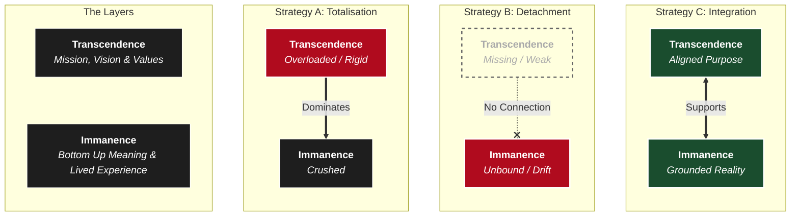

I've been thinking about the architecture of meaning that sits under civilisations and cultures.

In my piece about [The Civilizational Stack](), I described a Stack of Nested Systems that our culture operates within—from the "Operational" (How) to the "Architectural" (Why).

I later explored two alternative forks from the Western civilisational stack: Nietzsche and Emerson. Both were trying to update fundamental layers of the Stack.

In this post, I continue tracing the debugging log of Western meaning-making—from Melville’s diagnosis of "Total Meaning" to Heidegger’s attempt at an ontological refactor, looking it's similarities to Zen, and finally to the limits of the Beat generation.

## I. Ahab and the Failure of Monolithic Meaning

Melville's *Moby-Dick* is a masterwork. It is often read as a novel about obsession, and it is, but obsession is only the surface manifestation. At a deeper level, what the novel is really examining is a particular **Civilizational Architecture**—one in which meaning becomes singular, total, and non-negotiable.

As a writer, Melville presents that Civilisational stack _embedded_ into a particular character and context: Captain Ahab. However, we see it staged alongside other architectures that are already present and functioning.

### The Monolith: Instrumentality as Blindness
Ahab’s fixation on the White Whale is exclusive. Everything else—friendship, work, ritual, beauty—loses independent significance. The whale does not sit alongside other meanings; it absorbs them.

This mirrors the industrial logic of whaling itself. To the industry, the whale is a unit of oil. To Ahab, the whale is a unit of metaphysical malice. Both views are **Instrumental**: they treat the world not as something to be inhabited, but as a locked door to be pierced.

> **The Monolithic Error**
>
> Once meaning takes the totalised form, it becomes violent—not because it is evil, but because it is overburdened. By demanding that one thing explain everything, Ahab renders the rest of the world invisible.
{: .prompt-warning }

### Ishmael: The Distributed Network
Melville contrasts Ahab’s monomania with Ishmael’s **Pluralism**.

Ishmael moves fluidly between meanings—Christian theology, Polynesian ritual, scientific classification, and the immediate camaraderie of labor. He engages with all of them, but allows none of them to totalize the field.

This is often misread as modern multiculturalism, but it is something deeper: **Multi-Meaningism**. Ishmael is not only open to meaning generated by other cultures; he is also open to layered, emergent significance. He finds meaning in the tattoos of a cannibal just as easily as in the architecture of a whale skeleton. He is open to the meaning that saturates everything around him. He operates a "Distributed Network" of meaning where nodes are loosely coupled but highly resilient.

### The Failure Mode: Substitution vs. Decentering
There is a risk here of falling into a specific trap: **Meaning Subsidy**.

When Western structures feel brittle, a common modern move is to simply "import" meaning from elsewhere—treating other cultures or practices as a patch for a broken system without fixing the underlying architecture.

Melville avoids this. Ishmael does not **Reject** the Western tradition to replace it with a Polynesian one (Substitution). Instead, he **Decenters** it.
*   **Ahab** demands the Western stack be the *only* stack.
*   **Ishmael** treats the current Western stack as one valid register among many.

### The Stack Analysis
From a systems perspective, Melville is doing something precise. He is not trying to fix the **Civilisational Solution Space Layer** (the high-level justifications of why we are here).

Instead, he is demonstrating that the **Phenomenological Layer** (Lived Experience) remains functional even when the Architecture is unstable.
*   Ahab crashes because the Architecture fails.
*   Ishmael survives because he inhabits the lower layers: he relies on the immediate reality of labor, danger, and relationship ("The monkey-rope").

Melville’s insight is not a proposal for a new civilization. It is a diagnostic claim: **Human life is already meaningful even when the architecture fails.**

## II. Dostoevsky: The Cost of Entropy

If Melville shows the danger of Monolithic Meaning, Dostoevsky shows the opposite failure mode: **System Entropy**.

Melville systematically underappreciates this risk because he focuses on the **Edges** of society. His characters are drifters, sailors, and outcasts—people operating in a sandbox where the stakes are personal survival, not civilizational continuity.

Dostoevsky moves the stress test to the **Center**. He looks at families, inheritances, and cities—systems that require stability to function.

### The Privatisation of Meaning
Dostoevsky’s characters live in the aftermath of weakening absolutes. The external Network of God and Tradition has eroded, and the burden of justification shifts inward.

Figures like Raskolnikov attempt to run their own private operating systems, relying on Reason or Will to bootstrap morality from scratch. But these local instances cannot bear the structural load.
*   **Freedom** becomes resentment (The Underground Man).
*   **Rationality** becomes self-justification (Raskolnikov).
*   **Autonomy** curdles into isolation.

### The Loss of Verticality
The core failure here is the loss of **Moral Verticality**.

In a functioning architecture, shared meaning acts as a constraint that lifts the individual above their immediate incentives. It provides a reference point outside the self that draws one towards positive transformations, and justifies sacrifice and obligation.

Without this shared protocol, there is no mechanism to transcend individual needs.
*   There is no "documentation" for sacrifice.
*   There is no logic that justifies lifting others up at a cost to oneself.

Dostoevsky reveals that the collapse of shared meaning does not produce a neutral, pluralistic utopia. It produces **Noise**. Transcendence does not disappear; it reasserts itself in distorted, malware-like forms—fanaticism, submission, or crime—because the human need for justification remains even when the legitimate structures for it are gone.

## III. Nietzsche: The Genealogist and the Architect

What Dostoevsky reveals at the level of the psyche, Nietzsche diagnoses at the level of the **Civilizational Stack**.

Nietzsche recognises that Western civilization was organised around shared, transcendent commitments. These commitments functioned as **Load-Bearing Structures**. Like all successful infrastructure, they receded into the background.

**Undocumented Implicit Primitives**
Over time, Hindsight Bias set in. These structural commitments were effective for so long that they ceased to look like "Architecture" and started to look like "Nature." They became **Undocumented Implicit Primitives**—dependencies that the entire system relied upon, but which were no longer visible to the operators.

### The Expert Auditor
It is often missed that Nietzsche was simultaneously the most forward-looking and backward-looking thinker of his age.

He was a Philologist. He knew the "source code" of Western thought—from the pre-Socratics to the New Testament—better than its defenders did. His critique was not born of ignorance or rejection; it was born of **intimacy**.

He saw that the Christian-Moral framework was a brilliant architectural solution for a specific stage of human development. But he also saw that it was now generating **Technical Debt** (guilt, resentment, life-denial).

### The Architectural Divergence: Three Network Models

If the "Central Server" (God/Transcendence) is going offline, how do we re-architect the network? This is where Nietzsche diverges from the tradition and from Melville.

We can map three distinct architectures for the human node:

**1. The Traditional Node (Client-Server)**
*   **Architecture:** The individual is a **Client**.
*   **Logic:** It has limited local storage and processing power. It relies on a **Central Authority** (The Church/God) to validate truth and distribute meaning.
*   **Failure Mode:** If the Server goes down, the Client bricks. This is Dostoevsky’s fear.

**2. The Melville Node (Microservices)**
*   **Architecture:** Ishmael is a **Modular Consumer**.
*   **Logic:** He survives by keeping his dependencies loosely coupled. He plugs into Christian APIs here, Pagan APIs there, and Scientific APIs when needed.
*   **Trade-off:** He is resilient because he is modular. But Nietzsche fears this degrades into the "Last Man"—a node that consumes meaning without the capacity to generate it.

**3. The Nietzsche Node (Peer-to-Peer)**
*   **Architecture:** The *Übermensch* is a **Full Node**.
*   **Logic:** In a P2P network (like Bitcoin), a Full Node does not trust a central server. It downloads the entire history of the chain (Genealogy), verifies it from first principles, and becomes **Self-Sovereign**.
*   **Ambition:** Nietzsche wants to upgrade the human so it contains the "Source Code" of value within itself.

### The Ambition: A Self-Validating Network
Nietzsche’s project is not a power fantasy; it is an architectural requirement for a distributed system with no central authority.

He realizes that for the network to survive the death of the Central Server, the individual nodes must be upgraded. They must become **Generative** rather than **Dependent**.

The *Übermensch* is an attempt to build a **Self-Legislating Node**—one capable of bearing the weight of existence and validating value in a void, without making an API call to a non-existent God.

### The Scalability Limit
This begs the question: **Can an entire civilization run on this architecture?**

In distributed systems, running a Full Node is resource-intensive. It requires massive energy, storage, and "compute" to validate reality from first principles.

Is it reasonable to expect every single individual to become a self-legislating node? Nietzsche’s answer was "No." His model assumed a hierarchy of Supernodes (The Architects) creating value for the rest of the network (The Herd). But this reveals the limit of his project: maintaining a coherent network without a central server requires a "Compute Cost" that most nodes cannot pay.

## IV. Heidegger: The Ontological Refactor

Heidegger argues that the architectural crisis is not moral or cultural, but **Ontological**.

If this is true, a scalable solution may actually be easier to ship. Instead of asking every user to become a Nietzschean Supernode, we simply need to patch the Operating System they run on.

Heidegger traces the error to a "Legacy Architecture" inherited from Descartes and Kant: **The Subject/Object Split.**
1.  **Objective World:** Things "out there" (Facts/Matter).
2.  **Subjective World:** Thoughts "in here" (Values/Meanings).

**The Legacy Bug**
Once this picture takes hold, meaning migrates entirely into the subject. Shared meaning becomes fragile because it has no "Objective" location.
*   **The Glitch:** Objectivity is upheld as the deepest form of truth. Only "Objective" things are considered to "really exist."
*   **The Result:** Meaning looks like a user hallucination rather than a system feature.

### The Patch: Disclosure vs. Projection
Heidegger attempts a "Refactor" at the kernel level.

He argues that meaning is not projected by people onto a blank world; it is **Disclosed**. Before we are subjects analyzing objects, we are *Being-in-the-world*.
*   **Legacy View:** The world is a blank screen; we project movies onto it.
*   **Refactored View:** Meaning is the texture of the world itself.

This reconnects with Melville's Ishmael: Meaning isn't difficult to manufacture; it is encountered in the texture of the world.

### Poetry as "Root Access"
This links Heidegger directly to the **Immanence Poets**, particularly **William Carlos Williams**.

Williams’ maxim—*"No ideas but in things"*—is an ontological claim. It asserts that meaning is always already there. The problem was never a lack of signal (meaning); it was a lack of **Receiver Sensitivity** (attention).

For Heidegger, poetry is not "decoration." It is the deepest layer of the human stack. It represents the primary layer of being—a layer saturated with meaning *before* the Subject/Object split filters it out.

### The Strategic Goal: Containerization
Heidegger links us to the Nietzschean project in that he is trying to **Refactor** the Western civilizational stack, not destroy it.

He does not want to delete Objectivity. The idea of an "Objective World" is an incredibly powerful tool for instrumental purposes (Science/Technology).
*   **The Error:** Allowing the Tool to become the Operating System.
*   **The Fix:** Containerize Objectivity.

Heidegger seeks to restore a form of Transcendence by putting Objectivity back in its box. The goal is to have **a place for everything, and everything in its place**. By limiting the scope of the scientific view, he opens up space for other kinds of being (Meaning, Sacredness, Art) to be "Real" again without needing scientific validation.

## V. Zen and the Kyoto School (The Patch)

Heidegger’s project converges with Zen—specifically the Kyoto School (Nishida, Nishitani), who made this connection explicit. They, too, attempt to refactor transcendence from within.

Zen does not abolish the **Architecture of Transcendence**; it internalises it.
*   **Western Model:** Transcendence is an external object (God/Idea) that you submit to.
*   **Zen Model:** Transcendence is a realization within the world (*Śūnyatā* / Emptiness) that you wake up to.

### The Pedagogical Hack
Zen is sophisticated because it understands user psychology. It knows humans crave the "Object."

The aspiring student is led along a paradoxical path—often with a good serving of humour—where they seek this external transcendence. The tradition provides the **Location** of transcendence (The Figure of the Buddha, The Path to Enlightenment) to capture the student's striving.

But the realization, when it comes, is a "bait and switch."
The student climbs the ladder of transcendence only to find it leads back to the ground. The realization is of the fundamental metaphysical emptiness of things—a **Radical Immanence**.
*   **The Hack:** Zen stores Radical Immanence in the structural slot usually reserved for Transcendence.
*   **The Result:** It preserves the discipline and seriousness of the infinite, without the metaphysical baggage.

### The Bug in the Patch (Zen at War)
However, we must avoid the "Meaning Subsidy" trap of importing another architecture without understanding its structural constraints. Zen is not a perfect patch. Like all situational architectures, it reveals a structural vulnerability when scaled into the modern world.

Zen’s ethics are **Situational** and **Relational**. It excels at transforming persons (reducing ego, increasing compassion), but it struggles to restrain systems.

**The Missing Veto**
This brings us back to **Dostoevsky’s Core Insight**.
Certain civilizational failure modes—genocide, slavery, systematic war crimes—are not solved by "harmony" or "situational awareness." They require **Hard Constraints**.

*   **The Moral Veto:** A claim that says "You cannot do this, regardless of utility, power, or context."
*   **The Architecture:** To function as a Veto, a moral claim must act as an **External Dependency**. It must stand *outside* the system to judge the system.

Because Zen collapses the distance between the Absolute and the Relative, it dissolves the Archimedean point required to judge the Civilisation. Without "Hard" transcendent constraints (non-negotiable moral vetoes), Zen was co-opted by Japanese Imperialism. Immanence, even when disciplined, can align with power because it lacks the structural leverage to say "No" to the World.

## VI. The Beats: Meaning Subsidy and the Thin Stack

Zen represents the height of civilisational architecture—but it belongs to a different stack. The right "Meaning Architects" can learn deeply from other stacks, but only if they are sensitive to the structural dependencies that make them work.

As Western civilisation’s meaning-bearing structures began to thin, a specific failure mode emerged: **Meaning Subsidy**.
Instead of fixing the local architecture, the West began "importing" transcendence from the East to patch the holes in its own ontology.

### The 60s Refactor
The Beat Generation (Kerouac, Ginsberg) and the broader 60s counterculture represented a radical attempt to **Refactor Western Civilisation**.
*   **The Ambition:** To debug the system by removing "Exploitation" and "Repression."
*   **The Error:** In hindsight, the refactor was insufficiently sensitive to the architecture of tradition. It failed to distinguish between **Legacy Code** (outdated norms) and **Load-Bearing Walls** (necessary constraints).

To their credit, the Beats rediscovered **Immanence**. They proved that meaning survives the collapse of metaphysics. Life can still feel charged, electric, and significant without the old gods.

### The Scaling Failure: Stateless Meaning
However, this comes at a cost. When immanence is not held within a larger architectural frame, meaning becomes **Episodic** rather than **Cumulative**.

In systems terms, the Beat lifestyle is **Stateless**.
*   **Cumulative System:** State is saved. Progress builds on previous progress (Institutions, Families, Traditions).
*   **Episodic System:** State is reset every session. You have to generate the "high" from scratch every day.

> **The Drift**
>
> *On the Road* by Kerouac is a document of limits. The constant movement is compensatory. The refusal of structure preserves intensity at the expense of seriousness. Meaning is encountered again and again, but it does not sediment into infrastructure.
{: .prompt-info }

### The Dostoevsky Test
Ultimately, the Beat solution fails the **Dostoevsky Test** established in Section II.

While it succeeds at generating *User Experience* (Intensity/Joy), it fails to sustain *Moral Infrastructure*.
*   It cannot coordinate sacrifice.
*   It cannot impose limits on collective action.
*   It lacks the **Moral Verticality** required to lift the individual above their own immediate drives.

By operating on a "Thin Stack" (Active Experience / Inactive Constraints), it leaves the individual awash in meaning but stripped of the tools required to build a durable world or a moral self. It offers a way to *feel*, but not a way to *build*.

### The Danger of the Blind Refactor
This case illustrates a critical architectural principle: **Chesterton’s Fence**. You should not tear down a wall until you know why it was put up.

The Beat experiment clearly shows that a radical attempt to **Refactor** the entire civilisational stack—without understanding the layers and how they interact—is dangerous to our humanity. It treats complex dependencies (Tradition, Restraint, Obligation) as bugs to be deleted, rather than load-bearing features that sustain the moral conditions of life.

Where possible, **Reorientation** is almost always preferable to **Rebuilding from the Ground Up**.

## VII. Visualizing the Failure Modes

We can map these distinct approaches onto the Civilizational Stack.

## VIII. Conclusion: Reorientation vs. Rebuild

The crisis of meaning is not a disappearance of meaning. Meaning remains available at the level of **Lived Experience** (The User Layer).

The crisis is a failure of **Infrastructure** (The Architectural Layer).
*   **Ahab** shows us the danger of rigid, monolithic infrastructure.
*   **The Beats** show us the catastrophic limit of having no infrastructure at all.
*   **The 60s Refactor** shows us the danger of deleting load-bearing walls.

### The System Logic
A civilization that can name its own failure modes has not exhausted its resources. The work ahead is not the *invention* of meaning—it is the **stabilisation** of the stack that allows meaning to endure without becoming brittle, totalising, or absolute.

We do not need to delete the Western Stack. We need to **Debug** it.

This requires a shift in strategy.
*   **The Revolutionary** wants to wipe the server and reinstall a new OS (The Rebuild).
*   **The Architect** understands that the system must stay online while it is being fixed.

The lesson from Heidegger and Zen is that we can change how we inhabit the world without destroying the world itself.

> **The Engineering Principle**
>
> **Reorientation** is almost always preferable to **Rebuilding from the Ground Up**.
{: .prompt-tip }

It is safer, more robust, and more human to adjust our posture toward the architecture than to tear the architecture down, but that doesn’t mean we should be any less ambitious in Refactoring it for the Future.
