In my [previous post](), I was debugging a mysterious crunching noise in the drivetrain. I suspected chain wear or derailleur alignment.

Then, reality intervened.

On a rainy Tuesday rush hour, I suffered a catastrophic system failure: a flat rear tire.

This forced me out of "Theoretical Mechanic" mode (calm analysis in a dry living room) and into "Incident Response" mode (wet roadside, high time pressure). The experience highlighted the brutal difference between knowing *how* a system works and knowing *how to work* the system.

## I. The Theory-Practice Gap

### The Deceptive Simplicity of Simple Systems

As a user, a bicycle tire looks like one of the simplest systems imaginable: a circle of rubber filled with air.

But this is a classic case of **Deceptive Simplicity** and **Emergent Complexity**.

Systems appear simple only while they are working. Their complexity stays hidden until you need to actually do something with them.

My mental model was:
*   **Tire** $\rightarrow$ **Inner tube** $\rightarrow$ **Air**
*   **Flat** $\rightarrow$ **Replace tube** $\rightarrow$ **Done**

An abstraction that works perfectly _in theory_.

_In practice_, I discovered that “replace the tube” secretly expands into:
*   Unseat a tightly fitted bead
*   Understand leverage mechanics
*   Avoid pinching the new tube
*   Manage valve alignment
*   Re-seat everything in the correct sequence

The system forces you to drop several levels of resolution. You stop interacting with the *idea* of a wheel and start interacting with the physical **Bottom Up Reality** of rubber tension, rim friction, and tiny mechanical interfaces.

### Placeholder Understanding

We often operate on **Placeholder Understanding**. We know the high-level logic of a system, and we assume that execution is simply a matter of applying that logic.

*   **The Theory:** "Remove tire, replace tube, reinflate." (Linear, Simple).
*   **The Practice:** "The bead is seized. The lever creates friction. The valve interferes with fitting." (Non-Linear, Complex).

What I had confused was a *description of a task* with the *ability to perform it*.

The high-level abstraction ("Just remove the tire") dissolved as soon as I had to actually do it. I was forced to confront the **Underlying Complexity** that had been invisible to me.

### The Interface Mismatch

Flustered, my first attempt at a fix was a classic patch: a canister of emergency foam filler.
*   **The Logic:** Inject foam, seal puncture, get to work.
*   **The Reality:** Road bikes use **Presta valves** (screw-top), not Schrader valves (car style).

I tried to attach the canister to a closed Presta valve. The result was not a sealed tire, but a roadside covered in foam. Woops.

I had misunderstood the **interface** of the component I was interacting with.

When **Failure Under Load** happens, we are forced to suddenly rely on our **Placeholder Understanding** under time constraints and outcome expectations. **Failure Under Load** puts you into **Incident Response Mode**, which ironically interferes with sensitivity to complexity. I tried to force a solution because I was stressed and uncertain.

```mermaid
graph TD
    subgraph "High Level Model (The Map)"
    A[Flat Tire] -->|Apply Fix| B[Resolved]
    end

    subgraph "Low Level Reality (The Territory)"
    X[Flat Tire] -->|Valve Interface Error| Y{Foam Explosion}
    Y -->|Panic| Z[High Stress Manual Fix]
    Z -->|Leverage Constraint| W[Stuck Tire Bead]
    end

    style A fill:#3d3d3d,stroke:#fff
    style Y fill:#b00b1e,stroke:#fff
```



Eventually I abandoned the quick fix and committed to doing the job properly—watching YouTube tutorials by the side of the road and consulting LLMs to figure out how to remove a tire for the first time. Luckily, I had already removed a [wheel](% post_url 2026-01-08-the-protocol-of-maintenance %).

**The Lesson:** Theoretical knowledge structures the problem, but only **tactical knowledge** (muscle memory, leverage points, practical sequencing) solves it. It is hard to download tactical knowledge; you have to earn it through friction.

At the same time, **Bottom Up Experience** must be structured by theory to become true learning. What makes failure under load so counterproductive is that **Incident Response Mode** tends to:
*   Suppress curiosity
*   Reduce sensitivity to detail
*   Prioritise speed over understanding
*   Encourage rushed partial fixes

## II. System Failure Under Load

### Maintenance vs. Incident Response

There is a fundamental difference between:
*   **Maintenance:** Low time constraint. Low cortisol. You can pause to research.
*   **Incident Response:** Hard time constraint (Late for work). High cortisol.

Systems behave differently **under load**.

When I eventually replaced the tube and pumped it up using a hand pump, I missed a subtle dependency: the tire bead wasn't perfectly seated in the rim.

### The Positive Feedback Loop of Failure

Because I was rushing:
1.  I forgot to screw the Presta valve closed.
2.  I ignored a visual feedback signal (the tire looked slightly uneven).
3.  I rode on it anyway.

Time pressure led to skipped validation. Skipped validation produced a sub-optimal state. A sub-optimal state increased the risk of a secondary failure.

A second puncture would have been catastrophic—I had already used my spare tube. I managed to limp to work, but the ride felt unstable and wrong.

### A Lesson in Fire Drills

The clearest lesson was procedural rather than philosophical: I should have practiced this once at home.

A calm, low-stakes “fire drill” would have surfaced:
*   How stubborn a road tire can be
*   How tire levers actually work
*   How Presta valves function
*   How to seat a tube correctly

Instead, my first real attempt happened in the worst possible environment.

### What I Failed to Learn

After replacing the tube, I checked for sharp objects and found nothing. That should have triggered a deeper question:

**“If there was no visible cause, why did the puncture happen at all?”**

But under time pressure I treated the problem as “solved” rather than as data. Failure under load produces fixes, not understanding. Anti-fragile systems _learn from failure_ to become less fragile over time.

## III. The Hidden Variable (Occam’s Razor)

That evening, in the calm of the bike storage area, I inspected the tire again and noticed it was still slightly uneven.

Fixing this required deflating the tube, reseating everything properly, and pumping it up again—this time using a proper floor pump with a pressure gauge.

And that is when I accidentally discovered the real root cause.

### The Diagnosis: A Pinch Flat

The tire pressure had been far too low.

Under load, a soft tire compresses fully against the metal rim, pinching the inner tube and creating a tiny puncture—often with no external object involved.

### The Oversight

Pumping the tires was actually on my weekly maintenance list. I had researched it. I had intended to do it.

But I hadn’t executed it.

I had delayed buying a pump, then forgotten about the task entirely. I treated it as a boring chore instead of as **infrastructure critical maintenance**.

### The Connection to the Drivetrain

Here is the twist.

After fixing the flat and—crucially—pumping the tires to the correct ~70 PSI, I took the bike for a test ride.

**The crunching noise was mostly gone.**

I had spent days theorizing about complex derailleur alignment and chain stretch. I was hunting for a sophisticated mechanical failure.

The reality was a basic physical one.

Soft tires increase rolling resistance and change the geometry of the bike under load, amplifying vibration and noise throughout the frame.

```mermaid
graph TD
    A[<b>Symptom</b><br><i>Crunching Noise</i>]
    
    subgraph "The Rabbit Hole (Complexity)"
    B[Derailleur Alignment]
    C[Chain Stretch]
    D[Cable Tension]
    end
    
    subgraph "The Reality (Fundamentals)"
    E[<b>Tire Pressure</b><br><i>System Dampening</i>]
    end

    A -.->|My Intuition| B
    A -.->|My Intuition| C
    A -.->|My Intuition| D
    
    E -->|Root Cause| A
    E -->|Root Cause| F[Pinch Flat]

    style E fill:#1a4d2e,stroke:#fff,color:#fff
    style B fill:#3d3d3d,stroke:#fff
    style C fill:#3d3d3d,stroke:#fff
```



I had framed the problem as “high-tech complexity” when it was really “low-tech fundamentals.”

## IV. Conclusion: Theory, Practice, and Intuition

This experience highlights the [Frame Problem]().

I couldn’t solve the noise because I had framed it as a **mechanical alignment problem**. In reality it was a **basic maintenance problem**.

True competence is not just theory (“I know how a bike works”) nor just experience (“I’ve ridden for years”). It is the **integration** of both.

*   **The User:** Rides for decades but has no mental model; helpless when something breaks.
*   **The Novice:** Studies the manual but lacks the tactical knowledge to execute in the rain.
*   **The Mechanic:** Combines theory with hands-on experience to diagnose and repair.

The theoretical plan to maintain tire pressure was easy to forget. The brutal reality of replacing a tube in the rain on a Tuesday morning will not be.

I now pump my tires every week—not because a checklist tells me to, but because I have a bottom-up understanding that:

**Pressure = Performance.**

**Low Pressure = Failure Under Load**
```
