We obsess over **Optimization**. We hack our sleep, refine our workflows, and try to squeeze more efficiency out of our days.

But optimizing components does not guarantee a functioning system. You can have high-performance parts (Intelligence, Energy, Skills) that fail to produce value because they lack **Coherence**.

In my analysis of [Human Capital](), I distinguished between **Accumulation** (adding skills) and **Deepening** (increasing leverage).

**Rationality is the Deepening of our Decision-Making and Understanding Capabilities.**

It is not a "tool" you use to solve logic puzzles. It is a **System Property**. It is the structural integrity of your cognition—the degree to which your understanding and decision-making machinery is capable of creating maps which match the territory, and actions which fulfil your goals.

When the system is healthy, it helps us solve the **Allocation Problem** well. It ensures that your scarce resources (time, capital, energy) are directed toward high-value targets rather than just being spent efficiently on low-value ones.

Decisions are the highest-leverage points in a life. A single decision, made at the right time, acts as a fulcrum that alters the trajectory of an entire future.
*   What to study.
*   What profession to enter.
*   Who to partner with.
*   Where to live.

Across situations, the ability to make high-quality decisions—to maintain the integrity of the system under load—is the most critical capacity a person can have.

Informally, we call this art **Rationality**.

## I. Process over Outcome

Rationality is not about guaranteeing good outcomes. Good outcomes can arise from luck (buying a lottery ticket and winning).

Rationality is about having a **Good Process**.
Across many decisions, over time, better processes reliably outperform worse ones.

> **Definition**
> Rationality is the capacity to form and revise beliefs and choices in ways that are guided by reasons and responsive to evidence.
{: .prompt-tip }

We can think of rationality as similar to **Science**, but broader.
Science is an organized social process for generating and correcting explanations about reality through systematic confrontation with evidence. It is powerful because it ties beliefs to error-correction.

Better models lead to better decisions; better decisions make our goals easier to achieve.

## II. Rationality is a System Property

Rationality is often treated as an individual trait (like IQ or height). We say, "He is a rational person."

From a systems perspective, this is a category error. **Rationality is not a function; it is a system property.**

It behaves less like "Strength" and more like "Health."
*   You do not become healthy by doing one run or eating one good meal. Health is not a single act but a systemic condition of the organism.
*   You can be *more or less* Strong or Healthy, but it is an ongoing aspiration rather than a set point that can be reached.

To understand why, we must look at how health functions at each level of the hierarchy:

### The Analogy of Health

**1. First-Order Properties (Subsystems)**
Individual components performing their roles. The heart pumps, the lungs oxygenate, the immune system detects pathogens.
*   *Requirement:* Each part must function competently on its own.

**2. Second-Order Properties (Coordination)**
How those subsystems interact. Hormones regulate timing, the nervous system synchronizes activity.
*   *Failure Mode:* A body can have strong individual organs and still be unhealthy if their interactions are dysregulated (e.g., Autoimmune disease).

**3. Third-Order Properties (Adaptation)**
The organism’s ability to monitor, repair, and improve itself. Healing wounds, adapting to stress (hormesis), and recalibrating internal systems over time.
*   *Function:* This determines whether the system can **sustain** health across changing conditions.

## III. The Rationality Stack

Rationality has an analogous structure. It is the **Systemic Health** of belief- and decision-forming cognition.

```mermaid
graph TD
    subgraph "Level 3: Adaptation"
    L3["<b>Reflection</b><br><i>Monitoring & Self-Correction</i>"]
    end

    subgraph "Level 2: Regulation"
    L2["<b>Reasoning</b><br><i>Logic constrains Evidence</i>"]
    end

    subgraph "Level 1: Capacity"
    L1["<b>Cognitive Capacities</b><br><i>Perception, Memory, Inference</i>"]
    end

    L3 -->|Tunes| L2
    L2 -->|Directs| L1
    L1 -->|Input| L2
    L2 -->|Feedback| L3

    style L3 fill:#1a4d2e,stroke:#fff,color:#fff
    style L2 fill:#3d3d3d,stroke:#fff
```



**Rationality is not Intelligence.**

Level 1 capacities are indeed involved in rationality. Better Perception, Memory, and Inference help us recognize and update for errors. However, rationality cannot exist without the alignment of all three levels.

It does not matter how "smart" you are (Level 1) if you do not think in a logical way (Level 2). Smart people have existed for all of human history, often using their high processing power to construct elaborate rationalizations for untrue beliefs.

This is why **Self-Awareness** (Level 3) is the bottleneck.
Cognitive science has shown that the human mind runs on "Legacy Code"—biases like confirmation bias and identity-protective cognition. Evolution optimised our brains for navigating tribal politics, not solving complex modern problems. When we identify with our beliefs, a challenge to a fact feels like an attack on the self.

It doesn't feel nice to be wrong. Even if objectively the best thing would be to correct our beliefs, we fear losing social status by acknowledging mistakes. The system prioritizes **Defense** over **Accuracy**. Without an active Third Order to override this default setting, the system defaults to protecting the ego rather than finding the truth.

Let's dig further into each of these levels.

### Level 1: First-Order Capacities (Components)
These are the raw inputs.
*   **Perception:** Can you see what is actually there?
*   **Memory:** Can you recall relevant data?
*   **Inference:** Can you draw a straight line between A and B?

### Level 2: Second-Order Regulation (Reasoning)
This is where the system checks itself. This is the **Reasoning** layer.
*   **Constraint Satisfaction:** Do your beliefs contradict each other? Does your logic constrain your emotions?
*   **Evidence Responsiveness:** When new data arrives, does the system update, or does it reject the packet?

### Level 3: Third-Order Reflection (Repair)
This is the meta-layer.
*   **Self-Correction:** The system examines its own source code. "Why did I make that mistake? Is my heuristic outdated?"
*   **Calibration:** Adjusting the sensitivity of the system to avoid Type I (False Positive) or Type II (False Negative) errors.

## IV. Rationality in Practice: The Vital Signs

If rationality is "Cognitive Health," what are the vital signs? What does a rational decision-maker actually *do* differently?

It manifests not as cold logic, but as **Epistemic Hygiene**.

### 1. Decoupling (Ideas vs. Identity)
A healthy system treats beliefs as *objects*, not *body parts*.
*   **The Symptom:** When contradicted, the rational person feels curiosity ("I might be wrong"), not pain ("I am being attacked").
*   **The Mechanism:** They can update a belief without dismantling their identity.

**Business Application: The Pivot**
*   An irrational leader falls into the **Sunk Cost Fallacy**. They continue funding a failing project because "we've already spent $1M." They conflate the project's failure with their own failure. A rational leader is willing to kill the feature immediately if good data says users don't want it. They decouple the *decision to start* from the *decision to continue*.
*   A technical leader puts forward a hypothesis for a particular bug. Someone else offers an alternative explanation. The irrational person doubles down on their own explanation. The rational person considers both explanations equally based on their merits, regardless of whose idea they were.

### 2. Probabilistic Thinking (Certainty vs. Confidence)
The unhealthy system craves certainty. The healthy system quantifies uncertainty.
*   **The Practice:** Instead of saying "This will happen," they ask "What are the odds?"
*   **The Result:** They bet heavily when the odds are good and fold when they are bad, rather than being "right" or "wrong."

**Business Application: The Portfolio Strategy**
*   An irrational sales leader asks: *"Will this deal close?"* They demand a binary Yes/No. A rational one asks: *"What is the expected value (EV)?"* They treat the pipeline as a portfolio of bets. They allocate resources based on accurate math, not narrative.
*   An irrational solutions architect says: *"We must rewrite the whole system to be perfect."* A rational one says: *"Rewriting carries a 40% risk of failure and a 6-month delay. The current technical debt costs us 10% efficiency. The EV of rewriting is negative."*

### 3. Separation of Process and Outcome
This is the ultimate test of the system.
*   **Resulting:** Judging a decision by its outcome (I drove drunk and didn't crash; therefore driving drunk is safe).
*   **Rationality:** Judging a decision by the quality of the process at the time it was made.

A rational person can lose a bet and still know they made the right decision. They optimize for the **Long Run**, rather than the emotional hit of the immediate result.

**Business Application: The Hiring Process**
You hire a candidate following a rigorous process. They quit after two months for personal reasons.
*   **The Reactionary Response:** "The process failed. We need to change how we interview."
*   **The Rational Response:** "The process was sound; this was variance. Changing a good process based on a single data point is an error."

## V. Cultivating the System

So how does one become more rational?

You don't just "decide" to be rational, any more than you decide to be healthy. You cultivate the **System Property**.

Just as improving bodily health requires strengthening components and improving coordination, improving rationality requires cultivating the habits that support the system over time.

*   **Grounding:** Regularly tying decisions to evidence rather than impulse.
*   **Updating:** Remaining willing to revise beliefs when the territory changes.
*   **Humility:** Recognizing the limits of your First- and Second-Order capabilities.

You do not have to become a master to benefit. Even modest improvements in the **System Health** of your thinking can produce asymmetric gains in the trajectory of your life.

## VI. Conclusion: The Compound Interest of Clarity

When a person begins to improve the health of their decision-making system, the result is rarely a sudden epiphany. It is a gradual **reduction in friction**.

Life becomes less dramatic. The "crises" that used to consume attention—bad debt, toxic relationships, avoidable errors—start to fade, not because the world has become safer, but because the navigation system has stopped steering into rocks.

Something similar happens in businesses: when 

As the system heals, the time horizon expands.
*   The unhealthy system is trapped in the **Present**, reacting to the pain of previous bad decisions.
*   The healthy system lives in the **Future**, planting seeds that will compound into options, resources, and freedom.

For historical reasons, some people view rationality negatively: seeing it as about becoming "a robot", and "sucking the fun out of life". In practice, rationality is something we should all care about as much as we should about being healthy.

It is about becoming an **Agent**. About becoming better at making decisions, and the transition from being a passenger in your own life to being the pilot.
```
