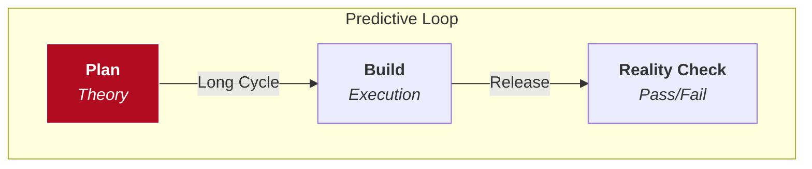
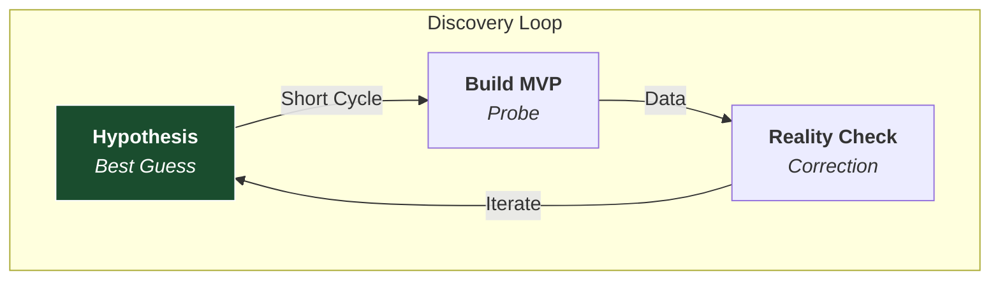

> **Principle**
> In complex systems, the winning strategy isn’t better prediction, but faster discovery—of both the problem and the solution—through interaction with reality.
{: .prompt-tip }

This principle appears again and again across very different domains.

Rationality, the Agile SDLC, science, the free market—whenever systems are operating under uncertainty, they converge on the same structure: **Generate variation, observe feedback from reality, and iterate.**

Across many domains, systems using this logic outperform systems using the opposite logic.

The opposite logic: instead of generating information through interaction with reality, systems attempt to determine the correct answer in advance. They substitute **Prediction** for **Discovery**.

Planning and building both exist in every system. The difference is which one the system uses to generate knowledge and which one it uses to filter knowledge.

| System Bias | Role of Planning | Role of Building |
| :--- | :--- | :--- |
| **Predictive Systems** | Chooses solutions | Executes them |
| **Discovery Systems** | Evaluates solutions | Generates them |

## I. The Two Types of Orientation

### 1. Predictive Orientation
*Plan → Choose Solution → Build → Reality Validates (or Refutes)*

This model assumes the problem frame and solution space are already understood.
*   **Characteristics:** Top-down innovation, Model-driven decision-making.
*   **Failure Mode:** Failure occurs when hidden assumptions collide with reality.
*   **Innovation:** Incremental improvements legible within the existing frame.
*   **Examples:** Central economic planning, Waterfall software development, large product specs.

### 2. Discovery Orientation
*Build → Generate Variation → Reality Reveals Signal → Planning Evaluates → Iterate*

This model assumes the problem framing itself may be incomplete or wrong.
*   **Characteristics:** Bottom-up exploration, Experiment-driven learning.
*   **Success Mode:** Building generates new information about both the problem and the solution.
*   **Innovation:** Can produce new frames and unexpected solutions.
*   **Examples:** Scientific experimentation, Startup MVP loops, SpaceX rapid prototyping, Game modding.

## II. The Shift: From Prediction to Discovery

For much of the 20th century, predictive planning was the rational strategy.
Building things (aircraft, industrial systems, infrastructure) was slow and expensive. A single prototype could cost millions. The optimal strategy was:

**Plan heavily → Minimize failure → Build once.**

### The Software Shock
Software changed the economics of experimentation. Suddenly, prototypes were cheap, iteration was fast, and feedback was immediate.

> **The Strategy Flip**
> When the cost of experimentation drops near zero, the optimal strategy inverts.
> It becomes cheaper and more effective to **Build → Test** than to **Plan → Predict**.
{: .prompt-info }

The companies that embraced this model (Amazon, Google, Netflix) began to dominate. They built infrastructure for continuous experimentation.

### The Companies That Lost the Transition
This shift displaced companies optimized for prediction.
*   **Nokia & BlackBerry:** Successful in the predictive hardware era. Failed when the smartphone became a software platform requiring rapid ecosystem experimentation.
*   **Yahoo & Myspace:** Operated with centralized product planning. Lost to Google and Facebook, who used large-scale A/B testing to discover user behavior.

The failure was rarely technological; it was **Organizational Alignment**. These companies were built to predict what customers wanted (Stated Preference). The new environment rewarded companies that could discover what customers actually did (Revealed Preference).

## III. The Exception: Apple

Apple appears to succeed through prediction. Products like the iPhone look like fully formed visions. But the reality is more subtle.

**Apple Still Uses Discovery — Just Earlier**
Apple does not avoid experimentation. It moves the discovery process **Upstream**.
Internally, Apple prototypes extensively: multiple hardware designs, interface experiments, component architectures.
*   **Externally:** Predict → Launch
*   **Internally:** Prototype → Test → Iterate → Select → Launch

Apple is also a useful bridge because it shows that this principle is not limited to software. Even in hardware development, progress comes from generating variation.

### Discovery in Hardware: SpaceX
The clearest example is **SpaceX**.
Historically, aerospace followed a predictive model (Simulation → Perfect Design). SpaceX inverted this. They build prototypes quickly, fly them, observe what fails, and iterate.

*   Rockets explode.
*   Structures buckle.
*   Engines fail.

Each failure produces information that cannot be obtained through simulation alone. SpaceX demonstrated that the discovery model applies even in one of the most complex hardware industries in existence.

## IV. The Rediscovery of a General Principle

What’s striking about this shift is that it did not begin as a theory. It emerged through competition. Companies that organized around shipping quickly simply produced more value under uncertainty.

Only later was it formally acknowledged that this was rediscovery of a general systems principle.

### 1. Gall’s Law (Systems Theory)
John Gall captured this in *Systemantics*:
> "A complex system that works is invariably found to have evolved from a simple system that worked. A complex system designed from scratch never works and cannot be patched up to make it work."

When systems evolve gradually, errors are exposed early. Complexity emerges through successive refinement, not perfect design.

### 2. The Scientific Method (Epistemology)
Karl Popper argued that knowledge advances not by proving theories correct, but by exposing them to the possibility of failure (Conjecture and Refutation).
Scientific progress depends on generating variation (Hypotheses) and allowing reality to select what survives (Experiment).

### 3. Markets (Economics)
Entrepreneurs launch products and business models. Most fail. The few that succeed scale. Competition acts as a selection mechanism that allocates resources toward what works. Schumpeter called this **Creative Destruction**.

### 4. Individual Rationality (Cognition)
As explored in [Rationality as a System Property](), the mind itself is a layered system.
*   **Level 1:** Perception generates candidate beliefs.
*   **Level 3:** Reflection monitors and updates the system when it fails.
A rational mind does not simply hold beliefs; it tests them against reality.

## V. Exploration Solves the Frame Problem

Exploration explains why planning alone struggles with **Ill-Defined Problems**.

As discussed in [The Frame Problem](), when the frame itself is wrong, planning simply searches the wrong space more efficiently. You become better at solving the wrong problem.

**Exploration**—tinkering, prototyping, interacting with the system—reveals constraints or opportunities that were invisible in advance. It helps collapse the search space by exposing what actually matters.

In this sense, discovery systems are not merely faster. They are better at **finding the problem itself**.

## VI. Conclusion: The Discovery Principle

When viewed in isolation, practices like Agile, A/B testing, and Rapid Prototyping look like management techniques. But seen in a wider context, they are the organizational implementation of a fundamental systems law.

Across biology, science, markets, and engineering, progress follows the same structure:
1.  **Generate Variation**
2.  **Expose to Reality**
3.  **Observe the Signal**
4.  **Retain what Works**

This is not merely a faster way of building products. It is a way of **Learning**.

Planning still has an important role. It coordinates resources, constrains the search space, and evaluates results. But planning cannot substitute for the one mechanism that produces the highest-fidelity information available to any system: **Interaction with Reality.**

That is the **Epistemic Asymmetry**.
*   Plans operate on **Models**.
*   Building exposes those models to the **World**.

In environments where the future cannot be known in advance, the system that learns fastest is the one that wins.
