"Rationality" is a technical term, but in everyday language, people hear something closer to "being coldly logical."

When we describe a "rational person," we typically imagine someone who:
*   Thinks logically.
*   Stays detached.
*   Suppresses emotion.
*   Makes decisions based on facts rather than feelings.

This creates a false binary in our mental model:
*   **Rational** = Logical
*   **Emotional** = Irrational

From a systems perspective, this is a category error.

**Rationality is not the opposite of emotion. It is the opposite of irrationality.**

Emotion and reasoning are both functional components of the cognitive system. Either of them can contribute to rational or irrational outcomes depending on how the system is regulated.

| False Contrast | Real Contrast |
| :--- | :--- |
| Reason vs. Emotion | Rationality vs. Irrationality |

## I. The Feedback Architecture

Modern cognitive neuroscience (e.g., Antonio Damasio) shows that emotion and reasoning are deeply integrated.

*   **Emotions:** Encode value, signal salience, and guide attention.
*   **Reasoning:** Interprets those signals, calibrates them against evidence, and updates beliefs.

You cannot have a functioning decision-making system without both.
Without emotion, you have no signal for *what matters*. Without reasoning, you have no mechanism to *verify reality*.

### The Feedback Loop
In a healthy cognitive architecture, these processes operate as a feedback loop rather than a hierarchy.

**System Health vs. System Failure**
Rationality is the **Integrity** of this loop. It is the state where:
1.  **Emotions** guide reasoning toward relevant problems.
2.  **Reasoning** constrains emotions with evidence.

**Irrationality** is not "being emotional." It is a breakdown in system regulation.
*   **Motivated Reasoning:** Emotion overrides Logic (Reasoning becomes a lawyer for feelings).
*   **Low EQ:** Logic disconnects from Emotion (The system loses the signal for what matters).

What we call emotional intelligence is hence a _subset_ of rationality.

## II. The Historical Bug: Plato vs. Descartes

If the systems view is so clear, why is the "Spock" model (Rationality = No Emotion) so dominant?

The misconception didn't come from nowhere. It is a legacy bug introduced by the **Cartesian Split**.

### 1. The Cartesian Error (Dualism)
René Descartes modeled the mind as a "thinking substance" distinct from the "physical body." He effectively introduced a hardware/software abstraction error into Western philosophy. By treating the mind as pure software and the body (where emotions are felt) as hardware, emotions were downgraded to an interface between the two - and largely noise.

This is similar to the [Legacy Bug]() that Heidegger identified in the Civilizational Stack: the Subject/Object Split. By separating the "Thinker" from the "World" (and the body), Descartes created a system architecture where Reason is a different thing from both Meaning and Emotions, and must constantly fight against its own hardware.

Cultural Output: Reason → Science/Progress. Passion → Mob/Fanaticism.

### 2. The Platonic System (Integration)
Ironically, the ancient view was more similar to the modern cognitive one. In *The Republic*, Plato describes the psyche not as a duality, but as a **System of Three Parts**.

| Part | Function | Modern Analogue |
| :--- | :--- | :--- |
| **Logos** (Reason) | Deliberates, seeks truth | Executive Function |
| **Thumos** (Spirit) | Drives honor, anger, motivation | Emotional/Motivational System |
| **Epithumia** (Appetite) | Bodily drives | Reward/Impulse System |

Plato’s metaphor of the **Charioteer** is explicitly systemic.
The Charioteer (Reason) does not fight the horses (Emotion/Appetite), but **Coordinates** them. A chariot with no horses doesn't move.

For Plato, rationality—what he calls Dikaiosyne in the soul—is the correct ordering of its components. It is a **Structural Property** of the system, not a mechanism for suppressing emotion.

> **Justice as System Health**
> 
> Dikaiosyne is often translated as “justice,” but the Greek term does not always map perfectly onto the modern English meaning of legal fairness. Plato’s concept is closer to **Proper Order** or **Functional Harmony**.
> 
> In the soul, it simply means that each part performs its proper role: reason guides, spirit supports it, and appetite is disciplined.  
> {: .prompt-info }

Rationality, in this sense, is not the suppression of emotion. It is the **Healthy Architecture** of the psyche. Like any systems architect, Plato draws on structurally similar systems at different levels of abstraction.

His favourite analogy is the fractal relationship between the macro-system of the City (Polis) and the micro-system of the Soul (Psyche).

## III. The Hierarchy of Cognition

We can map the precise relationship between the terms we use. They are not synonyms; they are different layers of the stack.

```mermaid
graph TD
    L1[<b>Level 1: Reasoning</b><br><i>The Tool</i>]
    L2[<b>Level 2: Rationality</b><br><i>The System Health</i>]
    L3[<b>Level 3: Wisdom</b><br><i>The Orientation</i>]

    L3 -->|Directs| L2
    L2 -->|Regulates| L1

    style L2 fill:#1a4d2e,stroke:#fff,color:#fff
    style L3 fill:#3d3d3d,stroke:#fff
```

### 1. Reasoning (The Tool)
*   **Definition:** The cognitive ability to draw inferences and construct arguments.
*   **Nature:** It is value-neutral. A paranoid schizophrenic often displays high *reasoning* ability (internal logic), but high *irrationality* (disconnected from reality).

### 2. Rationality (The System Health)
*   **Definition:** The correct operation of the cognitive architecture.
*   **Nature:** It ensures that reasoning tracks evidence and that emotions are calibrated to reality. It is the regulatory layer.

### 3. Wisdom (The Orientation)
*   **Definition:** The orientation and alignment of the system.
*   **Nature:** Rationality ensures you *can* navigate; Wisdom determines *where* you navigate.

For Plato, wisdom was an orientation to the Good. Elsewhere, I will dig into that further.

Here, I want to give my systems definition of wisdom:

> **System Definition**
> Wisdom is the capacity to orient oneself appropriately toward what matters across changing situations, and to enact that orientation through ongoing learning, embodiment, and adjustment.
{: .prompt-tip }

## IV. Conclusion: Rationality as Integrity

We need to deprecate the "Reason vs. Emotion" model. It is an architectural dead end.

Rationality is not about suppressing the signals from your body (Thumos/Appetite). It is about integrating them into a coherent system where:
*   **Emotion & Perception** provide the *Inputs* (Signal).
*   **Reasoning** provides the *Structure* (Regulation).
*   **Wisdom** provides the *Orientation* (Direction).

When we view rationality as **System Integrity**, it stops being a trait of the cold and detached, and becomes a capability of the integrated and effective.

By this model, **Emotional Intelligence** is simply the rationality of the emotional subsystem. It is the bidirectional loop where emotions efficiently guide reason, and are properly guided by it.
