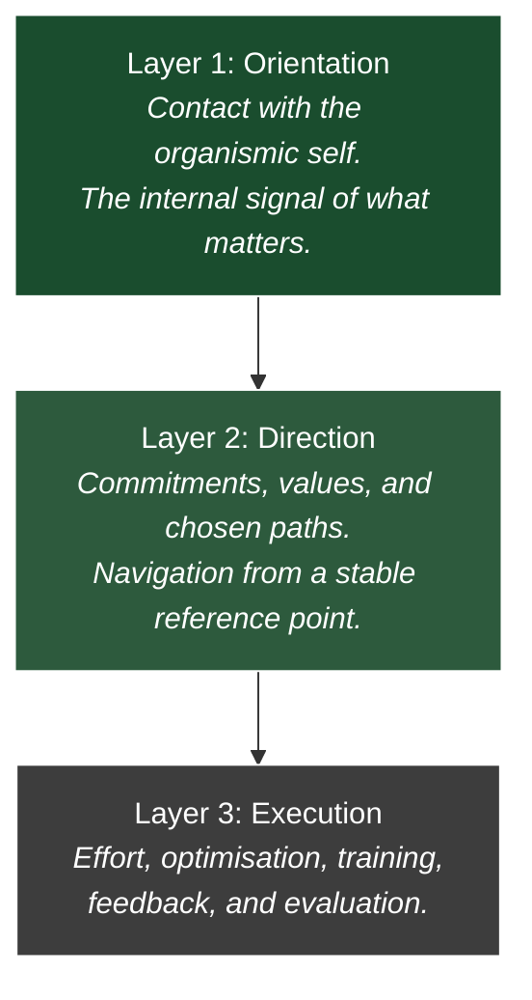

> You cannot engineer flourishing. You can only create the conditions for it.
{: .prompt-tip }

## Flourishing Across the Layers

In a [recent piece](), I argued that health cannot be understood as a single metric — not as muscle gain, not as the absence of injury, not as any one protocol getting the inputs right.

Debugging a shoulder problem all the way down the stack revealed something unexpected: the category of "health" itself starts to look like an arbitrary boundary. Fix the shoulder and you're dealing with posture, then movement patterns, then the nervous system, then orientation — the question of what the whole system is actually *for*. Health, properly understood, is an emergent property of a system that is functioning well across all its layers simultaneously.

That piece ended with a positive vision: design whole environments for whole human beings, in service of genuine flourishing. But it left a question open. If flourishing is what the system is running *for* — if it's the telos that gives the whole architecture its direction — what does it actually take to establish it? Not structurally, but psychologically. What makes the foundational layer so hard to get right, and so easy to quietly lose?

The word I kept circling was flourishing itself.

Not health in the maintenance sense — the absence of dysfunction, the green dashboard. Something richer than that. Aristotle called it *eudaimonia*: not happiness as a feeling, but as a condition. The full functioning of a thing according to its nature. A plant that has had enough light and water and room to grow doesn't just survive. It becomes fully what it is.

That's the distinction I want to pull on here. Maintenance keeps the system running. Flourishing is what the system is running *for*.

And the question that follows is: what does it actually take to get there? Not as an abstract philosophical question, but as a practical one. What are the conditions? Who has thought most clearly about them? And why, in a culture obsessed with optimisation and self-improvement, does it remain so elusive? The answer, I think, is sequencing. We are applying the right tools in the wrong order.

## The Invisible Load-Bearing Foundations

In the [Civilisational Stack](), I argued that the most important layers of any system are often the least visible. STEM disciplines sit downstream. They are nested within broader conceptual foundations — values, meaning, orientation — that they rely on but rarely interrogate.

The same architecture applies to a life.

Most of what we consciously work on sits at the upper layers. Career progression. Skill accumulation. Fitness metrics. Relationship logistics. These are real and they matter. But they run on top of something. And that something is easy to ignore precisely because, when it's working, it's invisible.

You don't notice the foundation when the building is standing.

The danger is that foundations can erode silently. Not through a single dramatic failure but through gradual drift — a slow accumulation of conditions that suppress the deeper signal without ever triggering an obvious alarm. The upper layers keep functioning. The dashboard stays green. And yet something is off in a way that's hard to name.

I wrote about this in the context of the gym practice. The optimised training protocol was working by every legible measure. Strength was increasing. The metrics were moving. But the thing the practice was originally for — the groundedness, the warmth, the embodied presence — had been quietly overwritten. Not because anyone decided to remove it. But because it was never made explicit enough to defend itself.

Undocumented load-bearing infrastructure is the most vulnerable kind.

The question is: what sits at the deepest layer? What is the foundation that everything else — health, direction, meaning, the capacity to flourish — actually stands on?

## Orientation as the Deepest Prerequisite

Before flourishing, there is orientation.

Not in the navigational sense — knowing which direction to travel, which goals to pursue, which path to take. That's a second-order question. It assumes you already know where you're standing.

Orientation in the deeper sense is prior to that. It's the condition of being in contact with yourself clearly enough to ask the question at all. Of knowing, from the inside, what matters and what doesn't. Of having access to your own signal rather than operating on borrowed maps.

Without it, the navigational questions don't resolve. You can be highly competent, well-directed, and materially successful while still feeling — in some persistent, low-grade way — that you are living someone else's life. Moving efficiently toward destinations you never quite chose. Performing a self rather than inhabiting one.

This is what an existential crisis actually is, I think. Not a dramatic collapse, though it can become that. More often it's quieter than that. A growing sense of disorientation. The navigation metaphors we reach for are telling: *on the wrong track. Lost. Going in circles. Not sure where I'm headed.*

All of these are spatial. They assume movement through a landscape. But the crisis isn't usually about the landscape. It's about the loss of the internal reference point that made the landscape legible in the first place.

You can't navigate without knowing where you are. And knowing where you are — really knowing, not just inferring from external markers — requires being in contact with something deeper than the current set of goals and obligations.

That contact is what I mean by orientation. It is knowing, from the inside, what matters — not as an abstract list of values, but as a felt signal that precedes and grounds any articulation of them. In the [architecture of the rational mind](), I defined wisdom as the capacity to orient toward what matters across changing situations. Orientation, in this sense, is that capacity made present — deeper than the map is how we want to use the map. Where do we want to go? Why? That turns out to be a prerequisite for almost everything else.

## The Stack of Human Functioning

You can think of a life as operating across several layers, each with a different function.

Each layer depends on the one below it. Execution works only when direction is clear. Direction works only when orientation is intact.

The logic of each layer is also different. Evaluation and feedback are essential at layers two and three — they are how direction gets refined and execution improves. Applied at layer one, before orientation is intact, the same evaluation becomes the interference that suppresses the signal it's trying to read. You cannot debug your way to orientation. You can only create the conditions for it to surface.

Most modern self-improvement focuses on the execution layer. The argument here is that flourishing depends on getting the sequence right — and that means starting at the bottom, not the top.

## Flourishing and Orientation — Inside Out, Not Forward

It's worth pausing on the difference between these two metaphors, because they pull in different directions.

Orientation is typically a navigation metaphor. It implies a landscape, a position, a direction of travel. To be oriented is to know where you are relative to something else. It's inherently relational — you orient *toward* something, *away* from something, *along* a bearing.

Flourishing is a biological metaphor. It doesn't imply movement through space. It implies growth from within. A plant doesn't flourish by travelling somewhere. It flourishes by becoming more fully what it already is, given the right conditions.

That distinction matters practically.

True orientation at this deepest layer isn't about reading a map. It’s about calibrating a compass. A compass doesn't need to know the destination, and it doesn't need to be pushed; it simply aligns with the magnetic field the moment you remove the iron interference around it. If anything, your existing maps might get in the way.

If you frame the problem as orientation in the *navigational* sense, the implied intervention is forward movement. Find the right direction. Set better goals. Clarify your values. Choose a path. These are all legitimate, but they operate at the upper layers. They assume the internal reference point is already stable enough to navigate from.

If you frame it as flourishing, the implied intervention is different. Not forward movement but inward conditions. Not *where am I going* but *what does this organism actually need to grow*. The question points downward rather than outward.

This is why the moments I keep returning to — the farm, the quiet gym, the walk home under the stars, the park — don't fit the navigation frame. I wasn't travelling anywhere in those moments. I wasn't making progress toward a goal. Something else was happening. Something more like growth from the inside, briefly unobstructed.

Flourishing at this level happens from the bottom up, from the inside out. You don't aim at it directly. You create the conditions for it. And then, if the conditions are right, it happens on its own.

Which immediately raises the question: what are those conditions? And who has thought most carefully about them?

## You Create Conditions, Not Outcomes

There is a particular kind of mistake that systems thinkers are prone to.

Having understood that a system has structure — that outcomes have causes, that causes can be identified, that interventions can be designed — the temptation is to assume that the right outcome can be directly engineered. That flourishing, like productivity or revenue, is something you can optimise toward if you just get the inputs right. Applied to an aligned system, this logic works. Applied before alignment is established, it actively distorts the perceptual field.

The [Discovery Principle]() post touched on this. In complex systems, the winning strategy isn't better prediction but faster discovery — through interaction with reality rather than control of it. You create the conditions for reality to reveal the signal. You don't manufacture the signal directly.

The same logic applies here. You cannot manufacture flourishing at the orientation layer. You cannot schedule it, optimise toward it, or install it as a line of code in a JSON document and expect it to run. The moment it becomes a target it starts to recede — because the targeting itself introduces the evaluative pressure that suppresses the conditions it requires.

What you can do is ask a different question. Not *how do I produce flourishing here* but *what is currently preventing it*. Not additive but subtractive. Not another protocol but the removal of interference.

This reframes the entire project of self-development. The first goal isn't construction. It's clearing.

And nobody thought more carefully about what that clearing actually requires than Carl Rogers.

## The Plant Analogy — Rogers and Plato Converge

Rogers was a psychotherapist, not a philosopher. He arrived at his conclusions empirically, but through thousands of hours sitting with people in distress, watching carefully what actually produced change and what didn't.

What he observed was this: when certain conditions were present in the therapeutic relationship, people moved — naturally, without being pushed — toward health, growth, and fuller functioning. When those conditions were absent, they didn't. The therapist's theories, interpretations, and directives mattered far less than the quality of the conditions they created.

He called the underlying force the **actualising tendency**. The inherent drive of every organism toward growth, wholeness, and the realisation of its own potential. Not something that needed to be installed or activated. Something that was always already there, pressing forward, waiting for the conditions that would let it operate.

His analogy was potatoes in a dark cellar.

Even in the most inhospitable conditions — no soil, no proper light, no water — potatoes will send out pale, spindly shoots toward whatever light source exists. The growth is distorted, effortful, barely functional. But the tendency itself never stops. It just needs better conditions to produce something healthy rather than something merely surviving.

What struck me when I first encountered this was how precisely it maps onto Plato's image of the sun.

In the *Republic*, Plato uses sunlight as the analogy for what we orient toward — the Good, the source of intelligibility and value. Not something we manufacture or argue ourselves into. Something we turn toward naturally, the way a plant turns toward light, once the conditions allow it. For Plato, wisdom is our ability to orient towards the true forms of things, not their shadows.

Two thinkers, separated by two and a half thousand years, arriving at the same image from opposite directions. Rogers from the therapy room. Plato from the cave.

That convergence is worth taking seriously.

## The Actualising Tendency — Growth Toward the Light

What Rogers was pointing at with the potato analogy wasn't a therapeutic technique. It was a claim about human nature.

The organism knows, at some level, what it needs. Not always consciously. Not always articulately. But there is a signal — a persistent, pre-cognitive orientation toward what is nourishing, integrating, growth-producing. Toward what Rogers called full functioning. Toward what Aristotle called *eudaimonia*. Toward what I've been calling flourishing.

This signal doesn't need to be taught or installed. It's prior to all of that. It's what you're left with when the interference clears.

The interference is what gets installed. The conditions of worth — the implicit rules about who you need to be in order to be acceptable, lovable, safe. These accumulate through development, through culture, through repeated exposure to evaluative environments. They don't replace the actualising tendency. But they can suppress it so thoroughly, for so long, that it becomes almost inaudible.

Almost. Not completely.

This is what I recognise in the moments I keep returning to. The farm. The quiet gym. The walk home under the stars. The park. In each of them, something about the conditions suspended the interference long enough for the signal to become audible again. Not a new signal. A remembered one. The nostalgic quality of return — arriving somewhere that was always there.

Rogers' insight is that this isn't mystical. It's biological. The organism is always pressing toward the light. The question is only whether the conditions allow it to grow straight or force it to grow crooked.

And crucially — this layer cannot be approached like the others.

## This Cannot Be Forced

This is the part that resists the systems thinker in me.

Every other post on this blog is, at some level, about how to engineer better outcomes. How to identify leverage points. How to design transmission layers. How to update operating systems. How to create the conditions for asymmetric value.

And all of that remains true and useful. But it depends on a prior condition that is easy to skip.

In the[Civilisational Stack](), I drew a distinction between two states a system can be in. When a system is aligned — when the connection between input and output is valid and the "why" is settled — value comes from throughput: pushing more through the machine. When a system is misaligned — when that connection is broken or ambiguous — throughput becomes irrelevant, or worse, counterproductive. You scale the wrong thing faster. Value at that point comes from definition: re-establishing what the system is actually for before you start optimising it.

This is not an argument against goals, effort, or optimisation. It is an argument about sequencing. Those things are exactly right, applied in the right order. The problem isn't goal-setting. It's applying goal-directed logic to a layer that hasn't been aligned yet — using throughput thinking on a system still in need of definition.

Alignment at this layer looks less like optimisation and more like clearing up ambiguity. It's not about pushing harder toward an output. It's about re-establishing that the connection between who you are and how you're living is actually valid. Once that connection is clear, effort compounds. Before it is, effort hides the problem.

In the language of organisations: performance management only works inside a baseline of psychological safety. Apply it without that baseline and you don't get poor performers improving — you get poor performers hiding. The sequencing error doesn't make performance management wrong. It makes it premature.

Because the actualising tendency is not a lever. You cannot pull it. You cannot mandate it into operation the way Jeff Bezos mandated Amazon's API architecture, or the way David Stirling forced irregular warfare into the British Army's doctrinal layer. Those were systems that responded to top-down intervention. This one doesn't.

In fact, top-down intervention is precisely what suppresses it.

The moment flourishing becomes a goal — something to achieve, something to measure progress toward, something to optimise — it recedes. Not because the goal is wrong but because the goal-directed stance itself reintroduces the evaluative pressure that creates the conditions of worth. You are back to performing. Back to monitoring. Back to the gap between where you are and where you should be.

This is Rogers' paradox of change, and it is genuinely paradoxical.

> Carl Rogers' paradox of change: "The curious paradox is that when I accept myself just as I am, then I can change".
> This means that lasting personal transformation requires first fully accepting one's current reality, flaws, and feelings, rather than forcing change through self-loathing or denial.
{: .prompt-tip }

The pathway to becoming more fully yourself is not through directed effort at this layer — not because effort is wrong, but because this layer responds to a different kind of work. Above it, push harder. At it, create the conditions. The sequence is: alignment first, then scaling. Movement becomes possible only through the suspension of that effort — through creating a space in which you are accepted, by another person, by a practice, by an environment, by yourself, exactly as you are. In that acceptance, without any forcing, what was blocked begins to move.

The plant doesn't try to grow. It just grows, when the conditions are right.

Which means the work is never on the flourishing itself. It is always, only, on the conditions.

## The Counsellor as Condition-Creator — The Servant Leadership Parallel

If the actualising tendency cannot be forced, only liberated, then the role of the therapist becomes something quite specific.

Rogers identified three conditions that were necessary and, he argued, sufficient for therapeutic change to occur. Unconditional positive regard — acceptance of the client without evaluation or judgement. Empathic understanding — genuine attempt to see the world from inside the client's experience. Congruence — the therapist being authentically present rather than performing a professional role.

Notice what is absent from that list.

Diagnosis. Interpretation. Technique. Direction. Expertise deployed on the client's behalf. All of the things we might assume a therapist is for.

Rogers wasn't against knowledge or skill. But he was precise about what actually produced change. It wasn't the therapist's theory of what was wrong or their prescription for what should happen. It was the quality of the conditions they created. The therapist's primary competence was in making the space safe enough for the client's own organism to do what it already knew how to do.

This maps almost exactly onto the [servant leadership model]() from an earlier post. 

After all, a company is simply a complex organism made up of individual organisms; it responds to the exact same biological truths. Simon Sinek's argument was that leaders who create safety — who remove the threat of internal judgement and competition — unlock a transmission layer that fear-based leadership destroys. The circle of safety isn't kindness for its own sake. It's the structural precondition for collaboration, creativity, and the kind of risk-taking that produces asymmetric value.

Rogers and Sinek are describing the same mechanism at different scales. The therapist and the servant leader are both, fundamentally, condition-creators. Their leverage comes not from directing the system but from creating the environment in which the system can direct itself.

The insight scales. From the therapy room to the team to the organisation to the culture.

Which raises an uncomfortable question about the culture we actually live in.

## The Mechanism Beneath the Woo — Evaluation Creates the False Self

Rogers is easy to dismiss. The language of unconditional positive regard and the fully functioning person can sound soft, imprecise, insufficiently rigorous. In professional and intellectual circles — particularly British ones — there is a reflexive scepticism toward anything that sounds like it belongs in a self-help section.

That scepticism is worth setting aside here. Because the mechanism Rogers identified is precise, structural, and maps directly onto observable behaviour.

It works like this.

When we exist in evaluative environments — where acceptance feels conditional on performance, appearance, correctness, or status — the organism adapts. It learns, usually early and usually without conscious awareness, that certain aspects of the self are unsafe to show. Fears. Wounds. Uncertainty. Failure. The parts that might invite judgement or withdrawal of approval.

So it builds a presentation. A curated self. Coherent enough to function socially, managed carefully enough to minimise exposure. Rogers called this the self-concept — the image of who we need to be — as distinct from the organismic self, who we actually are.

The gap between the two is the cost of the evaluative environment. This idea of the curated or false self—a presentation that becomes a distortion in our own self-knowledge and self-awareness—is incredibly close to Plato's idea of the prisoners in the Cave, stuck looking only at shadows and mistaking them for reality.

But the cost is not just psychological or philosophical. It is operational.

In the [architecture of trust]() post, I wrote about how fear destroys the transmission layer. When people are protecting themselves from internal threat, they stop sharing information, stop taking risks, stop surfacing errors. The network stops transmitting. The system optimises for self-protection rather than value creation.

That's not a metaphor. It's the direct organisational consequence of conditions of worth at scale.

The false self doesn't just cost the individual. It costs every system the individual participates in.

Which means the inverse is also true. But this requires a precise distinction. The argument is not that nothing should ever be evaluated. Feedback, error correction, and honest challenge are essential — they are how systems learn and improve. The Discovery Principle depends on them.

The point is narrower. Chronic evaluation as a structural condition — where acceptance feels perpetually conditional — produces the false self as a defensive adaptation. That's different from specific, well-timed, good-faith error correction. And crucially, the latter only functions when the former is absent.

Amy Edmondson's research on psychological safety makes this concrete. The highest-performing teams weren't the ones where nothing was ever criticised. They were the ones where errors surfaced earliest and most honestly — because the baseline conditions made that safe. Safety enabled correction. Remove the safety and the errors don't disappear. They go underground.

In systems terms: psychological safety isn't a welfare consideration. It's an observability condition. You cannot debug what the system is hiding from you.

Rogers wasn't against accountability. He was identifying what makes accountability actually work. Chronic evaluation doesn't produce transformation. It produces concealment. Which means the errors most in need of correction are precisely the ones least likely to surface.

The therapy room and the high-performing team are, structurally, the same system. Different scale, same mechanism.

## Safety Creates the Conditions for the Real Self to Emerge and Flourish

If chronic evaluation, defensiveness, and shame produce the false self, the inverse is equally precise.

When the conditions of worth are suspended — when acceptance stops being conditional — something shifts. Not immediately, and not always dramatically. But the organism begins to move. Toward honesty. Toward risk. Toward the parts of itself it had learned to keep hidden. Toward what it actually needs rather than what it has learned to perform.

That movement is vulnerability. Not vulnerability as weakness or exposure, but as the specific act of bringing the hidden parts of the self into contact with another person — or with your own awareness — without defensiveness. Without the armour.

This is harder than it sounds. The false self doesn't give up its position easily. It was built precisely to prevent this. Every instinct honed in evaluative environments points away from it — toward management, toward performance, toward keeping the gap invisible. Vulnerability means doing the opposite. Letting the gap be seen. Trusting that what's on the other side of that exposure isn't judgement but contact.

Rogers understood that this trust cannot be demanded or reasoned into existence. It has to be earned by the conditions. Which is why the quality of the environment is not incidental — it is the whole thing. In a space that has genuinely suspended evaluation, vulnerability becomes possible. And vulnerability is what allows the real self to surface rather than the managed one.

This is what Rogers observed in the therapy room, consistently enough to build a theory around it. Given the right conditions, people don't need to be directed toward health. They move there on their own. The actualising tendency does the work. The therapist's job is simply to create and hold the space.

This matters beyond the therapy room.

I've felt this in specific places and moments. The farm in Australia. The quiet gym before it got crowded. In Italy with my fiancée. The park alone. Each of them had something in common — not comfort exactly, not the absence of challenge, but the absence of ambient judgement. A space where I didn't have to manage how I was being perceived. Where the self-concept could relax its vigilance. An environment of safety and beauty.

And in that relaxation, something became accessible that isn't accessible in the armoured state. Not just comfort. Clarity. The sense of being in contact with my own signal rather than managing the gap between who I am and who I'm supposed to be.

Rogers called this congruence — the closing of the gap between the organismic self and the self-concept. Not a permanent achievement but a condition. One that fluctuates with the environment, with the quality of relationships, with the degree to which the surrounding culture installs or suspends conditions of worth.

Which is why environment matters so much. Not just as a backdrop but as an active structural condition. A high-judgement culture doesn't just feel unpleasant. It makes congruence harder to maintain. It raises the cost of authenticity. It pushes the organism toward the defensive crouch of the false self as the path of least resistance.

And a low-judgement environment does the opposite. It lowers the cost of being real. It makes honesty cheap and concealment unnecessary. It creates the conditions in which people can surface errors, take risks, share what they actually think, and move toward what they actually need. It creates genuine relationships between people.

At the deepest levels, this is what flourishing looks like from the inside. Not only achievement. Not only optimisation. Not only the green dashboard.

Contact with yourself. Warmth toward yourself. The embodied sense of being at home in your own life.

You cannot engineer it. You can only create the conditions for it.

And then — if the conditions are right — it happens on its own.

And when it does, it creates the conditions for everything downstream. Achievement. Optimisation. The green dashboard. Not only as local optimisations, but as natural expressions of a system that is oriented towards flourishing.

The green dashboard matters. Achievement matters. Optimisation matters. But they are second in sequence, not first.

Optimisation is powerful. It multiplies whatever objective it is pointed at. If the orientation is clear — if the connection between who you are and how you are living is intact — that multiplication produces growth. Effort compounds. Skill compounds. A life gathers momentum.

But if the orientation is missing, optimisation does something else. It scales the wrong objective. The system becomes more efficient at moving in directions that were never truly chosen. The dashboard goes green while the underlying signal drifts further out of reach.

This is why flourishing cannot be engineered directly. It cannot be produced by pushing harder on the upper layers of the stack. It emerges only when the deepest layer is intact — when the organism is in contact with its own signal and free to orient toward what actually matters.

Get that layer right and optimisation becomes an ally. Effort begins to work with the system rather than against it.

Get it wrong and optimisation quietly replaces the very thing it was meant to serve.
