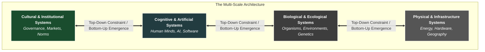

---
title: "The Architecture of Systems: A History, A Dictionary, and A Toolkit"
date: 2026-03-14 12:00:00 +0000
categories:[Systems, Tools]
tags: [systems-thinking, mental-models, complexity, history, engineering, architecture]
toc: true
mermaid: true
description: "A definitive guide to systems thinking. The history, the dictionary, and the toolkit for understanding and building in a complex world."
---

As I’ve thought through the topics on this blog, an underlying theme has gradually become clear: a tendency to think about the world in terms of systems. 

Looking back, many of the subjects that drew my attention from a young age shared a common thread. Biology explains the systems of life. Philosophy explores the deepest structures of meaning and reality. Psychology investigates the systems of the mind. Computing builds systems that process information. I was always naturally interested in these subjects—not only the individual things in isolation, but also how they fit into a larger structure.

At school, I had an aptitude for mathematics, but I found it frustrating when it was taught primarily as abstract procedures disconnected from reality. What interested me was the explanatory power of mathematical ideas—their ability to describe the systems underlying the world.

What fascinates me is real-world systems: ones that I can interact with,  ones that drive real-world results.

In previous essays, I’ve used "systems thinking" and "architectural thinking" somewhat interchangeably. There is a strong overlap, but a key difference:
*   **Systems Theory** is oriented toward *understanding*. It provides the conceptual frameworks and analytic tools to map complex reality.
*   **Architectural Thinking** is oriented toward *building*. It applies systems theory to design structures—whether software, organizations, or doctrines—that produce desired outcomes.

In this piece, I want to map the territory explicitly. This is a history, a dictionary, and a toolkit of systems thinking. It traces how humanity learned to understand complexity, how those tools occasionally failed us, and how we debugged our own civilisational operating system to build the modern world.

---

## I. The Greek Foundation: Wholes, Harmony, and Telos

Human intellectual history is not a straight line of progress. Sophisticated thinking existed in Mesopotamia, Egypt, India, China, and many other places. But intellectually, ancient Greek culture developed something unusually powerful: a sustained commitment to **naturalistic explanation**—the attempt to explain the world through underlying principles and structural causes rather than mythological narratives or _supernatural_ causes.

### 1. The Original Systems Problem: One vs. Many
Before Plato and Aristotle, the pre-Socratic thinkers wrestled with some of the most fundamental structural question of reality, such as: *Is reality ultimately one thing, or many things?*

Parmenides argued for unity. At a deep level, everything is interconnected; boundaries are arbitrary. Heraclitus argued for change. Everything is in motion; you cannot step into the same river twice. 

In modern terms, this is still a foundational systems problem: **How can a coherent whole exist while being made up of many changing parts?** The Greeks were giants: by attempting to reason their way toward a unified picture of the cosmos (reality) from first principles, they pioneered the systems theory approach of searching for underlying structure.

### 2. Plato: System Properties and Orientation
Plato shifted the focus from *what* reality is made of to *what gives it order*. 

In *The Republic*, Plato draws a striking parallel between the human mind (reason, emotion, desire) and the political community (different classes and roles). For Plato, ideas like Justice (*Dikaiosyne*), Truth, and Beauty are not mysterious moral abstractions. They are concrete descriptions of **System Properties**. 
*   **Justice** is harmony within a system—when parts are properly ordered and balanced, not pulling against each other.
*   **Goodness** is the flourishing that emerges when a system functions as it should.
*   **Truth** is the alignment between our understanding and the external structure of reality.

Plato also introduced the concept of **Orientation**. In the Allegory of the Cave, understanding does not come from accumulating information; it comes from a turning of the soul (periagōgē). In other words, system alignment is a crucial consideration; and so to avoiding misalignment. Correct understanding requires aligning our psyche (mind) with the deeper structure of the cosmos (reality).

### 3. Aristotle: Function, Telos, and Logic
Aristotle pushed these ideas from abstract harmony into practical mechanics. He introduced the idea of **Function**—asking *what is this part for?* 

This led to **Telos** (purpose or end). The *Telos* of a system is the role it naturally fulfils when functioning properly. A seed is oriented toward becoming a tree. This emphasises that systems are not static objects; they unfold through stages, moving from **Potentiality** to **Actuality**. Aristotle recognized that a system's structure constrains its *possibility space*—the range of futures it is capable of producing.

Aristotle also invented formal **Logic**, which treats *thought itself* as a system. If the structure of relationships between ideas is correct, the system of reasoning produces valid conclusions. Logic can be understood as the study of valid structures in systems in general.

### The Failure Mode: Loss of Origin and Dogmatization
This Greek civilisational architecture scaled massively, absorbed into the Roman, Islamic, and Christian worlds. But as it scaled, it encountered a structural bug: **Loss of Origin**.

The Greeks built this framework through radical, open-ended *first-principles inquiry* (best embodied by Socrates). But in medieval Europe, for example, Aristotelian frameworks were imported wholesale and fused with theological doctrine. The downstream architecture was preserved, but at the deeper layers, the generative method of open inquiry was suppressed. The system drifted from investigation into dogma.

> ### 🧰 Toolkit 1: The Classical Concepts
> *   **First-Principles Thinking:** Reasoning upward from fundamental, irreducible truths.
> *   **Holism:** The behaviour of the whole cannot be understood simply by looking at isolated parts.
> *   **System Properties:** Harmony, stability, and goodness are emergent results of correctly ordered relationships.
> *   **Balance and Proportion:** Healthy systems maintain key variables within stable ranges rather than extreme states.
> *   **Orientation:** Systems can be aligned toward or away from truth, stability, or flourishing depending on how their internal structures are organised and interact with reality.
> *   **Function (Telos):** The functional purpose or end-state a system is oriented toward.
> *   **Component Functional Analysis:** Components are best understood in terms of the role they play within the larger system.
> *   **Potentiality and Actualisation:** Systems contain latent possibilities that may or may not become realised depending on conditions.
> *   **Possibility Space:** The constrained set of potential future states a system can occupy.
> *   **Form / Structure:** The organisation of relationships between components determines system behaviour, not just the components themselves.
> *   **Relational Structure:** The behaviour of a system depends on how its parts interact with one another.
> *   **Multi-Lens Analysis:** Complex systems often require multiple explanatory perspectives, such as components, structure, processes, and purpose.
> *   **Hierarchy of Organisation:** Systems often contain nested levels where smaller systems combine to form larger ones.
> *   **Constraints:** Systems are shaped not only by their components but by the limits and rules that define what behaviours are possible.
> *   **Logic:** A formal framework for analysing relationships between propositions, enabling rigorous reasoning about system structure and behaviour.

---

## II. The Scientific Revolution: Decomposition and Mechanics

By the late medieval period, systems thinking had drifted into purely conceptual territory. Scholars debated the internal consistency of ideas rather than observing the world. 

### 1. Bacon and the Empirical Feedback Loop
Francis Bacon mounted a radical response: knowledge should be built upward from systematic observation. He introduced a systematic form of **Empiricism**. 

From a systems perspective, empiricism is a tool for stabilizing thought. It creates a **Feedback Loop** between conceptual models and reality. Theories generate predictions, observation tests them, and the model updates. It transforms knowledge production into an error-correcting learning system.

### 2. Descartes, Newton, and the Analytic Toolkit
This was part of a broader reorientation that birthed the Scientific Revolution. Descartes championed the method of **Decomposition**: dividing difficult, complex problems into smaller, isolated components. Newton applied this to motion and gravity, synthesizing it into mathematical laws.

This shift was profound. Where the Greeks focused on *wholes, harmony, and purpose*, the new science focused on *components, mechanisms, and causal laws*. 

### The Failure Mode: Component Bias and the Cartesian Split
This toolkit was extraordinarily effective for certain physical systems (mechanics, astronomy), and it unlocked the Industrial Revolution. But its success led to a massive over-extension. 

Descartes famously divided reality into mind and matter, treating the body and nature as complex, deterministic machines. This created **Component Bias** (Reductionism)—the assumption that if you break a system into parts to study it, those parts are fundamentally independent in reality. 

When applied to living organisms, ecologies, or societies, reductionism struggles. It creates **Emergence Blindness**, failing to see that the most important properties of a complex system arise from the *interactions* between parts, not the parts themselves.

> ### 🧰 Toolkit 2: The Analytic Methods
> *   **Empiricism:** Testing mental models against reality to force error-correction.
> *   **Decomposition:** Breaking complex phenomena into smaller, isolatable components.
> *   **Controlled Experimentation:** Manipulating variables to determine precise causal relationships.
> *   **Mathematical Modelling:** Representing system structures through quantitative relationships.
> *   **Mechanistic Explanation:** Asking *how* a system works (causality) rather than *why* it exists (purpose).
> *   **Idealisation:** Simplifying systems to isolate the core mechanisms that generate behaviour.
> *   **Analytical Isolation:** Studying components independently in order to understand their behaviour.
> *   **Law-Seeking:** Searching for universal rules that apply across many systems.
> *   **Predictive Modelling:** Using models to forecast system behaviour under different conditions.
> *   **Deterministic Dynamics:** Modelling systems as governed by stable laws where future states follow from initial conditions.
> *   **Replication:** Repeating experiments to verify that results are reliable rather than accidental.
> *   **Quantification:** Translating phenomena into quantities that allow precise comparison and prediction.
> *   **Measurement:** Finding observable and quantifiable signals so that system behaviour can be compared, tested, and modelled.
> *   **Observability:** The ability to infer the internal state and behaviour of a system through measurable signals and indicators.
> *   **Instrumentation:** Extending human observation through tools that measure phenomena beyond natural perception (telescopes, microscopes, sensors).
> *   **Calibration:** Adjusting models to match observed empirical data.
     
---

## III. Deep Time and Decentralized Order

The mechanistic model tended view systems as static, predictable assemblies -- like "clockwork" or "billiard balls". But in the 18th and 19th centuries, three domains shattered this illusion: Geology, Biology and Economics.

### 1. Geology, Evolution, and Deep Time
Geologists like James Hutton and Charles Lyell proved the Earth was not a static structure created in a single event, but a dynamic system shaped by slow processes accumulating over **Deep Time**. 

Understanding complex systems required understanding their long history, sometimes over millions of years. 

Charles Darwin applied this to biology. Evolution demonstrated that species are not fixed entities; they are populations changing through variation, selection, and environmental feedback over extremely long time periods. Darwin revealed that highly complex, adapted systems could emerge *without a central designer*. 

Evolution is a distributed learning process. The environment defines the constraint space, and populations explore it through trial and error across generations. 

### 2. Economics and the Invisible Hand
Simultaneously, the Physiocrats and Adam Smith were studying human systems operating in real-time. They realised that the economy was not a machine to be driven, but closer to a complex, self-organising system, similar to physiology.

Smith’s "Invisible Hand" demonstrated that distributed systems can process information collectively. Through prices and trade, local knowledge coordinates behaviour across vast networks. In highly complex systems, central planners lack the bandwidth to organize effectively. Decentralized processes are often vastly superior at processing distributed information.

### 3. Game Theory
Later formalised in the 20th century, Game Theory added the mathematics of strategic interaction. It provided tools to study decentralised systems composed of agents who reason about each other, explaining how cooperation, competition, and stable equilibria emerge in human and biological networks.

> ### 🧰 Toolkit 3: The Evolutionary & Economic Concepts
> *   **Deep Time & Accumulation:** Large structural changes resulting from small, compounding processes.
> *   **Variation and Selection:** The mechanism by which complex design emerges without a designer.
> *   **Decentralized Coordination:** Order emerging from local interactions (markets, prices) rather than top-down control.
> *   **Path Dependence:** How early historical contingencies permanently constrain future system trajectories.
> *   **Game Theory & Equilibria:** Analysing multi-agent systems where outcomes depend on strategic interaction.
> *   **Adaptive Search:** Systems explore a space of possible solutions through experimentation, variation, and iterative improvement.
> *   **Fitness Landscapes:** Systems operate within a landscape of possible configurations where some states perform better than others.
> *   **Local Optimisation:** Adaptive systems typically improve incrementally, moving toward nearby improvements rather than discovering globally optimal solutions.
> *   **Constraints & Niches:** System behaviour is shaped by environmental constraints and the specific roles or opportunity spaces available within the broader system.
> *   **Emergent Order:** Coherent structure can arise spontaneously from decentralized interactions without explicit design.
> *   **Feedback Between Agents and Environment:** Agents modify their environment, which in turn alters the conditions shaping future behaviour.
> *   **Co-Evolution:** Multiple systems evolve together, each changing the selection pressures experienced by the others.
> *   **Competitive Selection:** Competing designs, behaviours, or strategies are filtered over time as more effective configurations outcompete weaker ones.
> *   **Marginal Decision-Making:** Agents adjust behaviour incrementally in response to incentives rather than solving global optimisation problems.
> *   **Information Signals:** Distributed systems coordinate behaviour through signals that encode information about scarcity, opportunity, or demand (e.g., prices).
> *   **Spontaneous Order:** Stable system structures can arise unintentionally from repeated local interactions between agents.
> *   **Evolutionary Stability:** Some configurations persist because alternative strategies cannot successfully invade or outperform them.
> *   **Exploration vs Exploitation:** Adaptive systems must balance trying new possibilities with improving known successful strategies.
> *   ** Taxonomy:** The classification and naming of system components, states, or behaviours to map their relationships, hierarchies, and structural types.

---

## IV. Cybernetics and Ecology: Feedback and Networks

In the mid-20th century, engineers attempting to build advanced radar, anti-aircraft targeting, and early computers ran into a wall. Real systems had to operate in changing environments; they had to respond to new information and correct errors in real-time.

### 1. Cybernetics and Circular Causality
Thinkers like Norbert Wiener realised that to make machines adaptive, they needed **Feedback**. The output of the system must be fed back in as an input. 
*   **Negative Feedback:** Stabilizes systems (Thermostats, bodily homeostasis).
*   **Positive Feedback:** Amplifies change (Runaway growth, network effects).

Cybernetics replaced the linear causality of the scientific revolution (A $\rightarrow$ B $\rightarrow$ C) with **Circular Causality** (A $\rightarrow$ B $\rightarrow$ C $\rightarrow$ A). It also positioned **Information** (formalised by Claude Shannon) as a fundamental causal component of reality, equal to matter and energy.

### 2. Ecology and Network Interdependence
Simultaneously, biologists realised the "environment" wasn't just a physical backdrop; it was made of *other organisms*. 

Ecology shifted biology from studying isolated species to studying **Networks**. Food chains became food webs. Ecologists discovered **Dynamic Equilibrium** (systems stabilizing through continuous adjustment) and **Cascading Effects** (how altering a keystone node ripples through the entire architecture). 

Together, Cybernetics and Ecology proved that boundaries between natural and artificial systems are porous. Machines, ecosystems, and economies are all governed by the flow of information and feedback.

> ### 🧰 Toolkit 4: The Regulatory Concepts
> *   **Feedback Loops:** Mechanisms where system outputs are fed back as inputs, enabling self-regulation (negative feedback stabilises systems) or amplification (positive feedback accelerates change).
> *   **Homeostasis / Dynamic Equilibrium:** Stability maintained not through static balance but through continuous adjustment in response to changing conditions.
> *   **Information Flows:** Treating signals, data, and communication as causal forces that coordinate behaviour and regulate system activity.
> *   **Network Structure:** Analysing systems as interconnected nodes (components) and edges (relationships), where patterns of connectivity shape system behaviour.
> *   **Cascading Effects:** Understanding how local disturbances propagate through interdependent networks, producing large downstream impacts.
> *   **Control Systems:** Mechanisms that monitor system state and apply corrective actions to maintain desired operating conditions.
> *   **Signal Detection:** Identifying meaningful signals within noisy environments so systems can respond appropriately to changing conditions.
> *   **Robustness:** The ability of a system to continue functioning despite disturbances, uncertainty, or component failures.
> *   **Resilience:** The capacity of a system to absorb shocks, reorganise, and recover while maintaining core functions.
> *   **Redundancy:** Overlapping capabilities or backup components that allow system function to continue when individual elements fail.
> *   **Buffering:** Mechanisms that dampen fluctuations or delays in order to stabilise system behaviour.
> *   **Distributed Control:** Regulation emerging from many interacting components rather than a single central controller.
> *   **Set Points:** Target operating states that regulatory systems attempt to maintain through feedback and adjustment.
> *   **Delays:** Time lags between actions and system responses that can produce instability or oscillation if not properly managed.
> *   **Threshold Effects:** Points at which gradual changes in inputs produce sudden shifts in system behaviour.
> *   **Oscillation:** Cyclical system behaviour that emerges when feedback loops overshoot or interact dynamically.
> *   **Signal Amplification / Attenuation:** Mechanisms that strengthen or dampen signals as they propagate through a system.

---

## V. Complexity, Computation, and the Mind

As we recognized these shared patterns, Ludwig von Bertalanffy proposed **General Systems Theory**—the idea that we could study the architecture of systems itself, identifying *isomorphisms* (shared structural laws) across biology, physics, and organizations.

### 1. Complexity Science
However, high-level theory struggled to predict exact behaviour. This gave rise to **Complexity Science** (championed by institutions like the Santa Fe Institute). Complexity science studies systems where large numbers of interacting components produce **Emergence**, **Self-Organization**, and **Non-Linear Dynamics** (where small inputs yield massive outputs, or vice-versa). 

It introduced a profound epistemic humility: in chaotic, complex systems, perfect prediction is impossible. We must focus instead on identifying *attractor states*, *tipping points*, and managing resilience.

### 2. Systems Dynamics and Leverage Points
As systems thinking matured, figures like Jay Forrester and Donella Meadows applied these principles to global human challenges. Meadows, in particular, bridged the gap between abstract theory and practical action. 

She demonstrated that systems have **Leverage Points**—specific places within a complex structure where a small shift in one thing can produce major, systemic changes. Crucially, she showed that the highest leverage points aren't usually physical parameters (like subsidies or tweaking taxes), but the *goals*, *rules*, and *paradigms* (the orientation) out of which the system arises.

### 3. Computation as a Laboratory
We couldn't solve these non-linear systems with traditional equations, so we turned to computation. Computers allowed us to run **Agent-Based Simulations**. 

But building computers also forced us to master new architectural tools. Software engineering relies on **Abstraction Layers** (hiding lower-level complexity so higher levels can function), **Modularity**, and **Protocols** (APIs that allow independent systems to communicate). 

### 4. Cognitive Science and AI
Finally, we turned this computational lens inward. Cognitive science posited the brain as an information-processing system operating on predictive processing and Bayesian updating. This inspired computational neuroscience and eventually Artificial Neural Networks. 

Instead of explicitly programming rules (Techne), we built architectures capable of learning from environmental feedback. AI represents the culmination of this era: artificial systems that exhibit emergence, adaptation, and distributed learning.

> ### 🧰 Toolkit 5: The Computational & Complexity Concepts
> *   **Emergence:** System-level properties that cannot be deduced by looking at isolated parts.
> *   **Non-Linear Dynamics:** Disproportionate cause-and-effect; tipping points and phase transitions.
> *   **Leverage Points:** Strategic locations within a system where small interventions can produce disproportionately large changes in behaviour.
> *   **Abstraction Layers:** Managing complexity by stacking systems, where each layer hides the mechanics of the one below it.
> *   **Attractor States:** The stable conditions or patterns a dynamic system naturally gravitates toward.
> *   **Simulation & Agent-Based Modeling:** Testing system behavior computationally when mathematical prediction fails.
> *   **Self-Organisation:** Order arising spontaneously from local interactions between components without central control.
> *   **Complex Adaptive Systems:** Systems composed of interacting agents that adapt and evolve in response to changing conditions.
> *   **Network Effects:** System value or behavior changing as the number of interconnected participants grows.
> *   **Scaling Laws:** Patterns that remain consistent across different system sizes or levels of organisation.
> *   **Algorithmic Processes:** Viewing system behaviour as rule-based transformations of information over time.
> *   **Search & Optimisation:** Systems exploring large solution spaces to discover effective configurations.
> *   **State Spaces:** Mapping all possible system configurations and the transitions between them.
> *   **Parallel Computation:** Complex processing achieved through many simultaneous operations rather than sequential steps.
> *   **Distributed Systems:** Computation and decision-making spread across multiple interacting components or agents.
> *   **Computational Complexity:** Recognising that some system behaviours are inherently difficult to predict or optimise due to the limits of computation.

---

## VI. The Modern Frontier: Multi-Scale Integration

We have arrived at the present challenge. Most important systems today are **Multi-Scale Systems**.

Cells form brains, brains generate cognition, cognition creates economic behavior, and economies build technological infrastructure, which in turn alters the climate that affects the cells. Because reality does not respect academic or departmental boundaries, our thinking can no longer afford to either.

These layers exhibit both **bottom-up emergence** (components generating the system) and **top-down causation** (the system constraining the components). A change in a technical architecture (like a new machine learning algorithm) instantly triggers sociological and economic shifts. 

Crucially, we, as individual human beings, are now active nodes within these algorithmic systems—from the feeds that shape our attention to the global supply chains that provision our lives. We are no longer just observing the machine from the outside; we are simultaneously its architects and its components. You cannot understand—let alone safely alter—one layer without impacting the others.

As a result, navigating this frontier demands radical **interdisciplinary integration**. We must combine the insights of ecologists, economists, computer scientists, and philosophers. In the organisational realm, this translates directly to **cross-functional reasoning**. Engineering, operations, and strategic leadership can no longer operate as isolated silos; they must function as a coordinated nervous system, constantly exchanging high-fidelity feedback.

As we build global supply chains, algorithmically mediated markets, and hybrid human-AI ecosystems, the boundary between the natural and the artificial has vanished. The systems challenge is no longer just scientific (understanding the world in isolated domains); it is deeply interdisciplinary, architectural, and philosophical (designing, coordinating, and aligning the world across all scales).

---

## VII. Synthesis: The Meta-Structures of Systems Thinking

Looking back across these five historical eras, we have accumulated nearly a hundred distinct conceptual tools. However, to use them practically—to actually *architect*, *debug*, or *navigate* a system—it helps to reorganise them away from their historical origins and into functional categories. 

Regardless of whether you are analysing an ecosystem, a software stack, or human psychology, all systems tools generally map onto one of five foundational **Meta-Structures**:

### 1. Epistemology (How we *understand* the system)
The tools used to observe, test, and build mental models of reality. 
> *First-Principles Thinking, Empiricism, Decomposition, Observability, Logic, Measurement, Simulation, Multi-Lens Analysis, Analytical Isolation.*

### 2. Topology (How the system is *structured*)
The tools used to map the physical or conceptual architecture of a system at a single point in time.
> *Taxonomy, Hierarchy, Network Structure, Abstraction Layers, Components, Boundaries, Constraints, Redundancy, State Spaces.*

### 3. Dynamics (How the system *moves*)
The tools used to understand the flow of time, energy, and information, and how cause-and-effect propagate.
> *Feedback Loops, Non-Linear Dynamics, Cascading Effects, Information Flows, Deep Time, Delays, Oscillation, Threshold Effects.*

### 4. Regulation (How the system stays *aligned*)
The tools used to keep a system stable, correct errors, and direct behaviour toward a specific outcome or purpose.
> *Orientation, Telos, Homeostasis, Control Systems, Attractor States, Leverage Points, Distributed Control, Buffering, Set Points.*

### 5. Adaptation (How the system *evolves*)
The tools used to understand how systems grow, learn, and restructure themselves in response to environmental pressure.
> *Variation and Selection, Self-Organisation, Emergence, Search & Optimisation, Game Theory, Co-Evolution, Spontaneous Order, Adaptive Search.*

By categorising our thinking this way, troubleshooting becomes clearer. If a system is failing, we can ask: Is it an epistemological failure (we can't observe it properly)? A topological failure (the structure is fragile)? A regulatory failure (the feedback loops are broken)? Or an adaptive failure (it can no longer learn)?

---

## Conclusion: The Operating Framework for Reality

If we step back from this historical journey, the golden thread is clear. At each stage, expanding our ability to *understand* systems directly expanded our ability to *build* them.

*   The Greeks gave us the architecture of meaning, orientation, and reasoning.
*   The Scientific Revolution gave us the mechanics of matter.
*   Evolution and Economics gave us the power of decentralized adaptation.
*   Cybernetics and Computing gave us the tools of feedback and learning.

Today, no single individual can fully understand a modern digital platform, a global economy, or a neural network. In environments of deep uncertainty, traditional linear reasoning fails. 

Systems thinking is the antidote. It is not just an academic discipline; it is the operating framework for navigating complexity. By understanding architecture, feedback loops, incentives, and emergence, we gain the ability to guide system behaviour even when we cannot predict every outcome. 

As the systems we build become larger, more interconnected, and increasingly autonomous, the mastery of this toolkit is no longer optional. It is the prerequisite for human flourishing.
