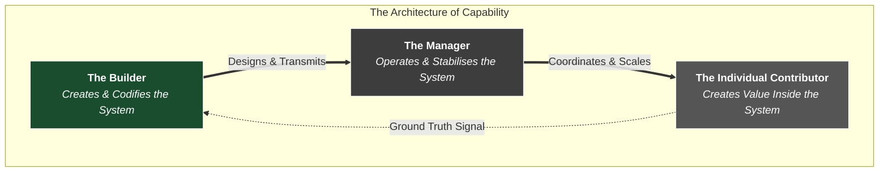

I keep returning to David Stirling as an archetype.

  
Not because of the history or the mythology, but because he keeps resolving into the same shape from different angles. Each time I look at the founder of the [Special Air Service]()—through the lens of strategy, systems, or leadership—the same pattern appears. And each time, the standard categories feel slightly off.

  

If you forced a modern organisational framing onto him, you might call him a manager. He selected people, set direction, and operated through others. But that description doesn’t quite hold. Stirling wasn’t managing an existing system. There was no stable unit, no established doctrine, no clear definition of the work.

  

In an environment of total uncertainty, "management" is the wrong word. Management assumes something already works—that there is a system to stabilise, roles to coordinate, and outputs to optimise. Stirling was doing something else entirely: bringing a system into existence.

  

> **The Core Insight**

> Modern organisations divide work into two categories: Individual Contributors (ICs) and Managers. But this binary only functions once a system is already stable.

>

> In environments of deep uncertainty, a third function is required: **The Builder**. The Builder does not execute within the system, nor do they merely coordinate it. They operate close to reality to extract the signal, codify the pattern, and engineer the conditions that turn individual performance into reproducible, scalable capability.

{: .prompt-info }

  

## I. The Question That Gets Asked (And Why It’s Wrong)

  

In modern organisations, the defining structural question is: *Is this role an IC or a manager?*

  

It is a clean, logical distinction. The Individual Contributor creates value directly. The Manager operates through others to scale that value. Most systems of work—career paths, compensation, performance frameworks—are built around this split.

  

On the surface, it makes sense. The two roles compete for the same hard constraint: **Attention**. Trying to operate deeply in the weeds while simultaneously coordinating the output of others usually leads to failure at both. The distinction tells us how work is meant to be organised.

  

But if the distinction holds, then David Stirling’s role must resolve one way or the other. Was he an operator creating value directly, or a manager coordinating others?

  

Neither description fits, because the IC vs. Manager distinction assumes something that wasn’t there.

  

### The Illusion of the Stable System

The binary assumes that the problem is understood, the interfaces between people are stable, and the path from input to output is known. In that environment, you can cleanly separate the people *doing* the work from the people *coordinating* it.

  

But before that point, those conditions do not hold. The problem isn’t fully defined. The work doesn’t yet decompose cleanly into roles. There is no stable system to operate within; there are only fragments.

  

Asking "IC or Manager?" in this phase is asking the wrong question. It attempts to categorise a role inside a system that does not yet exist. And when the system doesn’t exist, the work is not executing known tasks or coordinating known workflows. The work is *discovering what the work actually is*.

  

## II. The Player-Coach Trap

  

A common response to this tension is to try to do both: stay close to the work while also managing others. The "Player-Coach" model.

  

On the surface, it feels like the best of both worlds. You retain context, maintain control, and scale through others. But in practice, it breaks down. It runs directly into inescapable systems constraints.

  

* **Attention is finite.** The more time you spend coordinating, the less time you spend understanding the ground truth of the work. The more time you spend in the work, the less capacity you have to step back and shape it.

* **Value does not automatically scale.** Something working once—even repeatedly—does not mean it can be reproduced by others. Without deliberate translation, what looks like a system is often just heroic individual performance.

* **People are not systems.** You cannot scale capability simply by adding headcount. Without shared understanding, clear patterns, and consistent standards, adding people produces variation, not reliability.

  

At a small scale, the Player-Coach model can be masked. The system is simple enough that gaps can be patched with sheer effort, intuition, and proximity. But as complexity increases, the system becomes too large to hold in one person’s attention. Without deliberate structure, the work does not scale. It fragments.

  

The Player-Coach fails under load not because the person isn't capable, but because the role is structurally unstable. It attempts to alternate between two competing modes without ever resolving the underlying problem: *the system still hasn't been built.*

  

## III. Integration, Not Alternation

  

If Stirling wasn’t an IC, and he wasn’t a manager, what was he doing?

  

At one level, he stayed close to the work. He operated in the same environment as his men, exposed to the same constraints and the same feedback from reality. This wasn’t incidental; it was how the system learned. Without that proximity, there is no reliable signal. You’re no longer discovering what works—you’re just interpreting reports about it.

  

At the same time, he was selecting. He selected not just for competence, but for judgment. The environment demanded decision-making under uncertainty. The effectiveness of the system depended less on rigid instruction and more on who could be trusted to act. **Selection became a form of system design.** Who you include determines how the system behaves.

  

And alongside that, he was shaping how the work was understood. Patterns that worked were reinforced. Implicit knowledge gradually became structured doctrine.

  

### The Third Mode

It is tempting to view this as a hybrid: part operator, part manager. But that framing misses the mechanics. A hybrid splits time across roles—you do the work in one moment, and manage in another.

  

What Stirling did was **Integration**. The activities themselves performed multiple kinds of work at once:

* Running an operation isn’t just execution—*it generates signal*.

* Selecting people isn’t just management—*it shapes how the system behaves*.

* Reinforcing patterns isn’t just coordination—*it turns experience into capability*.

  

The work is not divided across roles; it is recombined into a different function that operates upstream of both.

  

Pure IC work produces results, but the knowledge remains local. Pure management scales activity, but loses contact with ground truth. The integrated mode closes the gap on both sides simultaneously. By staying close to the problem, it maintains the signal. By extracting and reinforcing patterns, it makes that signal transmissible.

  

In modern tech culture, this pattern is often labelled **"Founder Mode"**—operating close to the problem and building through direct interaction rather than hierarchical distance. But Founder Mode is just one specific instance of this pattern. It is a symptom, not the underlying structure.

  

## IV. The Real Distinction and the Lifecycle of Capability

  

The IC vs. Manager distinction isn't wrong; it is simply incomplete. The true structural distinction is not two roles, but three.

  



  

* **The IC** works *inside* the system. Without them, there is no signal—no proof that anything works.

* **The Manager** operates *the* system. Without them, there is no stability—no way to coordinate activity at scale.

* **The Builder** creates the system that others can operate within. Without them, value remains local or degrades as it spreads.

  

### The Non-Negotiable Sequence

These roles do not just coexist; they operate in a sequence dictated by the laws of complex systems.

  

1. **Prove:** Work close to the problem. Interact directly with reality. Establish what actually works.

2. **Codify:** Extract the pattern. Separate signal from noise. Make implicit knowledge explicit.

3. **Package:** Turn understanding into shared language, clear expectations, and repeatable approaches.

4. **Replicate:** Enable others to apply it. Test whether it holds beyond the original context.

5. **Institutionalise:** Embed it into processes and structures so it no longer depends on any one individual.


Skip a step, and the system becomes fragile. Organise too early, and you formalise confusion. Scale too early, and you amplify noise. Codify too late, and knowledge remains trapped in individuals.
  

## V. What Senior Leadership Actually Is

To see how this lifecycle plays out, we can look at how Stirling’s own role evolved.

In the earliest days of the SAS, Stirling was in the dirt. He was on the jeeps, planting the explosives, directly experiencing the friction of the desert. He had to be. In the discovery phase, the Builder must be the operator, because that is the only way to extract the high-fidelity signal needed to figure out what works.

But as the SAS proved its value, it grew from a small detachment of a few dozen men into a full regiment. The math of attention changed. Stirling could not physically be on every airfield.

At this point, a conventional military system would have replaced him with a staff officer—a pure Manager to run the unit according to standard doctrine. But Stirling didn’t hand the system over, nor did he try to cling to the Player-Coach model until it broke him. Instead, his scope elevated.

He stepped back from tactical execution and brought in trusted operators—men like Paddy Mayne and Jock Lewes—to act as the **interface with reality**. They took over the IC/Operator function, running the raids and generating the ground-truth signal.

Stirling stepped up to operate **on** the system. He spent his time in Cairo fighting High Command for resources, defending the unit’s autonomy from the traditional bureaucracy, designing the selection criteria for new recruits, and refining the overall doctrine based on the feedback his operators brought back. He stopped building the tactic and started building the institution.

### The Evolution of the Builder

There is a dangerous temptation at this scaling stage: assuming that once the patterns are codified, the Builder should step aside and hand the reins to a pure "Manager."

This is a classic scaling failure. If you hand a newly built capability to someone who only knows how to operate a system, but who lacks the context of why it was built that way, the system becomes rigid. They possess the recipe, but not the architectural wisdom. When the market shifts or reality changes, the pure Manager cannot adapt the doctrine. They will simply enforce the outdated rules harder.

The Builder does not leave when the system scales; their scope elevates. At a larger scale, this function becomes recognisable as **Leadership** broadly construed.

Leadership is not defined by headcount, or by how far you sit from the frontline work. It is defined by the layer at which you operate.

-   The IC works **inside** the system.
    
-   The Manager operates **the** system.
    
-   The Leader operates **on** the system.
    

What began in the early stages as direct interaction—working the problem, selecting people, shaping patterns—evolves into defining operating models, setting standards, and designing systems of coordination. The underlying function does not change, only its form. They define what the system is for, how it works, and how it must evolve to survive contact with a changing reality.

```
