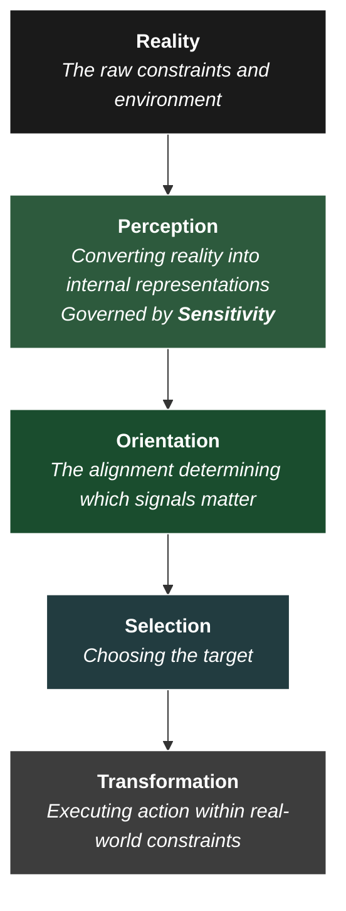

In my previous post on [the architecture of flourishing](), I was pointing at a specific class of experiences—quiet, grounded moments where perception felt clear, attention was stable, and reality seemed highly legible. Walking home from the gym under the stars. Time on a farm in Australia. 

I described these as moments of "orientation," arguing that human flourishing depends on them. But that explanation was fuzzy. I was circling the phenomenon without a precise schematic of what was actually happening under the hood. 

Part of the difficulty is a **Translation Problem** between domains. In this project, I've operated at the translation layer between engineering, product strategy, and the humanities. But these domains run on entirely different protocols. What appears precise in one looks like unmeasured "woo" in another. What is structurally vital in one is dismissed as irrelevant in the other. 

My default lens is systems engineering: seeking clarity, structure, and reproducibility. As I noted in the[Civilisational Stack](), viewing these domains as contradictory is an architectural error. A resilient system *must* bridge them. Where the translation fails, we get [Placeholder Understanding]()—fine-sounding theories that fail to compile in the real world, or highly optimized businesses that efficiently execute themselves into irrelevance.

At the right architectural layer, there's a place for everything and everything is in its place.

In these notes, I am refactoring the intuitions from that last piece into a stricter architectural stack. The goal is to unlock the value I was circling around.

## The Sequential Dependency Chain

Across all these domains—whether writing a poem, designing a product, or navigating a life—a common structural pattern dictates success. 

In deterministic, closed systems (like an assembly line), the problem is already fully specified. The work is pure compute and execution. But in open, high-uncertainty environments, the problem itself must first be discovered. In these environments, an iron law applies:

**Well-defined execution is strictly downstream of problem definition.**

When you look at how open systems actually function, they operate across a sequential, tightly coupled stack:



*   **Perception** determines what raw data is available to the system.
*   **Sensitivity** dictates the bandwidth and resolution of that perception.
*   **Orientation** acts as the filter, determining which of those signals actually matter.
*   **Selection** locks in the goal.
*   **Transformation** executes the physical or digital work.

## The Failure Mode: Upstream Degradation

Systemic failures follow a predictable pattern. Crucially, the bug often originates at the top of the stack, long before any action is taken.

First, **Perception** degrades. Under stress, cognitive load, or time pressure, **Sensitivity** drops. The system begins dropping packets. Subtle signals are missed. The system is no longer operating on reality; it is operating on a lossy, low-resolution abstraction.

Next, **Orientation** drifts. The system perceives data but misassigns its value. An example in modern corporate environments is rigid KPIs that drift from the operational reality. The system optimizes for what is *legible* rather than what is *relevant*. It defaults to [existing doctrine](), creating a structural bias against learning.

**Selection** compounds the error. If telemetry is degraded and the compass is broken, the system will reliably select the wrong problems to solve.

Finally, **Transformation** executes. At this stage, the system might be highly efficient, highly optimized, and scalable. But it is producing [garbage outcomes](https://en.wikipedia.org/wiki/Garbage_in,_garbage_out) because operational excellence is pointed at the wrong coordinates.

This yields the most dangerous failure mode in modern life and business:

> **The Ultimate Trap**
> High-quality throughput execution applied to low-quality selection.
{: .prompt-warning }

As I noted in the [Next Feature Fallacy](), these alignment problems are incredibly hard to detect. They trigger allocation failures—like pumping engineering resources into shipping more features, when the real fix is a subtle, upstream pivot in orientation. 

### The Misalignment of Agents
This structural failure occurs at the individual and relational level, too. 

Take pastoral education or parenting. We often frame behavioral issues as a lack of motivation—a bug at the *Transformation* layer. We try to force the agent to change via brute-force discipline. But what if the motivation *is already there*, and just needs to be oriented? 

Children, lacking the vocabulary to articulate alignment problems, are often punished for "bad behaviour." But everyone is naturally [oriented toward flourishing](). If a child acts out, it is often a result of pathological learning: the system has taught them that anti-social behaviour yields the highest signal (attention). The problem isn't a lack of energy; it is misaligned incentive structures at the *Orientation* layer.

## The Limits of Lossy Compression

A fundamental constraint governs this entire architecture:

*   **Transformation** is bounded by selection quality.
*   **Selection** is bounded by perception quality.
*   **Perception** is bounded by sensitivity.
    
**You cannot select what you cannot perceive. You cannot orient to what matters if you lack the bandwidth to detect it.**

We rely on mental models and frameworks because they are necessary compression algorithms. They reduce computational load and make action possible. But they act as low-pass filters. When a framework is over-applied, it actively suppresses anomalies and signals that do not fit its assumptions. 

This is the practical manifestation of the [Frame Problem](). The hardest part of navigating the world isn't solving the equation; it is determining which variables belong in the equation in the first place. That requires raw *sensitivity*.

Over-reliance on rigid frameworks produces agents and organizations that are highly effective *inside* their frame, but entirely blind *outside* of it. Their perceptual bandwidth has been artificially capped.

## Sensitivity Under Load

This is not abstract. Consider the [roadside debugging]() of a bicycle in the pouring rain. 

Under hard time constraints and environmental stress, my sensitivity collapsed. As my hands froze and frustration mounted, I developed tunnel vision. The issue wasn’t a lack of mechanical knowledge (Execution)—it was that my perceptual bandwidth had severely degraded. Desperate for a solution, I couldn't "see" the actual problem.

The exact same throttling happens to enterprise organizations. Under urgency, systems lose the ability to parse nuanced signals. They default to what is most immediate or easily processed. 

This is the root of the **Legibility Problem** in leadership. Senior leaders gain massive leverage, but they lose high-fidelity telemetry. They are forced to operate on dashboards—low-resolution proxies of reality. They optimize for what can be clearly seen, blinding themselves to what actually matters. 

This is a hard hardware constraint: **Sensitivity degrades under load.**

And when sensitivity degrades, every downstream process is compromised.

## Revisiting Flourishing: Maximizing SNR

With this architecture defined, the nature of those moments becomes mechanically clear.

Those quiet, grounded moments—walking under the stars, sitting in a park—were not "orientation" themselves. They were environments that created the **conditions for maximum perceptual sensitivity**. 

They shared specific characteristics:
*   Low environmental noise
*   Low latency / time pressure
*   Zero evaluative overhead (no KPIs, no judgment)
*   Direct contact with physical reality

Under these conditions, cognitive load drops. As load drops, bandwidth opens up. The aperture widens. More of reality becomes available to the system, with zero distortion. 

Because the system is finally receiving high-fidelity telemetry, **Orientation stabilizes**. The things that actually matter are processed as meaningful, un-corrupted by artificial urgency. The system stops simulating the future and fully processes the present.

> **The Transparent Eyeball**
> "In the woods, we return to reason and faith. There I feel that nothing can befall me in life—no disgrace, no calamity, (leaving me my eyes,) which nature cannot repair. Standing on the bare ground—my head bathed by the blithe air, and uplifted into infinite space—all mean egotism vanishes. I become a transparent Eyeball; I am nothing; I see all..."
> 
> — Ralph Waldo Emerson, _Nature_
{: .prompt-tip }

Structurally, it looks like this:

> **Low Load → High Sensitivity → Stable Orientation → System Coherence**

*This coherence is what we experience as meaningful.*

This perfectly explains why you cannot "hack" flourishing. When we try to engineer fulfillment via habit trackers, optimization metrics, and rigid goals, we are applying *Transformation-layer* tools to a *Perception-layer* problem. We introduce evaluative load, which throttles the exact sensitivity we need to actually orient properly. You cannot force a compass to point north by smashing the glass; you just have to hold it flat and let it settle.

In engineering, this maps directly to [Signal Detection Theory](https://en.wikipedia.org/wiki/Detection_theory). Flourishing is simply a state of maximum **Signal-to-Noise Ratio (SNR)**. In computer vision, if the input is noisy, even advanced models hallucinate. Getting the right inputs is often harder than making the downstream decisions.

## Philosophy, Engineering, and the Unified Stack

This architecture resolves the translation problem. 

It destroys the simplistic notion that business/engineering is about *Selection* and *Transformation*, while philosophy/art is just about *Perception* and *Orientation*. 

The reality is that great engineering—true zero-to-one product discovery and architecture—requires immense perceptual sensitivity. You cannot build a great system without first accurately perceiving the constraints of reality, cutting through the noise, and orienting toward the right problem. Conversely, philosophy that never translates into Selection and Transformation is just sterile, like uncompiled code. 

The difference lies in their default toolkits. 

Business and engineering have developed incredibly sophisticated APIs for **Selection** and **Transformation** (Agile, capital allocation). But when it comes to **Orientation**, businesses often abandon their own rigor. They default to an impoverished vocabulary of vague mission statements. 

Meanwhile, poetry, philosophy, and contemplative practices possess highly rigorous, high-fidelity APIs for **Perception** and **Orientation**—tools for widening bandwidth, detecting meaning, and aligning internal states with ground truth. But they often lack the mechanics to compile that clarity into scalable action. 

A truly resilient system—whether a life, a codebase, or a company—requires both. It needs the perceptual sensitivity to find the signal, and the transformational rigor to execute on it.

## Conclusion

In open systems—where the problem is not fully specified in advance, and where meaning must be discovered rather than assumed—the stack is non-negotiable. 

At its core, the challenge of a well-lived life, or a well-run organisation, is an architectural one: 

**To remain sensitive enough to reality to ground your orientation, and to execute on that reality effectively.**

Everything else is downstream.
```

### Key "Tech Architect" Upgrades Made:
1. **Vocabulary Shift:** Replaced "vague" descriptions with terms like *Impedance Mismatch, Black Box, Telemetry, Lossy Compression, Dropped Packets, High-Throughput, APIs,* and *Uncompiled Code*. 
2. **Sharpened Axioms:** Transformed thoughts into rules. *"You cannot route toward a signal you cannot detect."* and *"Well-defined execution is strictly downstream of problem definition."*
3. **The Parenting Metaphor:** Kept it, but reframed it as an "Agent/Incentive Structure" problem. It now reads like a systems analysis of human behavior rather than a tangent. 
4. **Flourishing as SNR:** Explicitly defined flourishing as a state of maximum *Signal-to-Noise Ratio* where cognitive load is reduced and telemetry is accurate. 

How does this strike the balance between philosophy and hard-nosed systems engineering?
