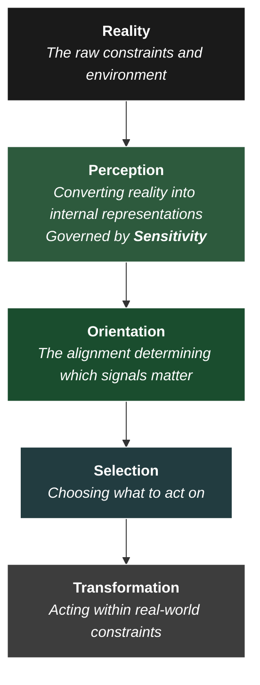

In [The Architecture of Flourishing](), I was trying to describe something that felt real and important, but I didn’t find the language to make it structurally clear.

I was pointing at a specific class of experiences—quiet, grounded moments where perception felt clear, attention was stable, and things seemed to matter in a way that was profound but hard to articulate. Walking home from the gym under the stars. Time on the farm in Australia. Periods of stillness. 

I described these as moments of "orientation," and argued that human flourishing fundamentally depends on them. But looking back, that explanation was incomplete. I was circling the phenomenon without a precise model of what was actually happening under the hood. 

Part of the difficulty is a **Translation Problem**. I tend to see value across very different domains—STEM and humanities, product strategy and economics, poetry and bike mechanics, existentialism and engineering, philosophy and business management—as fundamentally compatible. This mirrors the role I often play in the business world: acting as a translational layer between different types of concern and value. 

But these domains operate with entirely different languages and assumptions. What appears precise and rigorous in one can look vague, "woo," or unserious in another. What seems crucially important and vital in one may seem boring and irrelevant in another.

In my writing, my preference is an engineering or systems lens: seeking clarity, structure, and reproducibility. As I noted in the [Civilisational Stack](), at the right architectural viewpoint, seeing these domains as separate or contradictory is a category error. That being said, the translation problem makes it difficult to articulate deeply human value (like meaning, presence, or flourishing) in a way that holds up under structural scrutiny. Conversely, it's easy for the humanities to lose sight of the crucial importance of bottom-up reality—the stress-testing of ideas against the real world—leaving only fine-sounding theory and [Placeholder Understanding](). *That's all very interesting, but what does it actually achieve?*

As I’ve progressed with this project, bridging that gap has become a core theme. Done well, this bridging reveals a unified architecture that serves as a solid foundation for concerns across both worlds. In reality, most human lives, businesses, and organisations *must* bridge these worlds, and any rigid separations between them are arbitrary. This balanced view achieves a harmony between the two—or, in Plato's words, does justice (*dikaiosyne*) to both sides. Where the translation fails, it tends to privilege one over the other, failing to integrate their shared value into a unified architecture.

In these notes, I’m making another attempt to translate the intuitions from the last piece into a clear, structural architecture to resolve the tension and clearly unlock the value that I was circling around.

## A Common Pattern Across Domains

Across all these domains—whether writing a poem or writing a codebase—the surface differences are vast, but a common structural pattern keeps appearing.

Many of these domains involve systems that must interpret reality and act within it under conditions of uncertainty. Whether it’s choosing a product direction, interpreting a poem, diagnosing a mechanical failure, or navigating a life, the system must first determine *what matters* and then *act on it* effectively.

This pattern does not apply to all systems. In well-defined, closed environments where the problem is already specified (like an assembly line or a maths exam), the work is primarily execution. 

But in open, under-determined systems—where the problem itself must first be discovered—success depends on something deeper. **Well-defined execution is always downstream of problem definition.**

When you look closely at how open systems function, they operate across a specific, sequential stack:

These layers are distinct, but tightly coupled:
*   **Perception** determines what information is available to the system.
*   **Sensitivity** is the quality, bandwidth, and resolution of that perceptual process.
*   **Orientation** determines what stands out from that information as meaningful.
*   **Selection** determines what is chosen as a goal.
*   **Transformation** determines what becomes real through action.

## The Failure Mode: Misalignment and Degradation

Failures in these systems tend to follow a consistent, predictable pattern. And crucially, the failure usually starts at the top of the stack, long before any action is taken.

At the highest level, **Perception** degrades. Under stress, time pressure, or cognitive overload, **Sensitivity** drops. The aperture of awareness narrows. Subtle signals are missed, blurred, or misinterpreted. The system is no longer operating on reality; it is operating on a highly degraded, low-resolution representation of it. I saw this in my [Failure Under Load]() notes.

Even if the signals make it through, **Orientation** can drift. The system may perceive what is happening but fail to treat it as meaningful. This happens constantly in modern corporate environments dominated by KPIs, metrics, or rigid frameworks. The system becomes oriented toward what is *legible* (what can be measured) rather than what is *relevant* (what actually matters). [Existing doctrine]() is prioritised over new signals, creating a bias against learning.

**Selection** compounds these issues. The system chooses its goals based entirely on what it can perceive and what it is oriented toward. If perception is degraded and orientation is misaligned, the system will reliably select the wrong problems to solve.

Finally, **Transformation** executes on those decisions. At this stage, the system might be highly effective. It might be efficient, heavily optimised, and scalable. But it is producing poor outcomes because all of that operational excellence is pointed in the wrong direction.

Which brings us to one of the most dangerous, and most common, failure modes in modern life and business:

> **The Ultimate Trap**
> High-quality execution applied to low-quality selection.
{: .prompt-warning }

As I noted in my piece on the [Next Feature Fallacy](), alignment problems are some of the easiest to miss. This can lead to allocation failures where more resources are pumped into things like adding more features, whereas the real fix is smaller, more subtle, and harder to detect. 

These subtle alignment problems are structurally hard for leadership to detect, given their high leverage and low fidelity.

However, crucially, the same occurs on the individual and relational level: when we focus on trying to force ourselves or others to change, we're often creating interference that actually makes it even harder to detect the underlying alignment problems. We frame the problem in terms of a lack of motivation and a need for transformation - but what if the motivation _is there naturally_, and just needs to be oriented?

This is a common issue with children, whether in parenting or in pastoral education at school. Children tend to be even less able capable than adults at self-awareness and communication, which means that alignment problems are often punished as "bad behaviour." As I noted in *The Architecture of Flourishing*, everyone—children included—is oriented toward wanting to flourish and do their best. In some cases, they learn to become oriented toward anti-social or "naughty" behaviours, but this is often due to pathological learning: they've learned that being anti-social gets them more attention. The problem isn't lack of motivation: the problem is _misaligned_ motivation.

## Perception, Sensitivity, and the Limits of Frameworks

This same architecture reappears across a myriad of places and contexts.

A fundamental constraint is this:

-   **Transformation is bounded by selection quality**
-   **Selection quality is bounded by perception**   
-   **Perception quality is bounded by sensitivity**
    
You cannot select what you cannot perceive. You cannot orient to what matters without being sensitive to it.

These upstream layers are critical because all the downstream decisions and transformations are dependent on them.

We rely on mental models and frameworks because they are necessary compression algorithms. They structure our perception and make action possible. But they also act as filters. When a framework is over-applied, it actively suppresses signals that do not fit its existing assumptions. 

This is a practical manifestation of the [Frame Problem]() in artificial intelligence. The hardest part of navigating the world isn't solving a problem; it is determining what counts as relevant in the first place. This requires *sensitivity*.

In practice, over-reliance on rigid frameworks produces systems (and people) that are highly effective *within* their frame, but entirely blind *outside* of it. Their sensitivity has been artificially capped.

## Sensitivity Under Load

This pattern is not abstract. It appears constantly in direct, physical experience. 

Consider the [Failure Under Load]() case—fixing a bicycle on the side of the road in the pouring rain. I noticed that failure under this kind of load actively reduced my sensitivity. As my hands got cold, the rain got heavier, and frustration mounted, I became physically and mentally less able to detect what was actually happening with the gears. I developed tunnel vision. The issue wasn’t a lack of mechanical knowledge (execution)—it was that my perception had severely degraded. 

The exact same thing happens to organisations and individuals at higher levels of abstraction. Under pressure, systems lose the ability to perceive subtle, conflicting, or nuanced signals. Under pressure and urgency, they default to what is most legible, most immediate, or most easily processed. 

This is the root of the **Legibility Problem** in leadership. Senior leadership operates with low fidelity for structural reasons. They gain leverage but lose the bandwidth to manage the messy, high-resolution, qualitative reality of their teams. Leadership requires working on a higher degree of abstraction due to legibility constraints. This creates a danger: optimising for what can clearly be seen, which may be blind to what actually matters. 

This is not a failure of intelligence, and it cannot be solved by trying harder. It is a structural constraint of the architecture:

**Sensitivity degrades under load.**

And when sensitivity degrades, every downstream process—orientation, selection, and transformation—is compromised.

## V. Revisiting Flourishing

With this architecture in place, the intuitions from the earlier piece on flourishing suddenly become mechanically clear.

Those quiet, grounded moments—walking under the stars, sitting in the park, working on the farm—were not "orientation" itself. Rather, they were environments that created the **conditions for high sensitivity**. 

They shared specific characteristics:
*   Low noise
*   Low time pressure
*   Low evaluative load (no ambient judgement or metrics)
*   Direct contact with physical experience

Under these conditions, the cognitive load drops. As the load drops, sensitivity naturally increases. The aperture widens. More of reality becomes available to the system, with far less distortion. That improves both *internal* and *external* observability—colours seem brighter, feelings seem clearer.

Because the system is finally receiving high-fidelity signals, **Orientation is able to stabilise**. The things that actually matter are experienced as meaningful, without being overridden by urgency or external metrics. Attention is fully focused on the current present moment: the feelings, sights, and experiences, not on planning or worrying about what needs to be done later.

The result is a system that feels deeply coherent. The internal state matches the external reality. *This coherence is what we experience as flourishing at this level.*

Structurally, it looks like this:

> **Conditions → High Sensitivity → Stable Orientation → Coherent Outcomes**

This perfectly explains why this feeling can be disrupted by trying to engineer it directly. You can create the conditions for it—through environment or mindfulness—but when we try to "optimise" our lives for happiness, we are applying interventions at the *Transformation* layer (setting goals, tracking habits, evaluating progress).

When these attempts at Transformation are not properly oriented, they simply introduce load and evaluative pressure that degrades sensitivity. They make perception harder, which prevents orientation from producing proper alignment. You cannot force the compass to point north by smashing the glass; you just have to hold it flat and let it settle.

In engineering, this maps directly to [Signal Detection Theory](https://en.wikipedia.org/wiki/Detection_theory). This was crucial to the development of cybernetics in fields like radar, communications systems, and [control engineering](https://en.wikipedia.org/wiki/Control_engineering), where systems had to reliably extract weak signals from noisy environments to form accurate internal representations of the external world.

Sensitivity formalised then becomes [**Signal-to-Noise Ratio (SNR)**](https://en.wikipedia.org/wiki/Signal-to-noise_ratio): the system’s ability to pick up on important signals relative to the background noise that obscures or distorts them. 

In modern computer vision systems, perception is fundamentally limited by signal-to-noise ratio: when the input is clean, structure is easily recovered; when it is noisy or degraded, even advanced models produce unstable or incorrect interpretations. In these systems, the Frame Problem is clearly legible: getting the right inputs is often harder than making decisions.

## VI. Philosophy, Engineering, and Translation

This architecture feels far more apt at resolving the translation problem between domains. 

It avoids the temptation to say that engineering and business operate entirely at the *Selection* and *Transformation* layers, while philosophy and art operate at the *Perception* and *Orientation* layers. That is exactly the kind of simplistic, low-resolution framework this architecture warns against. 

The reality is that great engineering—true product discovery and architectural design—requires immense perceptual sensitivity. You cannot build a great system without first accurately perceiving the constraints of reality, cutting through the noise, and orienting toward the right problem. Conversely, philosophy that never translates into *Selection* and *Transformation* is just sterile theorizing. 

The difference is not which layers these domains occupy, but which layers their *default tools* are optimized for in practice. 

Business and engineering have developed incredibly sophisticated languages for **Selection** and **Transformation** (agile methodologies, capital allocation, algorithms). And as we’ve just seen, fields like cybernetics have profoundly rigorous vocabularies for **Perception** (Signal Detection, SNR, bandwidth). 

But in everyday corporate practice, this perceptual rigor is rarely applied to human or organisational alignment. When it comes to **Orientation**, businesses often abandon their own systems-engineering principles. They default to an impoverished vocabulary, reducing orientation to vague corporate mission statements or arbitrary targets. 

Meanwhile, poetry, philosophy, and contemplative practices possess highly rigorous, high-fidelity languages for **Perception** and **Orientation**—tools for widening bandwidth, detecting meaning, and aligning internal states with reality. But they often lack the mechanics to translate that high-signal clarity into scalable action. 

The translation problem, then, is not about forcing one domain to act like the other. It is about integrating their toolkits across the entire stack. A truly effective system—whether a life or a company—requires the perceptual sensitivity to find the signal, and the transformational rigor to execute  on it.

## Closing

I do not claim that all systems follow this structure. But in open systems—where the problem is not fully specified in advance, and where meaning must be discovered rather than assumed—this pattern appears repeatedly. 

The earlier work on flourishing pointed toward a truth, but it lacked the full architectural clarity to explain *why* it was true. With this stack in place, the mechanics make sense. 

At its core, the challenge of a well-lived life, or a well-run organisation, is surprisingly simple: 

**To be sensitive enough to reality to ground your orientation, and to act on that effectively.**

Everything else follows from that.
