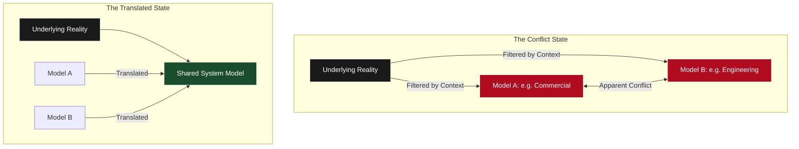

## I. Plato and the Turning of the Soul

In Book VII of *The Republic*, Plato describes education not as the transfer of knowledge, but as a "turning of the soul" (*periagōgē*) toward what is true.

This suggests a very different model of human nature than the one often assumed. On this view, people are not empty vessels to be filled, or agents to be directed through persuasion or control. They already possess the capacity to understand reality—but more than that, they are naturally oriented toward it. The impulse to recognise and respond to what is true is not something added from the outside, but a fundamental part of human nature.

The role of teaching, mentoring, or leadership is therefore not to impose knowledge, but to bring something out—to reorient someone toward what is already there. That reorientation often feels less like instruction and more like recognition: an insight, or an "aha" moment, where something becomes clear.

> "In every work of genius we recognize our own rejected thoughts; they come back to us with a certain alienated majesty."
>
> — Ralph Waldo Emerson
{: .prompt-quote }

The recognition is important. It suggests that understanding is not being imposed from the outside, but recovered—something that was already present, but not yet properly seen.

When that natural orientation is disrupted, it is better understood not as a deliberate choice to be wrong, but as a **misorientation**—a breakdown in how reality is being perceived or interpreted. The underlying drive toward what is true remains, even when it is expressed through partial or distorted views.

This becomes especially visible in situations like a divorce. Two people who once wanted the same thing—to build a life together—can end up in deep conflict, each convinced that the other is unreasonable or acting in bad faith. But in many cases, both are still responding to real concerns: stability, fairness, recognition, care.

What has broken down is not necessarily their orientation, but their *model* of the same underlying reality. Each is interpreting the situation through a different framework—different assumptions, different causal stories, different meanings attached to the same events. What looks like opposition is often a misalignment between these models rather than a conflict of aims.

In effective mediation, the shift does not come from persuading one side to concede, but from making those models legible to each other. As each perspective is clarified, the apparent conflict can begin to resolve—not because either side has changed what they care about, but because they can now see how their perspectives relate to the same underlying reality. The problem was not a lack of capacity to understand, but a lack of alignment between how that understanding was structured.

The same pattern appears across many contexts. What looks like irrationality, resistance, or disagreement is often the result of people working from different models of the same situation. The issue is not that they lack the capacity to understand, but that those models have not yet been brought into alignment.

This is why, for Plato, education is ultimately directed not at the most reactive aspects of a person, but at what is highest—their capacity to understand, to orient, and to respond to what is true. It is a form of influence that appeals to that capacity rather than overriding it.

There is also an implicit equality in this model. The standard is not the person, but the reality they are both oriented toward. Ideas, decisions, and judgments do not derive their validity from who expresses them, but from how well they correspond to what is actually true. Influence, in that sense, comes not from authority or status, but from being more closely aligned with reality.

When that orientation is shared, the relationship changes. It is no longer one of direction or control, but of joint attention—two people accountable to the same thing. The asymmetry of knowledge may remain, but the structure of the relationship is one of equals. Under this model, the aim is not to persuade or to control, but to awaken—to bring someone back into alignment with a capacity that is already their own.

## II. The Translation Problem

If people are capable of understanding reality, and often oriented toward the same underlying things, then a natural question follows: *why does so much disagreement persist?*

The answer is that people do not interact with reality directly. They interact with it through models—ways of representing, simplifying, and making sense of what is happening. These models are shaped by context, incentives, experience, and language.

Two people can therefore be responding to the same underlying situation, while describing and interpreting it in completely different ways. What appears as disagreement is often a mismatch between these representations rather than a conflict at the level of reality itself.

This is especially visible in cross-functional environments. A commercial team might frame a problem in terms of revenue, urgency, and opportunity cost. An engineering team might frame the same situation in terms of system stability, technical constraints, and long-term maintainability. Both are responding to real aspects of the same system, but they are operating within different models of it.

At the same time, these are not fundamentally opposed goals. Both depend on the performance of the same underlying system. When the system is functioning well—when it is stable, scalable, and capable of generating sustained value—that improvement is not isolated. It propagates. It makes outcomes better across the board.

This is easy to lose sight of in moments of disagreement, where the situation is often framed in zero-sum terms: speed versus stability, short-term versus long-term, one team’s priority versus another’s. From within those local perspectives, it can appear as if one side’s gain must come at the expense of the other.

But in many cases, this is a misreading of the system. The apparent tension arises not because the underlying goals are opposed, but because each side is optimising locally within a different representation of a shared objective. When the system improves, it improves for everyone. **What looks like a trade-off at the local level is often a coordination problem at the system level.**

A different approach is to treat the situation as a **Translation Problem**. The goal is not to convince one side to adopt the other’s view, but to make each model legible to the other—to surface the constraints, assumptions, and causal relationships that are implicit within each perspective.

When this happens, the effect is not just clarity, but integration. Perspectives that initially appeared to be in opposition often turn out to be describing different parts of the same underlying system. What looked like a conflict becomes a partial view. Translation does not collapse one side into the other—it combines them into a more complete picture.

This reflects a more realistic way of understanding disagreement. In many cases, especially among people operating at a reasonable level of competence, it is unlikely that one side is simply wrong about everything while the other is entirely correct. More often, each is oriented toward something real, but only a part of it.

This pattern extends beyond organisational settings. In political disagreements, for example, opposing sides are often oriented toward different aspects of the same underlying reality—stability and change, freedom and security, efficiency and fairness. Each captures something real, but only a part of it. 

When those perspectives are held in isolation, they appear incompatible. But when the underlying concerns are made explicit and translated into a shared frame, the disagreement often resolves into a question of trade-offs—how to balance competing priorities within a single system—rather than a fundamental disagreement about reality itself. It is much easier to reason about trade-offs within a shared model than to resolve conflicts between incompatible ones.

In this sense, translation does not create alignment so much as reveal it. The alignment was already present at the level of the system—it was simply obscured by the way it was being represented.

## III. Alignment Without Control

If alignment can be revealed rather than imposed—if it emerges from a shared understanding of reality—then the role of control begins to look very different.

Many models of leadership assume that coordination requires direction: setting goals, enforcing decisions, aligning incentives, or resolving disagreement through authority. These approaches operate on the assumption that alignment must be created from the outside, often by overriding or constraining individual perspectives.

But this does more than limit autonomy. It interferes with the very process by which alignment with reality emerges. When perspectives are overridden rather than understood, the underlying models are never integrated. The opportunity for shared sense-making is lost, and with it the possibility of arriving at a more complete understanding of the situation.

This has consequences not only for outcomes, but for development. When alignment is imposed, people learn to follow decisions rather than to reason about them. They are not learning how to orient themselves toward what is true, but how to operate within someone else’s model. 

By contrast, when alignment is reached through translation and understanding, the process itself becomes instructive. People learn how to see more clearly, how to reconcile perspectives, and how to navigate complexity for themselves.

In this sense, leadership is not just a mechanism for producing decisions, but a way of modelling how to engage with reality. It demonstrates how to interpret situations, how to resolve apparent conflicts, and how to arrive at alignment without coercion. Over time, this changes not just what people do, but how they think.

A different model is therefore possible: one based not on control, but on **non-domination**.

> **Non-Domination**
> In political philosophy, non-domination refers to freedom from arbitrary control—the condition of not being subject to another’s will without understanding or recourse. It is a central idea within republican and liberal thought, where the aim is to enable coordination without coercion.
{: .prompt-info }

The same principle applies here. If alignment can be achieved through shared understanding, then it does not need to be imposed. Coordination can emerge from a common orientation toward reality, rather than from authority.

This does not imply that all disagreements disappear, or that all trade-offs resolve themselves. Real differences remain. But once those differences are situated within a shared model of reality, they become tractable. They can be reasoned about, negotiated, and balanced—rather than fought over as incompatible worldviews.

The role of leadership, in this context, shifts. It is no longer primarily about decision-making authority or directional control. It becomes a matter of facilitating clarity: surfacing assumptions, aligning representations, and helping others see how their perspectives fit within a larger whole.

This is a more demanding form of leadership. It requires a deeper engagement with the structure of problems, and a willingness to remain accountable to what is actually true rather than what is expedient or immediately persuasive. But it also produces a different kind of outcome. When alignment is reached in this way, it is more stable. It does not depend on enforcement, because it is grounded in shared understanding. And it does not collapse when authority is removed, because it has been internalised rather than imposed.

In this sense, coordination becomes a form of **coordinated independence**. Individuals retain their autonomy—their ability to think, judge, and act—but are aligned through a common orientation toward the same underlying reality.

This is why control is not only unnecessary in many cases, but actively limiting. It can replace understanding with compliance, and alignment with superficial agreement. Where translation would have revealed coherence, control can lock in fragmentation. A system built on shared understanding, by contrast, allows alignment to emerge without domination—through the integration of perspectives rather than their suppression.

## IV. Conclusion: Coordinated Independence

Taken together, this suggests a different way of thinking about leadership. Not as the ability to direct others, or to impose alignment, but as the capacity to clarify, to translate, and to orient—so that alignment can emerge without coercion.

The aim is not to create followers, but to create the conditions in which teams can align on a shared model of reality—orienting toward the same underlying objectives and coordinating through shared understanding rather than direction.

This way of thinking has deep roots. Socrates described philosophy as a form of midwifery (*maieutics*): not the transmission of knowledge, but the act of helping others bring forth what they are already capable of understanding. The role is not to supply answers, but to make understanding possible.

In a different register, Emerson describes something similar through the idea of emulation. To emulate is not to copy, but to recognise in another’s thought something that is already latent within oneself—to be moved not by imitation, but by a kind of intellectual recognition that leads to transformation.

Across these traditions, a common model appears. Influence does not come from authority alone, or from the ability to persuade, but from the ability to make what is true more visible, more coherent, and more sharable. **Alignment is not constructed through control, but revealed through understanding.**

In this sense, leadership is not a position, but a way of relating—to reality, and to others. Its function is not to resolve every question, but to  enable better questions, clearer models, and more coherent coordination.

This is what makes co-leadership possible. Not the absence of leadership, but its distribution—through shared orientation, shared understanding, and shared responsibility for engaging with what is true.

The result is not uniformity, but alignment: a form of coordinated independence in which individuals retain their autonomy, but are able to act together because they are grounded in a common view of the situation.

At its highest level, this is not simply a more effective way of making decisions. It is a different way of engaging with the world—one that treats understanding as something to be awakened, not imposed, and coordination as something to be achieved through alignment, not control.
