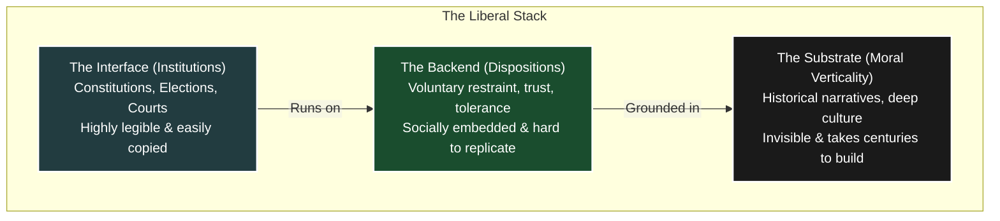

In my [previous piece on verticality](), I approached the architecture of the modern world indirectly—by looking at how different cultural frameworks make sense of human suffering. Following thinkers like Nietzsche and Dostoevsky, I explored how classical liberalism inherited the moral verticality of the Judeo-Christian tradition, but heavily obfuscated it beneath procedural, bureaucratic language.

As Martin Heidegger might put it, I was circling something and beginning to see it more clearly. I was tuning into a real signal, but my underlying model still had a fair amount of interference. 

There are two common traps when doing this kind of architectural archaeology. On one side are mythologised, linear narratives (like [Whig history](https://en.wikipedia.org/wiki/Whig_history)), which treat the liberal present as the inevitable, perfected endpoint of human progress. On the other side are post-modern overcorrections that collapse everything into contingency—treating institutions as arbitrary products of history, with no underlying structure or recurring constraints.

Both approaches miss the reality of how systems are built. 

Civilisational systems are not just historical artefacts; they are solutions to recurring architectural problems. Different societies arrive at different configurations, but they are often solving variations of the exact same underlying constraints.

This requires a shift in method. The analysis here is not normative. It does not ask what liberalism *should* be. It is closer to the realist approach of Niccolò Machiavelli and Thomas Hobbes: political systems stand or fall on whether they actually execute under real-world conditions.

Once you take that step, the question changes. It is no longer: *What does liberalism believe?* It becomes: **What structural problem is liberalism trying to solve, and what dependencies does it require to function?**

## The Architectural Paradox of Neutrality

In my [recent piece on leadership](), I explored the concept of **non-domination**—the ability to coordinate people through shared understanding and alignment rather than arbitrary control. At its core, liberalism is the attempt to scale that exact principle into a civilisational architecture. It is a solution to a specific structural problem: **how to coordinate a society without relying primarily on coercion.**

Liberalism is designed to accommodate disagreement. It creates a framework in which individuals can hold entirely different conceptions of the "good life" while still participating in a shared political order. Because of this, liberalism must present itself as procedurally neutral at the level of the interface, even while depending on non-neutral conditions beneath it. It provides an interface—rights, procedures, and constraints—that allows different ways of life to coexist without the system taking a hard position on which is ultimately correct. 

It points towards moral vetoes but simultaneously maintains institutional neutrality.

This neutrality is a strict constraint. If the system defines the "good" too strongly, it ceases to be neutral between competing factions, and the pluralism collapses. Therefore, liberalism must remain explicitly "thin" at the level of its formal doctrine. 

But this creates a massive structural tension.

If liberalism is *only* a neutral institutional substrate, how does it generate the behavioural conditions it depends on? 

The short answer is: it doesn't.

## The Undocumented Backend

Despite presenting itself as a neutral interface, liberalism depends on "thick" preconditions that it does not generate itself—preconditions that are, historically speaking, relatively rare.

If a system is to coordinate behaviour without relying on state coercion, a vast proportion of compliance must be voluntary. Individuals must follow rules not because they are constantly forced to, but because they recognise them as binding.

This implies a heavy set of underlying dependencies. For the liberal interface to function, the population must be willing to:
1. **Restrain themselves** even when they could defect for personal gain. (Corruption)
2. **Treat members of the outgroup**—those with radically different identities or beliefs—as legitimate participants rather than enemies. (Intolerance)
3. **Accept unfavourable outcomes** (like losing an election) without reverting to force. (Intemperance)
4. **Defer to abstract rules** rather than immediate tribal advantage. (Partiality)

These are not institutional properties. They are *dispositions*—patterns of moral psychology and behaviour that exist prior to, and beneath, formal structures. As I noted in the [Translation Problem](), resolving conflict without coercion requires competing factions to share a baseline orientation toward the same underlying reality. If that shared baseline (the backend) doesn't exist, models cannot be translated, pluralism becomes zero-sum, and the system fractures.

These dispositions are not optional enhancements. Any system that attempts to minimise coercion must generate these behaviours somewhere. If they are not internalised, they must be imposed.

And they are not trivial. They are historically contingent, unevenly distributed, and highly fragile. Yet, formal liberalism tends to treat these conditions as a given—implicitly assuming that once the institutions (courts, elections, constitutions) are installed, the corresponding behaviours will automatically boot up. 

> **The Structural Paradox**
> Liberalism does not eliminate coercion; it simply minimises its direct use by relying on internalised constraints. But those constraints must come from somewhere. The system relies on a hidden layer of social ordering that it cannot explicitly specify within its own formal doctrine. What is not enforced externally must be enforced internally.
{: .prompt-warning }

This is a category error. Courts can adjudicate disputes, but only if their authority is recognised. Elections can allocate power, but only if outcomes are accepted. 

## The Solution Space: Anglo, French, and American Configurations

Any system that attempts to sustain non-coercive coordination at scale must solve for this hidden layer. What varies across liberal democracies is not *whether* this layer exists, but *how it is instantiated*. 

To understand liberalism in practice, we need to move from thinking in terms of a single model to thinking in terms of a **solution space**. 

### 1. The Anglo Tradition (Internalised)
In the Anglo tradition, these preconditions were historically supplied by a specific moral-cultural configuration: internalised Protestantism. 

Protestantism placed a radical emphasis on individual conscience and a direct relationship with God. Moral authority was internalised rather than mediated exclusively through an external Church. This was reinforced by widespread literacy, a community-based social structure reliant on reputation, and the common law tradition. 

In [an earlier piece](), I noted that liberalism seemed to lack "moral verticality." But looking at the Anglo configuration, we see that the verticality had not disappeared—it had simply been pushed down the stack. England developed a deeply moral culture in which individuals experienced obligation and restraint not as external imposition, but as internal duty. Norms and social trust perform much of the ordering function, allowing the state to remain relatively "light-touch." 

The abolition of slavery is perhaps the pinnacle achievement of this moral culture—more on that to follow.

### 2. The French Tradition (Externalised)
French liberalism emerged under very different constraints—namely, a highly centralised state tradition and a historically adversarial relationship with the Catholic Church. As a result, it developed a configuration in which the ordering function is externalised. The state, the law, and a shared civic framework (*laïcité*) take on the role of generating order. Legitimacy is grounded explicitly in universal public institutions. This produces clarity, but requires greater formal enforcement.

Instead of relying on internalised restraint, the system relies more heavily on formalised, universally applied rules enforced by central institutions. This reduces dependence on shared moral culture, but increases dependence on institutional legitimacy.

### 3. The American Tradition (Hybrid)
The American system combines the internalised norms of the Anglo tradition with a shared, externalised civic layer—often described as an "American civil religion" (a profound reverence for the Constitution, the Founding Fathers, and the narrative of liberty). This hybrid model allowed the system to scale pluralism more aggressively across a diverse population, though it introduces deep tensions between its internal and external components, which often span geographical regions as well. 

It creates a structural tension: when the shared civic narrative fragments, the system loses its external layer of cohesion, while the internal norms alone are not widespread enough to be sufficient to stabilise it.

## Why Liberal Export Fails

Understanding this layered architecture explains one of the most persistent geopolitical failures of the last century: why exporting liberalism so rarely works. 

When Western nations attempt to export liberalism, they export the **Interface**. Constitutions, electoral frameworks, and court systems can be specified, codified, and implemented rapidly. They are legible and transferable. 

But the **Backend** cannot be copy-pasted. Norms of restraint, the recognition of authority, and the ability to treat political rivals as legitimate actors are socially embedded. They take centuries to compile.

> **The Installation Error**
> Exporting liberalism as a set of institutions is not exporting the system itself—it is exporting only its surface layer. You cannot install the Interface if the database is missing. 
{: .prompt-info }

The result is a predictable pattern of distortion. Elections take place, but outcomes are rejected. Courts exist, but they are used for factional warfare. Political competition becomes zero-sum, and coordination quickly shifts back toward coercion, patronage, or authoritarian control. Without the deeper architecture, the Interface will inevitably crash.

## Conclusion: Fixing the Debate

Part of the difficulty is that, in the modern world, even participants in liberal societies are often only weakly connected to the intellectual and moral traditions that underlie the system.

Even a century ago, most thinking people would be deeply versed in the civilisational canon. Today, most people do not encounter liberalism through John Locke, Adam Smith, or John Stuart Mill, nor through sustained engagement with the religious, philosophical, and historical frameworks that shaped the system’s underlying structure. The majority of people may not even know who these people are. A fundamental culture shift has happened away from reading and toward videos and other digital media.

Instead, they interact with liberalism primarily through its interface—institutions, rights, and procedural norms—without direct access to the deeper layers that give those elements their coherence.

This exacerbates the layer of abstraction.

The system is not only dependent on an undocumented backend; it is also experienced as if that backend does not exist. The result is a population that is operating within a complex architecture, but reasoning about it as if it were flat.

This layered architecture explains why the ongoing cultural debates about liberalism are so consistently frustrating. Both defenders and critics are arguing about the wrong level of the stack.

Defenders point to the Interface—the capacity to manage conflict and protect rights—and attribute liberalism's success to formal institutional design. They mistake dependent variables for root causes. 

Critics focus on the same surface layer and find it lacking. They argue that liberalism is thin, procedural, and incapable of generating cohesion. What they are attacking is not liberalism as it exists in reality, but a simplified, abstracted model of it that has been stripped of its historical backend.

At the level of institutions, liberalism *is* thin. But at the level of the full civilisational stack, it is incredibly thick—relying on deeply implicit, historically inherited moral structures. 

If we want to understand liberal systems, we have to stop analysing the interface in isolation. Just as [Plato recognised]() that true education is an orientation of the soul, a functioning political system requires an orientation of the culture. The real unit of analysis lies in the layers beneath: the moral psychology, social norms, and civilisational architecture that actually sustain the system.

