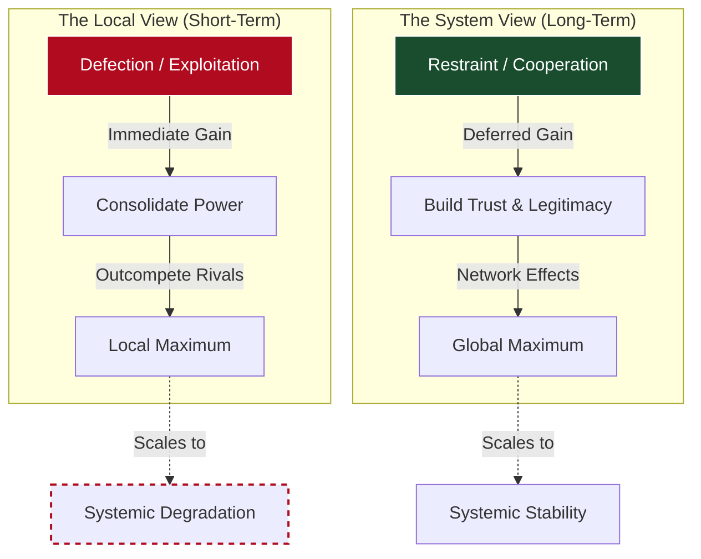

## I. The Real Problem: Unnatural Stability

In my earlier notes on [systems and leadership](), I’ve been working from a consistent premise: in open, high-uncertainty environments, the primary problem is not execution, but coordination under incomplete understanding. Whether in organisations or societies, the challenge is not just doing work, but aligning agents around a shared model of reality without collapsing into coercion or fragmentation.

Liberalism can be understood as a civilisational-scale attempt to solve that same problem.

But it does so under a severe constraint.

It depends on patterns of behaviour that are not the default mode of human systems. At its core, it requires:
*   Restraint in the use of power, even when advantage can be taken
*   Recognition of legitimacy in opponents, even under deep disagreement
*   Tolerance across difference, including toward those outside one’s immediate group

In earlier pieces, I described how [coordination without control]() depends on shared orientation—the ability of different agents to remain aligned to the same underlying reality, even when their local models differ. Liberal systems attempt to scale that pattern: to allow disagreement at the level of models, while maintaining alignment at the level of the system.

But this introduces a structural tension.

These behaviours are not trivial extensions of human nature. Across most historical contexts, power is exercised where it can be, legitimacy is granted selectively, and tolerance weakens sharply at the boundary of the group. The capacity to treat an opponent as legitimate, or an outgroup member as morally equivalent, is not a baseline instinct—it is a stabilised condition.

This is where the architecture begins to come into view.

In earlier notes on the [“missing backend,”]() I argued that liberal systems rely on a set of underlying dispositions—restraint, legitimacy, tolerance—that are not generated by institutions alone. What becomes clearer here is that these dispositions are not just socially contingent, but structurally fragile. They tend to hold in small, high-trust environments, but degrade under scale, anonymity, and difference.

But even this may not be the deepest layer.

These behaviours do not exist in isolation. They appear to depend on something prior: a way of seeing other people, a way of interpreting reality, a sense in which others are not merely obstacles or instruments, but participants in a shared structure of meaning.

This becomes clearer when we move from abstraction to edge cases.

Consider two groups with no shared history of cooperation—different languages, different religions, different cultural norms, and no prior integration into a common political structure. From the perspective of each group, the other is not naturally legible as part of the same system. There is no immediate reason to extend trust, no shared frame for legitimacy, no obvious basis for restraint. In such a setting, the default modes are competition, separation, or domination.

What would it take for these groups to function as part of a single system?

It is not enough to impose institutions. Rules can coordinate behaviour temporarily, but they cannot by themselves generate the conditions under which those rules are recognised as binding. Nor is it enough to prescribe behaviours. Without a shared frame of meaning, restraint will be experienced as unilateral disadvantage, and tolerance as risk.

Something deeper has to occur.

The groups must come to see each other differently—not just strategically, but structurally. They must become mutually legible as participants in the same reality, subject to the same constraints, and in some sense accountable to the same underlying standard. Without that shift, restraint becomes conditional, legitimacy becomes negotiable, and tolerance becomes unstable.

## II. The Structural Tension: Local Dominance vs Global Cooperation

The tension inside liberal systems is not just moral — it is structural.

We often describe the core behaviours that sustain these systems—restraint, tolerance, recognition of others—as moral commitments. Historically, they have been framed and reinforced through moral and metaphysical systems: obligations grounded in religion, philosophy, or shared ethical traditions.

But this framing can obscure something more fundamental.

These behaviours are not only moral—they are structural. They are conditions required for systems to function at scale.

Moral frameworks have historically played a critical role in stabilising them—making restraint feel binding, making others legible as equals, making cooperation durable under pressure. But even if those frameworks weaken, the underlying requirement does not disappear.

The system still depends on them.

From this perspective, the question shifts. It is no longer simply “why should we act this way?” but “what happens if we don’t?”

At the level of incentives, a persistent mismatch emerges between what appears optimal locally and what is optimal for the system as a whole.

Locally, exploitation often dominates. When one party can extract value from another without immediate consequence, it is frequently the rational move in the short term.

Systemically, cooperation dominates. Over time, systems built on trust, legitimacy, and mutual recognition vastly outperform those organised around extraction and coercion.

This creates a deep instability.

Liberalism can be understood as an attempt to resolve this mismatch—to make cooperation the dominant strategy at a scale where human instincts still perceive exploitation as optimal.

The difficulty is that our intuitions are calibrated for a very different environment.

In small, tightly bound groups, cooperation is reinforced through visibility, reputation, and repeated interaction. Defection is punished quickly, and trust can emerge organically. But these conditions do not hold at scale. In large, anonymous, and highly differentiated systems, the feedback loops are weaker, the time horizons longer, and the gains from defection more immediately visible.

The result is a persistent illusion.

What looks “rational” in the short term—exploiting a weaker group, consolidating power, excluding competitors—often appears as the dominant strategy from a local perspective. But when these behaviours scale, they begin to degrade the very system that makes coordination and prosperity possible in the first place.

This pattern recurs across history:
*   Systems of slavery that generate immediate economic gain while undermining broader notions of personhood and legitimacy
*   Empires that extract resources from peripheries while destabilising the larger political order
*   Forms of political exclusion that consolidate power in the short term while eroding long-term institutional trust

In each case, the same dynamic is visible: locally rational actions accumulate into globally destructive outcomes.

This is the structural pressure that liberal systems are constantly operating under.

They depend on cooperation at a scale where defection remains continuously tempting, and often immediately rewarding. Without mechanisms that stabilise restraint, the system is pulled—again and again—toward patterns of behaviour that are individually rational, but collectively corrosive.

And this is where the role of morality becomes clearer.

Moral language is not incidental. It has historically been the primary way these structural constraints are made visible, justified, and enforceable at the level of human behaviour. It is what turns long-term systemic requirements into something that feels binding in the present.

But in the modern context, this layer often appears thin.

When moral claims are detached from the deeper structures that once grounded them, they struggle to compete with immediate incentives. They can articulate the right behaviour, but lack the force to consistently enforce it—especially at the boundaries, where the gains from defection are highest and the costs most diffuse.

This creates a gap.

The system continues to rely on behaviours that are structurally necessary, but the frameworks that once made those behaviours compelling no longer operate with the same force. What remains is a set of expectations that are clearly required, but increasingly difficult to justify or sustain.

That gap is where the deeper problem begins to emerge.

## III. The Metaphysical Drift: Lost Foundations, Persistent Constraints

The gap that emerges at the end of the previous section points to something deeper.

These behaviours—restraint, tolerance, recognition of others—were not historically sustained by incentives alone. They were stabilised within a broader metaphysical framework that made them intelligible, binding, and in some sense unavoidable.

That framework was never perfectly realised. Its core commitments were often applied unevenly, and large portions of humanity were excluded from their scope. And yet, despite that inconsistency, it was real enough to shape behaviour, anchor expectations, and provide a basis for critique when systems failed to live up to their own principles.

Within that framework, certain claims were not merely asserted, but taken as structurally true:
*   That human beings possess an inherent dignity that does not depend on status, power, or utility
*   That moral obligations are binding even when they run against immediate interest
*   That personhood is universal, not contingent on group membership
*   That restraint is not simply strategic, but required

These were not just ethical preferences. They were claims about the nature of reality—about what a person is, how one ought to relate to others, and what ultimately grounds legitimacy.

Over time, however, that framework has weakened.

Modern liberal systems tend to operate in a more procedural and secular register. They retain the language of rights, equality, and dignity, but increasingly detach those concepts from the metaphysical structures that originally gave them weight. The result is a form of inheritance without full continuity: the vocabulary persists, but its grounding becomes less clear.

But the underlying constraints have not changed.

The system still depends on restraint. It still requires legitimacy across difference. It still relies on the recognition of others as participants in a shared structure of meaning. None of these requirements disappear when their original justification weakens.

This creates a structural asymmetry.

The behaviours remain necessary, but the framework that made them coherent—and compelling—no longer operates with the same force. What was once experienced as binding obligation is more easily reframed as preference, negotiation, or strategic choice.

In this sense, we have retained the constraints, but lost the ontology that made them stable.

This does not immediately collapse the system. Cultural inertia, institutional momentum, and residual norms can sustain these behaviours for extended periods. But under pressure—especially where incentives to defect are strong—the lack of grounding becomes visible. The system begins to rely on expectations that are clearly required, but increasingly difficult to justify or enforce.

This is the deeper instability.

Liberalism, in its modern form, runs on a set of moral assumptions that it can no longer fully justify, but cannot function without.

## IV. Why This Pattern Is Stable

The pattern that emerges from the previous section—principles applied internally, suspended at the margins—is not an anomaly. It is not simply a failure of will, or a deviation from an otherwise stable system.

It is a stable equilibrium.

To see why, we need to combine three layers: psychology, incentives, and grounding.

At the level of human psychology, there is a persistent asymmetry. People do not naturally perceive all others as equal participants in a shared system. Moral concern is strongest within the group—those who are familiar, visible, and recognised as “like us.” Outside that boundary, perception shifts. Others are more easily seen as abstract, distant, or instrumental. The recognition that underpins restraint does not automatically extend to them.

As Paul Bloom argues in *Against Empathy*, our intuitive moral responses are not impartial or universal—they are narrow, selective, and biased toward those closest to us. Empathy is powerful, but it is not evenly distributed. It pulls us toward identifiable individuals within our field of concern, while leaving others—often those most structurally affected—outside its scope. As a result, it cannot serve as a reliable foundation for large-scale, impartial coordination.

At the level of incentives, this bias is reinforced.

Exploitation often yields immediate, tangible gains. Extracting resources, consolidating power, or excluding competitors can appear rational from a local perspective—especially when the costs are diffuse, delayed, or borne by those outside the decision-making group. In these conditions, restraint is costly, while defection is rewarded.

At the level of grounding, the problem compounds further.

Where the underlying frameworks that once made restraint feel binding have weakened, the force holding these behaviours in place diminishes. What was once experienced as a non-negotiable obligation becomes easier to reinterpret as a matter of context, trade-off, or strategic choice.

Taken together, these forces create a predictable dynamic.

Even when a system articulates universal principles—equality, dignity, shared legitimacy—the application of those principles is naturally pulled toward the centre, where recognition is strongest and incentives are aligned. At the edges, where psychological distance is greater and gains from defection are clearer, those same principles become easier to suspend.

This is why selective liberalism is stable.

> **The Systemic Drift**
> The system does not fail because its principles disappear. It fails because they are unevenly applied in ways that are locally rational, psychologically intuitive, and structurally reinforced.
{: .prompt-warning }

The boundary of application becomes the system’s pressure valve.

Under normal conditions, this selectivity can persist without immediate collapse. But it introduces a persistent drift. The system is continually pulled toward narrower definitions of who counts, where obligations apply, and when restraint is required—not because it rejects its principles outright, but because it is easier, in practice, to limit their scope than to uphold them universally.

## V. The Paradox: Universal Language, Partial Reality

At this point, a deeper contradiction comes into view.

Even at its moments of greatest failure—when exclusion is most visible, when exploitation is most entrenched—liberal systems continue to articulate universal principles. They do not abandon the language of equality, dignity, or shared humanity. On the contrary, they often reaffirm it.

The claim that “all men are created equal” is not a marginal statement—it sits at the foundation of the American political tradition. Traditions of liberty in the British and broader Western context similarly appeal to general principles: rights that are not supposed to depend on status, power, or particular identity. Philosophical frameworks across the tradition, from natural rights theory onward, consistently point toward universality as an ideal.

And yet, historically, these principles have been applied selectively.

They have coexisted with systems of slavery, with political exclusion, with imperial hierarchies that clearly violate the very universals being asserted. The contradiction is not subtle, and it is not hidden. It is explicit and persistent.

This is what makes it structurally significant.

If the system simply abandoned its universal claims, the contradiction would disappear. It would become a system organised explicitly around hierarchy, power, or group dominance. But liberal systems do not do this. They continue to assert universality even while failing to realise it.

This suggests that the contradiction is not incidental—it is embedded in how the system operates.

The same framework that produces universal claims also permits their selective application. The language of equality persists, but its scope is constrained in practice. The ideals remain intact at the level of articulation, while their implementation is shaped by the same psychological, incentive, and structural pressures described earlier.

The result is a persistent duality.

The system declares universality while operating selectively.

This is not merely hypocrisy, though it can appear that way. It is a structural condition in which the principles of the system extend beyond its current capacity—or willingness—to fully realise them.

And it is precisely this tension that creates the conditions for both its failures and its transformations.

## VI. What Failure Reveals: The Hidden Architecture

The contradictions described in the previous section do more than expose inconsistency or hypocrisy. They reveal something deeper about how the system actually works.

When liberal systems fail—when principles are applied selectively, when exclusions become visible, when the gap between language and reality widens—what emerges is not simply breakdown, but structure.

Specifically, a deeper layer becomes visible.

Beneath the institutional surface—beneath constitutions, laws, and formal rights—there exists a moral framework that is only partially articulated, but nonetheless operative. It does not always appear in explicit doctrine, and it is not consistently applied. But under conditions of stress, it becomes legible. It is the layer to which people appeal when they argue that the system has failed on its own terms.

This is why moments of correction—abolition, civil rights, expansions of suffrage—so often take the form they do. They are not framed as the invention of entirely new principles, but as demands that the system live up to something it already claims to be.

That “something” is not reducible to any single tradition. It is better understood as a synthesis—a set of overlapping components that together form the [hidden architecture of the system]():

*   **A conception of personhood** grounded in the idea that human beings possess an inherent dignity that does not depend on status, power, or utility. This is most clearly associated with the Christian tradition, where the moral status of the individual is universalised in a way that cuts across existing hierarchies.
*   **A notion of transformational obligation** toward the other—not merely tolerance, but a requirement to recognise and respond to others as morally significant. This extends beyond reciprocity or contract, and introduces the possibility that the system must expand to include those previously excluded.
*   **A framework of civic order** drawn from classical traditions, emphasising law, duty, and the maintenance of a shared structure within which collective life is possible. This provides the stabilising layer that allows norms to be embedded in institutions.
*   **A set of liberal constraints**, developed particularly in the Anglo tradition, which limit the use of power, protect individual rights, and enable incremental adaptation rather than wholesale rupture.

This synthesis, however, contains a deep internal tension—one that helps explain both its power and its instability.

As Orlando Patterson argues in his work on the history of freedom, the Western emphasis on liberty did not emerge in isolation. It developed in contrast to—and in many ways in direct relationship with—the experience and institution of slavery. Freedom becomes a central value precisely because its opposite is so starkly defined.

Patterson is uniquely positioned to see this clearly. He was educated within the British colonial system in Jamaica, formed through a curriculum grounded in the classical tradition and the intellectual inheritance of the West. He understands the language of liberty, personhood, and civic order not as an external observer, but from within the architecture itself.

And yet, he is also positioned at the point where that architecture fails.

This combination is critical. It reveals a broader structural pattern.

The clearest perception of a system’s contradictions often comes from those who are both deeply shaped by its underlying framework and directly exposed to its inconsistencies. They possess the internal language to understand the system’s ideals, but also the experiential vantage point to see where those ideals are not being realised.

This is the same pattern visible in Martin Luther King Jr., who drew on the full moral and constitutional vocabulary of the American tradition to expose the gap between its principles and its practices.

King’s argument was not framed as an external critique of the United States, but as an internal one. He appealed directly to the founding documents—the Declaration of Independence and the Constitution—not as historical artefacts, but as living commitments. When he spoke of equality, he was invoking the claim that “all men are created equal” as a binding principle that the nation had already affirmed, but had failed to realise in practice.

At the same time, he drew deeply from the Christian moral tradition, particularly its emphasis on universal personhood and the obligation to love one’s neighbour—even one’s enemy. This was not sentimental language. It functioned as a structural claim: that every individual, regardless of race or status, possessed an inherent dignity that could not be overridden by law, custom, or majority will.

These two strands—the constitutional and the theological—were not separate in his rhetoric. They reinforced each other. The Constitution provided the legal and political grammar of equality and rights; Christianity provided the moral force that made those claims feel binding and non-negotiable. Together, they formed a framework within which segregation could be exposed not just as unjust, but as incoherent within the system’s own logic.

This is why King’s approach had such power. He did not argue that America needed to become something entirely new. He argued that it needed to become what it already claimed to be.

In doing so, he exemplified a specific kind of intervention: one that operates from within a system’s deepest layers, using its own principles to force a realignment between its ideals and its reality.

It is present, in an earlier form, in the American Founders themselves. The revolutionary generation did not, for the most part, frame their break with Britain as a rejection of the underlying political tradition. Instead, they articulated their grievances in its language. The slogan “no taxation without representation” was not a call to invent a new system from first principles—it was an argument that the existing system was failing to live up to its own standards.

Within the logic of the British constitutional tradition, representation was tied to legitimacy. Taxation without representation was therefore not simply inconvenient or unjust in a local sense—it was a violation of the system’s own organising principle. The colonists positioned themselves not as outsiders rejecting British political order, but as participants within it, pointing to an inconsistency between principle and practice.

Even where the Founders moved toward more explicitly revolutionary claims—most clearly in the Declaration’s assertion that “all men are created equal”—this was framed not as a rupture, but as a clarification. The argument was that the underlying principles already implied these conclusions, even if they had not yet been fully realised. The revolution, in this sense, was presented as a demand for coherence: that the system be made consistent with its own logic.

A similar dynamic appears in the British abolitionist movement, particularly in the work of William Wilberforce. Unlike the American revolutionaries, Wilberforce was not seeking to break from the system, but to reform it from within. As a member of Parliament, he operated fully inside the institutional structure of the British state.

Yet the force of his argument did not come primarily from institutional logic, but from moral conviction—rooted in the Christian belief in the inherent dignity and moral equality of all persons. The slave trade was not framed merely as inefficient or politically problematic, but as a fundamental violation of what the society, at some level, already claimed to stand for.

This is what made the shift so profound.

The abolitionist movement did not introduce an entirely foreign set of values into British society. It articulated, with unusual clarity and force, a set of moral intuitions and latent principles that were already present within the culture—but only partially expressed, inconsistently applied, or submerged beneath economic and political interests.

In doing so, it revealed a deeper layer of the system’s architecture: a form of [moral verticality]() that, once activated, had the capacity to override entrenched incentives and reshape institutions.

This is the critical mechanism.

When these underlying convictions are weakly held or inconsistently applied, practices like slavery can persist despite being in tension with the system’s stated ideals. But when they are articulated in a way that aligns with the broader moral and cultural framework—when they become legible as what the system already implies—they can generate a powerful realignment.

This realignment is primarily non-coercive.

It begins with a shift in how reality is interpreted—how people understand what a person is, what is permissible, and what is legitimate. As that shift spreads, it alters not just individual beliefs, but the shared moral landscape within which decisions are made.

Practices that were once taken for granted begin to appear unstable, then questionable, and eventually illegitimate. What was previously acceptable becomes increasingly difficult to justify—not because of external enforcement, but because it no longer coheres with how people understand the world.

As this reinterpretation propagates, it reshapes the incentives within the system from the inside. Actions that were once locally rational become socially and morally costly. Cooperation and restraint, which previously required external reinforcement, begin to stabilise through shared understanding.

Institutional change follows this shift rather than initiating it.

There is, inevitably, coercion at the margins. Laws must be enacted, practices formally prohibited, and resistance addressed. But by this point, coercion is no longer the primary driver of change. It functions as a boundary condition—formalising and enforcing a transformation that has already occurred at the level of orientation.

The system does not change because it is forced to. It changes because a critical mass of participants no longer sees the old arrangement as legitimate.

And the scale of that shift is easy to underestimate.

For most of recorded history, slavery was not an anomaly—it was a baseline feature of complex societies. From the ancient world through to the early modern period, it was treated as normal, necessary, and largely unquestioned. Entire economic systems, legal frameworks, and cultural assumptions were built around it.

The abolition of the slave trade—and eventually of slavery itself—was therefore not simply a policy change. It was a civilisational rupture: the deliberate dismantling of a social practice that had persisted, in one form or another, across virtually every known society. It happened in one particular society at one particular moment in time, and propagated outwards.

What now appears obvious was, at the time, radically counterintuitive.

And that is precisely the point.

The fact that such a transformation could occur—not through total systemic collapse, but through a process of internal articulation, alignment, and eventual institutionalisation—reveals something fundamental about the architecture itself.

This is not a system lacking moral verticality. It is a system capable of generating it—capable of producing, under the right conditions, moral claims strong enough to override immediate incentives, entrenched interests, and historical precedent.

The paradox is not that liberal civilisation lacks depth. It is that it contains a form of depth it does not fully understand, and cannot easily account for within its own surface-level description.

The same structural pattern appears, at a deeper civilisational level, in the transformation of the Roman world through early Christianity.

Early Christianity did not emerge as an external system imposed on Rome from the outside. It operated within the existing cultural, philosophical, and institutional framework of the empire. It used the language of Greek philosophy, engaged with Roman law, and spread through the very networks that sustained imperial order.

But within that framework, it introduced something far more radical than a new set of ideas. It introduced a new interpretation of suffering, and through it, a new definition of the human person.

At the centre of the Christian worldview is a singular claim: that the ultimate expression of reality is not power, but suffering willingly borne—and that this suffering is not meaningless, but redemptive. In identifying the highest with the lowest—the divine with the crucified—it collapses the distinction between status and worth.

From this follows a transformation that is difficult to overstate.

If the ultimate reality is revealed in the suffering of the most vulnerable, then every human being—regardless of status, citizenship, or role—possesses an inherent and inviolable dignity. The marginal is no longer peripheral to the system; it becomes morally central. The category of the “non-person” becomes unstable.

This is not simply an ethical preference. It is an ontological shift—a redefinition of what a person is, and therefore how one must relate to them.

Crucially, this transformation does not initially present itself as a political overthrow. It operates as a reinterpretation of the existing moral and metaphysical landscape—one that gradually reshapes how individuals understand authority, obligation, and the boundaries of moral concern.

But unlike a purely philosophical reinterpretation, this framework carries a unique property: it enables radical updates from within the system, triggered by encounters with suffering.

Where suffering is recognised but not integrated, systems stabilise around hierarchy, exclusion, and domination. But where suffering is treated as morally authoritative—as something that reveals a failure in the system itself—it becomes a mechanism for correction. It generates pressure not just for sympathy, but for structural change.

This is the deeper pattern.

The system is not rejected outright. It is interrogated from within, using its own highest principles as the standard against which it is judged. The force of the critique comes precisely from this alignment: it exposes not an alternative vision, but an inconsistency in the existing one.

And this capacity is not evenly distributed.

It becomes visible most clearly in those who are deeply sensitive to the underlying architecture of the tradition—those who both understand its internal logic and experience its failures directly. Figures like Martin Luther King Jr., the American Founders, and others are able to articulate these inconsistencies not as external critiques, but as demands for coherence.

They do not merely identify what is wrong. They are able to express what the system already implies but has not yet realised—and to do so in a language that can scale.

Crucially, this language does not only resonate with the oppressed. It scales among those who are participating in, benefiting from, or even enforcing the existing system. Because it is framed within the system’s own moral and conceptual vocabulary, it does not present itself as an external threat, but as an internal contradiction.

It does not simply accuse—it reveals.

And in doing so, it creates the conditions for a particular kind of transformation: not the defeat of one group by another, but the reorientation of the system as a whole. Those who previously imposed or justified the structure are not only resisted, but—at least in part—brought into alignment with a revised understanding of it.

This is what makes the change scalable.

It is not driven solely by pressure from below, nor imposed entirely from above. It propagates through the system by reshaping how participants at every level understand what is legitimate. The same framework that once justified the structure becomes the basis for its transformation.

## VII. Transformation, Not Just Expansion

It is tempting to describe progress in liberal systems as the gradual expansion of who counts as a person—an ever-widening boundary of inclusion.

But this framing is incomplete.

What occurs in these moments is not simply an extension of an existing category. It is a transformation—both of those who are included, and of the system that includes them.

To understand why, we need to return to the deeper layer introduced earlier.

In the discussion of metaphysical drift, the key point was that the behaviours sustaining liberal systems—restraint, tolerance, recognition—do not exist in isolation. They depend on underlying [orientations toward reality]() and toward other people. These orientations are easy to overlook because they sit at the base of the architecture. They are not always explicitly articulated, and their connection to downstream outcomes—laws, institutions, reforms—is not always obvious.

But they are load-bearing.

At this level, concepts like truth and love are best understood not as abstract ideals, but as fundamental orientations.

Truth, in this sense, is an orientation toward reality—a willingness to see things as they are, rather than as they are convenient to perceive. At a deeper level, it is transformative. To come into contact with truth is not simply to acquire new information; it is to have one’s understanding reorganised. Assumptions are exposed, contradictions become visible, and previously stable interpretations begin to break down.

This is close to the Platonic idea of orientation: not the accumulation of facts, but a turning toward what is real. And once that shift occurs, it is difficult to revert. The system—whether an individual or a society—must either realign or tolerate an increasingly visible incoherence.

Love, in this context, is an orientation toward others. It is the disposition to recognise others not as instruments, obstacles, or abstractions, but as participants in a shared structure of meaning—bearers of dignity whose claims cannot be dismissed without consequence.

Crucially, this is not limited to the in-group. It is an expansion of concern that reclassifies others—often those previously excluded—as morally relevant in the same way as oneself. It is, in effect, a form of radical inclusion at the level of perception: a reconfiguration of who counts as “one of us.”

These orientations operate upstream of institutions, but they propagate downward.

When truth exposes a contradiction—when a system recognises that its practices do not align with its stated principles—and when love expands the scope of who is considered a legitimate subject of those principles, the result is pressure for transformation.

This is why these moments are not merely additive.

On one side, those who were previously excluded are recognised as persons. But on the other, the system itself is forced to change. Its principles must now be applied more consistently. Its practices must be brought into alignment with its claims.

Inclusion, in this sense, is not just a boundary shift. It is a structural update.

It alters not only who is inside the system, but how the system must operate in order to remain coherent with its own underlying orientation toward reality and toward others.

This is why these concepts are so often misunderstood in the modern context.

At the level of contemporary discourse, ideas like truth and love are frequently treated as abstract, subjective, or secondary—important perhaps at a personal or cultural level, but not central to the functioning of political or institutional systems.

But from the perspective developed here, the opposite is closer to reality.

These are not peripheral concepts. They are load-bearing.

They sit at the base of the architecture, shaping how reality is perceived, how others are recognised, and how obligations are understood. The difficulty is that their effects are indirect. They do not operate at the level of formal rules or explicit coordination. They operate upstream, altering the conditions under which those rules and forms of coordination can function.

This makes them difficult to articulate within a framework that privileges what is measurable, procedural, and immediately legible.

And yet, despite this, modern liberal systems continue to rely on them.

Even as the explicit metaphysical frameworks that once grounded these orientations have weakened, the orientations themselves persist—embedded in culture, habits of thought, and inherited moral intuitions. They continue to perform stabilising work, enabling cooperation, restraint, and legitimacy under conditions where purely instrumental incentives would otherwise push toward fragmentation.

In this sense, the “software” remains active, even as our ability to describe it has degraded.

This creates a deeper tension.

When liberal systems attempt to extend themselves outward—to export their institutional forms or replicate their models in other contexts—they tend to operate at the level of the interface: constitutions, elections, legal frameworks, rights.

But the underlying architecture does not transfer so easily.

The orientations that sustain these systems—toward truth, toward others, toward restraint—are not installed through institutions alone. They are cultivated, internalised, and historically accumulated. Without them, the same institutional structures behave very differently.

This is where the contradiction emerges.

A system grounded in non-coercion attempts to reproduce itself through institutional imposition. What is intended as the extension of freedom can, at the level of implementation, become a form of coercion—because it attempts to install the surface layer without the underlying conditions that make it viable.

The alternative, as the historical examples suggest, is not straightforward.

The transformations that stabilise these systems do not occur through direct imposition, but through processes of internal realignment—through shifts in how reality is perceived, how others are recognised, and how obligations are understood. They involve not just institutional change, but mutual transformation across the system.

But here we encounter a final limitation.

To articulate this process—to describe how such transformations occur, and how they might be cultivated—requires a vocabulary that can account for these deeper layers of the architecture.

At present, that vocabulary is largely missing.

Concepts like truth and love, while still active within the system, are often classified as subjective, private, or non-rigorous. They lack a stable place within our dominant ontology. As a result, the very elements that remain structurally essential are the ones we are least able to describe, justify, or deliberately reproduce.

This is the deeper problem.

The system continues to run on foundations it can no longer fully see—and therefore cannot easily rebuild.

## VIII. Two Failure Modes: Fragmentation and Rigidity

If the deeper architecture described above—these underlying orientations toward truth and toward others—is weakened or unrecognised, the system does not simply remain stable.

It begins to fail in predictable ways.

Two failure modes emerge, which appear opposed, but share the same underlying cause: a loss of connection to the system’s own foundations.

### 1. Fragmentation: Updates Without the Architecture
On one side, the system fragments.

Groups that experience exclusion or injustice generate real and necessary pressure for change. But when this pressure is articulated without reference to the underlying architecture—without recognising that the system already contains, however imperfectly, the principles required for its own transformation—it becomes difficult to scale.

The system is treated as external, or even adversarial.

Rather than being interrogated from within, it is opposed from without.

At this point, something subtle but critical is lost.

The language of reform is no longer framed as a demand for coherence—an insistence that the system live up to what it already claims. Instead, it appears as the introduction of an alternative framework, one that is not widely shared across the system.

This breaks the [mechanism of translation]().

What could have been a non-coercive realignment becomes a conflict between competing models. Institutional language—rights, justice, equality—no longer functions as a common reference point, but as a contested surface.

The result is predictable: polarisation, escalation, and, in extreme cases, breakdown.

Not because the grievances are illegitimate, but because they are no longer expressed in a way that the system as a whole can recognise as its own.

At a deeper level, this reflects a failure of embodiment.

The very orientations required to update the system—toward truth and toward others—are not fully carried through the reform itself. The system is othered, rather than engaged as something that already contains the seeds of its own correction.

### 2. Rigidity: Systems That Cannot Update
On the other side, the system fails in the opposite direction.

It becomes rigid.

Without sensitivity to its underlying architecture, the system loses its capacity to recognise contradiction as a signal. Its principles become procedural, formalised, and increasingly disconnected from reality.

In this state, maintaining order requires greater reliance on coercion.

Institutions persist, but legitimacy weakens. Challenges are suppressed rather than integrated. What was once a system capable of self-correction becomes one that defends its current configuration, even when it is clearly misaligned.

This is the failure mode of systems that have lost their orientation entirely.

They no longer know how to update.

And because they cannot update incrementally, correction does not disappear—it accumulates.

Pressure builds beneath the surface: contradictions deepen, legitimacy erodes, and the gap between the system’s principles and its reality becomes increasingly visible and unstable.

Eventually, that pressure is released not through reform, but through rupture.

This is why rigid systems often appear stable—until they are not.

When change comes, it tends to be abrupt, discontinuous, and frequently destructive.

The French Revolution is a clear example of this pattern: a system unable to integrate mounting contradictions ultimately collapses into a period of radical upheaval and violence.

At a larger civilisational scale, the later Fall of the Western Roman Empire reflects a similar dynamic. The system’s capacity to adapt eroded over time, leaving it increasingly dependent on coercion and increasingly unable to respond coherently to internal and external pressures.

These systems are not stable in any deep sense.

They are brittle.

Their order is maintained not through alignment, but through suppression—and when that suppression fails, there is little capacity left to absorb the shock.

### The Missing Middle: Embodied Alignment
Between these two failure modes lies a much narrower path.

The historical examples discussed earlier—abolition, the American founding, the civil rights movement led by Martin Luther King Jr.—did not succeed simply because they identified injustice.

They succeeded because they operated from within the architecture.

They recognised that the system already contained the principles required for its own transformation, and they articulated those principles in a way that made the contradiction visible—not only to the oppressed, but to those embedded within the system itself.

This is what made the change scalable.

But this is not just a matter of rhetoric. It is a matter of embodiment.

To update the system in this way requires holding the underlying orientations oneself—remaining committed to truth, even when it exposes painful contradictions, and to others, even when they are experienced as adversaries.

This is what makes the mechanism so demanding.

It requires engaging not only those who are excluded, but those who are participating in or benefiting from the system—without reducing them to enemies, and without abandoning the claim that they, too, are part of the same moral structure.

And this is where something deeper becomes visible.

When those who are excluded continue to act as if the underlying principles are already true—extending recognition, dignity, and restraint even where they are not reciprocated—they create a form of asymmetry that is difficult for the system to sustain.

The boundary between “in-group” and “out-group” begins to destabilise.

The act of recognition is no longer mutual, but it is also no longer absent. It is carried unilaterally.

This has structural consequences.

Systems of exclusion depend on maintaining a stable perception of the other as outside the moral frame. But when that frame is consistently reasserted—when those excluded continue to engage as if they are already participants in a shared moral reality—it becomes increasingly difficult to maintain the justification for exclusion.

This is why figures like Daryl Davis are so striking.

By engaging directly with members of the Ku Klux Klan—not primarily through coercion or condemnation, but through sustained interaction grounded in recognition—he was able, in some cases, to shift their orientation from within.

The same pattern appears, at a different scale, in King.

This is not primarily a coercive mechanism. It is a non-coercive realignment that operates by changing how reality is perceived—what counts as a person, what is legitimate, what can be justified.

Institutional change follows, but it is downstream.

The deeper shift is in orientation.

And this reveals something important about who is able to carry out these transformations.

The people most affected by the system’s failures are often uniquely positioned to see its contradictions. But more than that, they are sometimes the only ones capable of articulating those contradictions in a way that the system can recognise—because they are both inside the architecture and subjected to its limits.

The question is often asked: why should those who are harmed bear the burden of this work?

Structurally, the answer is not that they should.

It is that, in many cases, they are the only ones who can.

Because they are the ones who can hold both sides at once: the reality of the failure, and the deeper truth of the system.

And when that is embodied—when dignity is maintained in the face of its denial—it becomes difficult to sustain the structures that depend on its absence.

That is what makes realignment possible.

## IX. Moral Vetoes: The Critical Mechanism

What prevents the system from collapsing into pure selectivity is the presence of moral vetoes.

A moral veto is the refusal to pursue advantage when doing so would violate the system’s own principles.

It is the point at which a locally rational action—one that would yield immediate benefit—is consciously rejected because it cannot be reconciled with the underlying structure of the system.

Seen this way, moral vetoes are not optional ethical gestures. They are structural constraints.

They are what interrupt the drift toward exploitation.

As described earlier, liberal systems operate under a persistent tension: [what appears optimal locally often conflicts with what is required for the system to function at scale](). Exploitation, exclusion, and coercion frequently present themselves as efficient strategies in the short term.

Moral vetoes are the mechanism that overrides those incentives.

They prevent the system from taking actions that would degrade its own foundations—even when those actions are immediately advantageous.

In doing so, they perform three critical functions:
*   They override short-term incentives that would otherwise push the system toward exploitation
*   They enforce long-term cooperation by maintaining the conditions under which trust and coordination remain possible
*   They preserve legitimacy by ensuring that the system’s actions remain aligned with its stated principles

But there is a deeper layer.

At the level of the liberal interface—rights, laws, institutions—these vetoes are visible. They appear as constitutional limits, legal protections, and normative commitments. The system can state them clearly.

What it cannot do is generate them.

For a moral veto to actually hold under pressure—to override immediate gain, to resist exploitation when it is advantageous—requires something beneath the interface.

It requires the underlying architecture described earlier: orientations toward truth and toward others that make certain actions feel not just inadvisable, but illegitimate.

Without that deeper layer, the veto weakens.

It remains in language, but loses force in practice.

What appears, at the institutional level, as a clear constraint becomes, at the behavioural level, negotiable. Exceptions multiply. Justifications emerge. The system begins to act against its own principles while continuing to affirm them.

This is the critical asymmetry.

Liberalism can encode moral vetoes at the level of rules, but it depends on a largely undocumented moral and existential architecture to enforce them.

It relies on dispositions it cannot formally specify, and on transformations it cannot procedurally produce.

This is why moments where moral vetoes hold are historically significant.

The abolition of slavery, driven in part by figures like William Wilberforce, represents a clear instance of such a veto: a refusal to continue a practice that was economically beneficial but fundamentally incompatible with the system’s underlying principles.

The civil rights movement, led by Martin Luther King Jr., similarly enforced a moral veto against entrenched systems of exclusion—again rejecting a locally stable but structurally corrosive equilibrium.

In both cases, the system was capable of continuing as it was, at least in the short term.

But it was prevented from doing so.

And that prevention did not originate in the institutions alone.

It emerged from a deeper alignment—one that made the violation of principle untenable, not just inefficient.

These were not simply reforms. They were moments in which a civilisation became explicitly aware of a contradiction within its deeper architecture—and, in that recognition, refused to continue violating itself.

And that refusal depended on something the system itself cannot fully describe: a process in which those who suffer under it come to embody, with unmistakable clarity, the very principles it claims to uphold.

In doing so, they collapse the distance between principle and reality. They make the system visible to itself.

What was once abstract becomes undeniable. What could be ignored becomes impossible to justify.

The contradiction is no longer theoretical—it is lived, present, and inescapable.

And under that pressure, the system is forced to choose: either abandon its principles, or finally honour them.

Liberalism endures only where these vetoes hold under pressure—and where the deeper architecture required to sustain them remains intact.

## X. Conclusion: The Hidden Engine

Liberalism is often understood at the level of its interface: institutions, rights, procedures, and formal constraints.

But these alone are not what sustain it.

Beneath that interface sits a deeper architecture—one that is only partially articulated, but absolutely load-bearing. It consists of orientations and dispositions that do not arise naturally or reliably on their own:
*   a capacity for restraint in the face of advantage
*   a willingness to recognise legitimacy across difference
*   an ability to extend moral concern beyond the immediate in-group

These patterns are not the default mode of human systems.

They are historically unusual, psychologically fragile, and especially unstable under pressure.

And yet they are structurally necessary.

Without them, the system drifts toward selectivity, fragments under tension, or hardens into coercion. The institutional layer remains, but the underlying capacity for coordination degrades.

This is the hidden engine.

Liberal systems do not sustain themselves through rules alone. They depend on a deeper layer of alignment—one that makes certain actions feel illegitimate even when they are advantageous, and that enables the system to correct itself without collapse.

This is what allows moral vetoes to hold.

But this architecture is increasingly difficult to see, and even harder to describe. It draws on concepts—truth, dignity, obligation, love—that sit uneasily within a modern ontology that tends to treat them as subjective or secondary.

As a result, the system continues to rely on forces it struggles to name.

This creates a fundamental tension.

We attempt to export the interface—institutions, laws, procedures—without the underlying architecture that makes them viable. We try to enforce, at the surface level, behaviours that are actually generated much deeper in the system.

And when those behaviours fail to materialise, we interpret it as a failure of implementation, rather than a failure of foundation.

But the deeper problem is structural.

Liberalism is not self-sustaining at the level of institutions alone. It depends on a fragile and largely [undocumented moral architecture]()—one that must be continually renewed, embodied, and, at times, rediscovered under pressure.

Its survival does not ultimately depend on whether it can articulate its principles.

It depends on whether it can continue to enforce them—especially when doing so runs against immediate advantage.
