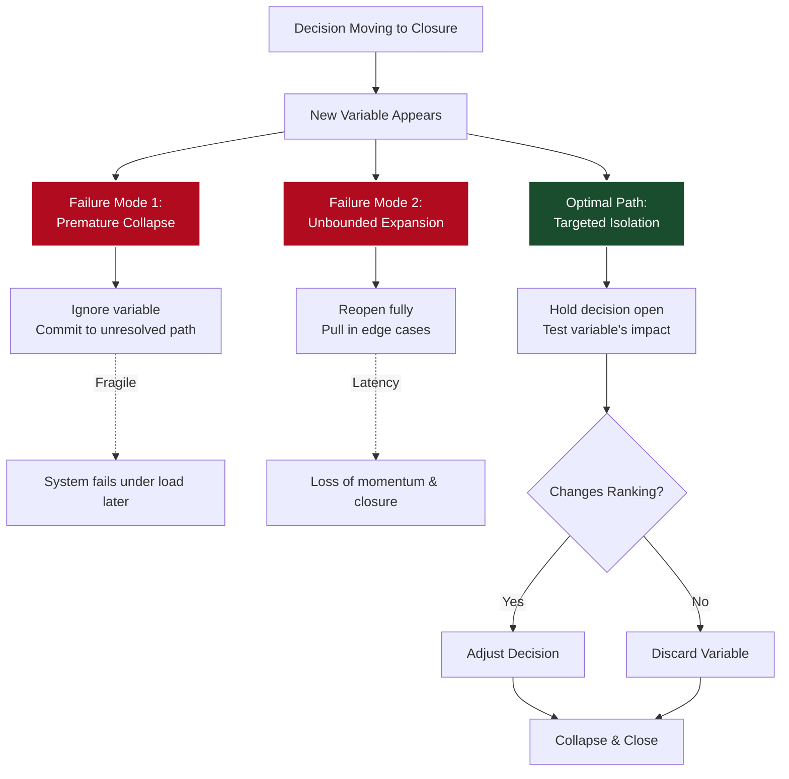

> **Decision-Relevant Simplicity**
>
> Simplicity is not about reducing variables. It’s about preserving only the variables that affect decision ranking.
{: .prompt-tip }

## I. The Instinct to Collapse

In almost any complex environment, the correct default move is to simplify early. 

This isn't merely a matter of speed; it is a structural necessity because complexity actively degrades decision-making. When you keep too many variables in play, the computational load on the system increases, and the core signal quickly becomes buried in noise. You end up spending more energy managing the shape of the problem than actually moving it toward resolution.

As a result, a significant portion of the work at senior levels is essentially an exercise in aggressive filtering. This does not mean casually ignoring constraints. Rather, it is the ability to compress a messy, high-dimensional situation down to the few variables that actually have the power to alter the outcome. In practice, this means throwing away a vast amount of detail, acting without complete information, and recognising that most late inputs simply do not matter enough to justify the latency they introduce.

In economic terms, once you have gathered enough information to reliably rank your options, the marginal value of additional data drops off a cliff. Beyond that threshold, acquiring more detail is highly unlikely to change your chosen trajectory, but it guarantees an increase in systemic friction. 

Because of this, effective operators develop a highly tuned instinct: collapse the search space quickly, isolate the core signal, and maintain momentum.

Most of the time, this instinct is completely correct. 

Beneath the surface, you are implicitly solving an optimization problem: trading a negligible loss of accuracy for a massive gain in speed by reducing the problem to its minimum viable state. As long as additional information doesn't change the ultimate ranking of your options, that trade-off holds.

But this trade-off is not a fixed law of physics. 

Occasionally, the environment shifts. The cost of a false positive increases, a new constraint emerges, or a late variable fundamentally threatens to alter the ranking of the options. At that point, the underlying decision architecture is no longer the same. Continuing to collapse the problem out of habit is no longer aggressive simplification—it is simply solving the wrong problem.

## II. The Shifting Trade-Off

Anyone who works on complex transactions—whether closing enterprise deals, negotiating partnerships, or architecting new platforms—encounters a version of this dynamic repeatedly. 

In these environments, speed is not just a preference; delay carries a tangible cost. Opportunities decay, counterparties lose focus, and alternatives are taken. If a system cannot reach a decision efficiently, it frequently loses the agency to act at all. Consequently, there is an immense, ongoing pressure to simplify the problem space into a state that can actually close. 

For the most part, yielding to this pressure is the correct strategic posture. Because the marginal benefit of velocity is extraordinarily high and the value of edge-case information is low, collapsing complexity is the most efficient path to value creation.

But that relationship is inherently unstable.

Eventually, a threshold is reached where the marginal cost of speed overtakes its benefit. Pushing for premature closure stops improving the outcome and starts exponentially increasing the risk of systemic failure. This is the sweet spot where the situation becomes structurally difficult, primarily because from the outside, it looks exactly like every other scenario. The ambient pressure to converge remains. The institutional demand for momentum is unchanged. Yet, the underlying math of the trade-off has fundamentally shifted.

Navigating this specific class of problem is a recurring challenge in solution architecture and cross-functional leadership. When executed properly, this function is far more than operational support. It acts as an external technical authority, actively [shaping the trade-off between speed and correctness]() while the decision is still highly fluid.

## III. The Two Failure Modes

If you observe enough of these critical junctures, a distinct pattern of failure emerges. When a new, potentially disruptive condition surfaces late in the process, organizations typically default to one of two pathological responses.

The first is **Premature Collapse**. The new condition is acknowledged, but the decision-making apparatus simply absorbs the shock and continues on its original trajectory. The implicit assumption is that this new variable is merely another late-stage detail that can be safely ignored. While this often works for trivial issues, when applied to a load-bearing constraint, the system closes on the wrong architectural shape. It provides the right answer to a version of the problem that no longer exists.

The consequences of this aren't theoretical. A deal or a technical design that closes without integrating structural reality hasn't actually been resolved; the failure has merely been pushed downstream. As I noted in [*Failure Under Load*](), these unresolved variables manifest later as systemic fragility—the integration falls apart entirely, or it requires so much manual intervention that the original ROI is destroyed.

The second failure mode is **Unbounded Expansion**. Here, the new condition is taken so seriously that the decision is blown wide open again. However, it does not reopen cleanly. A single anomaly generates cascading uncertainty. The team begins pulling in adjacent constraints, distant edge cases, and hypothetical risks. The discourse becomes highly comprehensive, but it entirely loses its center of gravity.

At this stage, the problem space expands so broadly that it becomes impossible to define what conditions would actually satisfy a decision. The system isn't exactly stuck, but it has lost its momentum. From the inside, this feels like rigorous, responsible risk management—if a variable *might* matter, it feels negligent to ignore it. Yet, this unbounded expansion introduces a fatal latency into the system. 

Both responses—ignoring the variable to maintain momentum, or reopening the entire frame to ensure safety—are attempts to do the responsible thing. But structurally, both fail.

## IV. Resolving What Matters

What is actually going wrong at this juncture? The failure isn't about being too simplistic or too rigorous—those are simply opposing ends of a standard operational slider. The true breakdown occurs when the margin for error within that trade-off tightens drastically.

When a new detail surfaces that *might* alter the outcome, but its actual impact remains unverified, the decision enters a liminal state. It is no longer cleanly closeable, but it shouldn't be blown entirely open either. Most systems lack the protocol to handle this gray area. They either bulldoze the variable or let it detonate the existing framework. Neither approach actually resolves the underlying ambiguity.

The core principle here is simple but rigorous: 

> **The Stability Threshold**
> A decision only reaches true stability once the variables capable of altering it have been definitively resolved. Crucially, "resolved" does not mean fully understood. It simply means *known not to affect the final outcome*. Until that threshold is crossed, the system remains volatile.
{: .prompt-warning }

This is where the concept of simplicity is routinely misunderstood. The goal is not merely the reduction of variables. True simplicity is about preserving *only* the variables that affect decision ranking. A constraint does not need to be deeply analyzed to be discarded; it only needs to be mapped well enough to prove it won't change the trajectory.

Therefore, the solution isn't about picking a permanent spot on the speed-versus-correctness spectrum. It is about avoiding action while critical variables remain unresolved. As I explored in [*The Frame Problem*](), the only viable path forward is to reopen the decision *just enough* to test the variable's impact on the outcome, and then collapse the frame immediately once the answer is known. 

Not fully open. Not prematurely closed. Resolved, then simplified.

## V. The Protocol of Isolation

In practice, executing this maneuver requires a highly specific protocol. When a decision is already moving toward closure and a potentially disruptive variable is introduced, the immediate goal is not to debate its merits. The goal is to isolate it.

You must aggressively define the boundaries of the condition. What exactly would change if this were true? Equally importantly, what would *not* change? The objective is to distill the disruption down to a testable proposition. This means pushing the problem into its narrowest possible form—not for the sake of elegance, but to create a model small enough to reason about rapidly, yet accurate enough to preserve the core signal.

Get this compression wrong, and the system fails predictably. Abstract it too much, and you discard the very nuance that alters the outcome. Leave it too detailed, and you are back to an unbounded, unresolvable problem space.

Simultaneously, you must manage the operational pressure in the room. The execution-oriented team members will view the pause as an unnecessary complication, pushing to maintain momentum. The risk-averse members will view it as a fatal flaw, pushing to halt the process entirely. If leadership fully aligns with either camp, the system reverts to the failure modes described above.

Instead, the correct architectural move is to hold the decision in a state of suspended animation *just long enough* to process the isolated variable. Sometimes this is instantaneous—a quick clarification reveals the constraint doesn't apply. Other times it requires a brief, intense burst of computation: pulling in a subject matter expert, running a quick calculation, or mapping a specific edge case.

Regardless of the effort required, the exit condition is binary: *does this alter the decision ranking?* 

If it does not, the variable is immediately discarded and momentum resumes. If it does, the decision is adjusted to accommodate the new reality, and *then* momentum resumes. In either scenario, the expansion is strictly temporary. Once the variable is resolved, the decision closes again, yielding a simplicity that is now structurally sound.

## VI. Earned Simplicity

Looking back at the mechanics of the decision, the distinction between a cheap abstraction and a resilient architecture becomes clear.

You could have ignored the anomaly to preserve speed, accepting the risk of structural failure later. Alternatively, you could have opened the problem up completely, protecting against error at the cost of operational paralysis. Both are common, highly defensible responses, and both routinely lead to suboptimal outcomes.

The third path is significantly harder to execute. It requires the discipline to hold the decision open just long enough to isolate the anomaly, reduce it to a measurable constraint, and definitively test its impact on the outcome. It requires knowing precisely when to let complexity in, and exactly when to excise it.

This is the nuance that is so often missed. The ultimate objective is not the avoidance of complexity. The objective is to reduce the problem space to the absolute threshold where the decision remains correct. Any reduction beyond that point means you are actively ignoring variables that dictate reality; you are no longer simplifying, you are distorting.

Therefore, the target is never simplicity for its own sake. The target is the leanest possible version of the problem that still perfectly preserves the signal. 

This is where true operational leverage lives. Once you achieve that state, the decision becomes simultaneously faster and more reliable. You are no longer trapped in a zero-sum trade-off between speed and correctness—you are extracting both from the exact same reduction.

That is what makes this kind of simplicity *earned*. It is not the starting condition of a problem; it is the residue that remains only after you have rigorously resolved what actually matters.
