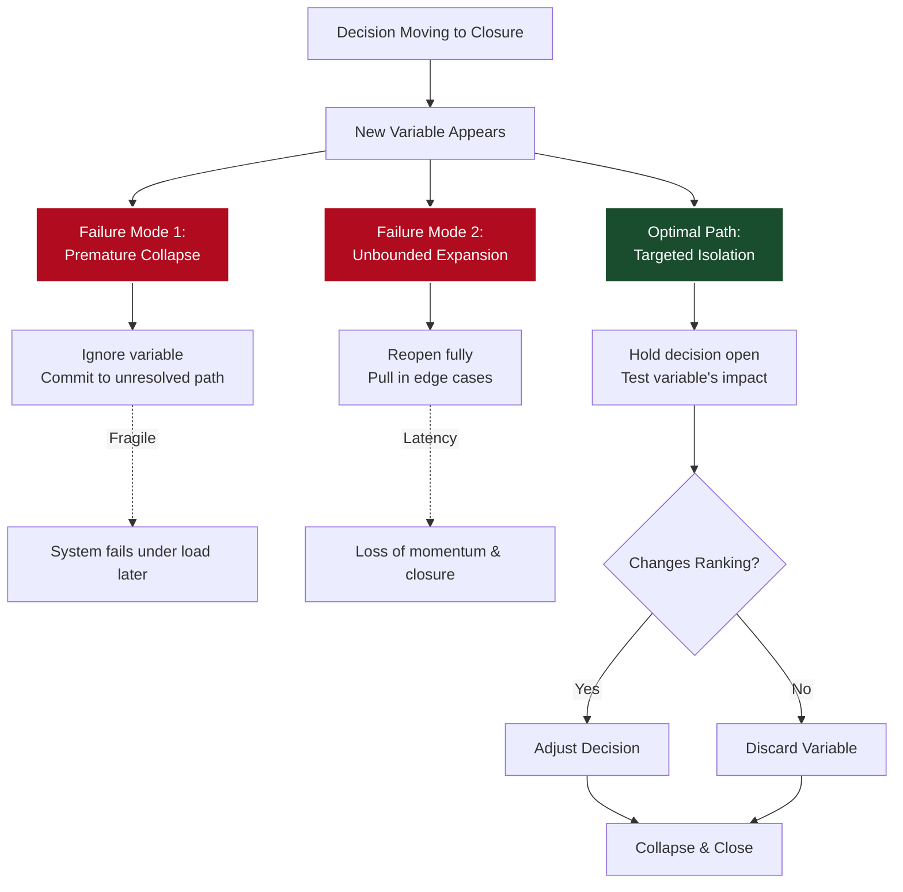

> **Decision-Relevant Simplicity**
>
> Simplicity is not about reducing variables. It’s about preserving only the variables that affect decision ranking.
{: .prompt-tip }

## I. The Instinct to Collapse

Most of the time, the right move is to simplify early.

Not just because it’s faster, but because complexity degrades decisions. The more variables you keep in play, the harder it is to see what actually matters. Signal gets buried in noise. You spend more time handling the shape of the problem than moving it forward.

So a lot of the work, especially at more senior levels, is filtering. Not in the sense of ignoring things casually, but in being able to compress a messy situation down to the few variables that actually change the outcome. That’s harder than it sounds. It means deciding what not to carry forward, often without complete information.

In practice, this means throwing away a lot. Most details don’t matter. Most late inputs don’t change the decision. If you treated everything as potentially important, you’d never close anything.

Another way to say this is that once you have enough information to rank the decision options, the marginal value of additional information drops sharply. Beyond that point, more detail is unlikely to change the ranking, but still increases complexity.

So people develop a strong instinct: collapse quickly, preserve the core signal, keep momentum.

Usually, that instinct is right.

What’s actually happening underneath is that you’re implicitly solving a trade-off. You’re optimising for speed by collapsing the problem down to the minimum set of variables needed to act. As long as additional information doesn’t change the ranking of the decision options, that’s the correct move.

But that trade-off isn’t fixed.

Occasionally, it shifts. The cost of being wrong increases, or the likelihood that additional information will change the ranking goes up. Sometimes this is triggered by a new variable. Sometimes it’s a change in constraints, or a better understanding of an existing one. Either way, the underlying decision problem is no longer the same.

At that point, continuing to collapse isn’t just aggressive simplification.

It’s solving the wrong problem.

## II. The Shifting Trade-Off

If you work on anything that needs to close—deals, partnerships, new opportunities—you see a version of the same situation over and over.

These are the cases where speed really matters. Not just in a general sense, but because delay has a cost. Opportunities fade, counterparties move on, alternatives get taken. If you can’t get to a decision, you often lose the chance to act at all.

So there’s constant pressure to simplify. To reduce the problem to something that can actually close.

Most of the time, that pressure is correct. The marginal benefit of moving quickly is high, and the marginal value of additional information is low. So collapsing complexity is the efficient move.

But that relationship isn’t stable.

There’s a point where it flips—where the marginal cost of speed starts to outweigh the marginal benefit. Where moving quickly stops improving the outcome, and starts increasing the risk of getting the decision wrong.

That’s the point where the situation becomes difficult.

The hard part is that it doesn’t look different.

From the outside, it looks like every other situation where you should just simplify and move. The same pressure to converge is there. The same need to keep momentum.

But something has shifted underneath. The trade-off isn’t the same anymore.

It’s a specific kind of problem: a class of problem that shows up repeatedly in solution architecture.

It also explains something about the role. When it’s done properly, it’s not just sales support. It’s a kind of external technical authority, [shaping the trade-off between speed and correctness]() while the decision is still live.

## III. The Two Failure Modes

If you see enough of these, you start to notice a pattern.

Sometimes nothing really changes. The new condition comes in, people acknowledge it, but the decision keeps moving in the same direction. The implicit assumption is that this is just another late detail, and like most late details, it won’t matter.

Most of the time, that’s fine. It’s how things get done.

But when it isn’t, the decision still closes, just on the wrong shape. It was the right answer to the earlier version of the problem, not the one you ended up with.

And that matters more than it seems. These aren’t theoretical decisions. You’re trying to get something over the line that has to work afterwards. A deal that closes but doesn’t quite hold together isn’t really closed. It just moves the problem forward.

You don’t notice immediately. It shows up later.

Sometimes it just doesn’t work and falls apart. More often it sort of works, but not well enough to justify what it cost, or not as well as it should have.

The other thing that happens is the opposite.

The new condition gets taken seriously, and the decision opens up again. But it doesn’t reopen cleanly. One question turns into a few. Then a few more. You start pulling in related constraints, edge cases, possibilities. The discussion gets more complete, but also less focused.

At some point it becomes hard to tell what would actually be enough to decide. You’re not stuck exactly, but you’re not moving either.

That also makes sense when you’re in it. If something might matter, you don’t want to ignore it.

So you end up with these two behaviors. In one, you keep the original frame and push through. In the other, you reopen the problem and start expanding it.

Both feel like the responsible thing to do at the time.

And both can go wrong in ways that only become obvious later.

## IV. Resolving What Matters

So what’s actually going wrong here?

It’s not really about being too simple or too thorough. Those sit on opposite sides of a trade-off. In some situations you can lean hard in one direction and it works.

The problem is when that trade-off tightens.

A detail comes in that might matter, but you don’t yet know if it does. At that point, the decision is no longer cleanly closeable, but it isn’t fully open either.

Most systems handle this badly.

Either the detail is ignored and the decision continues as if nothing changed. Or the decision reopens and starts expanding, pulling in adjacent questions and constraints.

Both are attempts to deal with the same condition: something that could still change the outcome.

But neither actually resolves it.

In one case, the variable is collapsed too early. In the other, it’s kept open but allowed to expand without bound.

The underlying issue is simple.

> **The Stability Threshold**
> A decision is only stable once the variables that could change it have been resolved. Not fully understood—resolved. Known not to affect the outcome.
{: .prompt-warning }

Until then, they are still live.

This is where the idea of simplicity usually gets distorted.

What matters isn’t how much you can reduce, but whether you’re preserving the parts that still affect the outcome.

Simplicity is not about reducing variables. It’s about preserving only the variables that affect decision ranking.

A variable doesn’t need to be fully understood to be removed. It only needs to be understood enough to know whether it changes the decision.

That’s what determines the right level of simplicity.

So the problem isn’t picking the right side of the trade-off. It’s [acting without resolving what still matters]().

The only way through is to reopen the decision just enough to determine whether the variable changes the outcome, and then collapse it immediately.

Not fully open. Not prematurely closed.

Resolved, then simplified.

## V. The Protocol of Isolation

What this looks like in practice is fairly specific.

The decision is already moving toward closure. There’s a preferred path. Then something comes in that might matter.

The first move isn’t to argue about it. It’s to isolate it.

What exactly is the condition? What would it change if it were true? And just as importantly, what wouldn’t it change?

You’re trying to reduce it to something you can actually reason about. Not the full situation, just the part that could still affect the decision.

That usually means pushing it into a simpler form. Not because simplicity is the goal, but because you need something you can test. A version of the problem that’s small enough to answer, but still accurate enough to matter.

If you get that wrong, things break in predictable ways. Too simple, and you’ve thrown away the part that actually changes the outcome. Too detailed, and you’re back to an open-ended problem that won’t close.

So you’re looking for the narrowest version that still holds. The simplest model that doesn’t lose the signal.

At the same time, there’s pressure in the room.

Some people want to keep moving. From their perspective, this looks like just another late complication. Others want to open it up properly. From their perspective, it’s a risk that hasn’t been understood yet.

Both are reasonable. And if you side with either one completely, you get the same failure modes as before.

So instead, you hold the decision in place just long enough to answer the question.

Not everything. Just the part that could still change the outcome.

Sometimes that’s quick. A missing detail, a clarification, a constraint that turns out not to apply. Sometimes it takes a bit more—pulling in the right person, getting a number, checking a specific edge case.

But the goal is always the same: resolve whether it matters.

As soon as you have that, you collapse it.

If it doesn’t change the decision, you remove it and move on. If it does, you adjust the decision and then move on.

Either way, you don’t leave it open.

The expansion is temporary. It has a clear purpose and a clear end condition.

Once the variable is resolved, it’s gone.

And the decision closes again, usually in a simpler form than before—but now that simplicity is stable.

## VI. Decision-Relevant Simplicity

If you go back to the situation, the difference becomes clearer.

You could have ignored the condition and closed anyway. That would have preserved momentum, but at the cost of committing to something that hadn’t been resolved.

You could have opened it up fully. That would have protected against missing something, but at the cost of losing the ability to close.

Both are reasonable. And both show up all the time.

The alternative is smaller.

You hold the decision open just long enough to isolate the condition, reduce it to something you can actually reason about, and determine whether it changes the outcome. Then you collapse it again.

If it doesn’t matter, it disappears. If it does, the decision adjusts. Either way, it closes.

That’s the part that’s easy to miss. The goal isn’t to avoid complexity. It’s to reduce it to the point where the decision is still correct.

Any simpler than that, and you’ve started ignoring variables that actually change the outcome. At that point, the simplicity is no longer helping. It’s distorting the decision.

So the target isn’t simplicity by itself. It’s the simplest version of the problem that still preserves what matters.

That’s where the leverage is.

Once you have that, the decision becomes both faster and more reliable. You’re not trading speed against correctness anymore. You’re getting both from the same reduction.

That’s what makes it earned.

Simplicity is what remains after you’ve resolved what matters.
