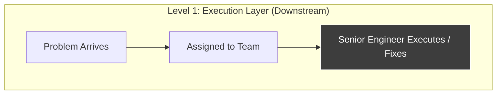
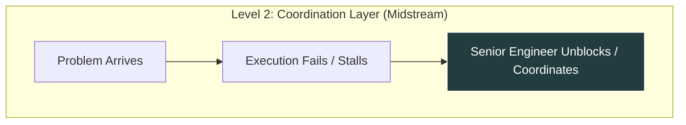
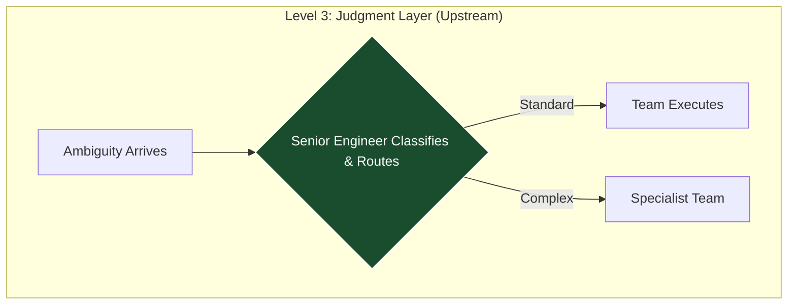

I was recently watching *The Pitt*, a medical drama set in a Pittsburgh emergency department where each episode unfolds in real-time over the course of a single shift. 

What initially caught my attention was the role of the attending physicians—the way they step into the most critical cases, make rapid decisions under uncertainty, and direct the response across the team. But the more interesting realization came a level deeper.

That behavior only makes sense because of how emergency departments actually operate as systems.

Patients don’t arrive neatly categorized. They come in with incomplete information, conflicting signals, and varying levels of risk. The system has to rapidly assess, classify, and route each case—deciding which can follow standard pathways, and which require immediate senior intervention.

Crucially, not everyone goes to the attending physician. 

Most cases are handled through established protocols and well-understood patterns. Only a specific class of problem—high-risk, ambiguous, or poorly understood—gets escalated to the most senior decision-makers right at the door. That selectivity is not incidental. It is the mechanism that allows the system to function under pressure.

This is where the parallel to technical organizations becomes highly relevant.

In many companies, incoming technical problems are triaged in a lightweight, administrative way: tickets are created, issues are routed, and work is distributed based on surface-level categorization. But when problems are ambiguous, high-impact, or don’t fit existing patterns, that model starts to break down. 

What I want to explore here is the underlying operating system that emergency departments use to handle those cases—and what it would look like to apply that same model to a high-leverage technical role. Not as a loose analogy, but as a system design problem.

## The Operating System of an Emergency Department

To make this useful, we have to look at how emergency departments actually operate. At a high level, they are designed to do one thing well: take in a continuous stream of incomplete, ambiguous problems and route them to the right level of care as quickly as possible.

That starts with triage. 

When a patient arrives, they are rapidly assessed. The goal is not to produce a full diagnosis, but to answer a simpler and more urgent question: *How risky is this, and how quickly do we need to act?* 

Most patients fall into well-understood categories. They can be routed into standard pathways, handled by established protocols, and treated by junior doctors, nurses, or specialists working within their domain. This is what allows the system to scale.

But a smaller subset of cases behaves differently. These are the patients where the symptoms don’t point to a clear diagnosis, multiple interpretations are possible, or the cost of being wrong is unusually high. 

For these cases, the system does something very deliberate: it routes them early to a senior clinician. 

The attending physician’s role in that moment is not to execute treatment directly. It is to form a working model of the problem, decide what matters, and determine the next steps. In parallel, the rest of the system continues to operate. Simple cases move through quickly. The system does not collapse everything into a single queue.

If you strip away the medical context, what emergency departments have built is **a decision system for operating under uncertainty**. At its core, the system is continuously answering three questions:

1. **What is this, really?** Is this something we recognise, or something ambiguous?
2. **How much does it matter if we get it wrong?** What is the cost of misclassification? 
3. **Where should this be handled?** Which part of the system is best placed to deal with it?

This reveals a profound architectural distinction:

> The system is not optimised to surface only the *hardest* problems. It is also optimised to surface the most *uncertain, high-consequence* problems at the earliest possible moment.
{: .prompt-tip }

That is what allows it to operate at speed without sacrificing safety.

## The Failure Mode of Technical Triage

If this model is so effective, why don’t most technical organizations operate this way?

In practice, most engineering systems look very different. Problems still enter incomplete and ambiguous—but instead of being explicitly classified, they are immediately converted into work. Tickets are created, tasks are assigned, and execution begins before the problem itself is fully understood.

Classification still happens, but it happens implicitly. It’s driven by who raised the issue, how urgent it feels, or how well it fits an existing Jira queue. Routing decisions are made without a clear model of risk or ambiguity.

This leads to a predictable set of systemic failure modes:

1. **Misclassification at the Start:** Ambiguous or high-risk problems are treated as standard work. They are routed into execution pathways that assume the problem is already understood. By the time the underlying issue becomes clear, the system has already committed to the wrong path.
2. **Escalation as a Correction Mechanism:** Because problems are not surfaced early based on uncertainty, they are escalated *later* based on failure. Senior people become involved only after things break or timelines slip. At that point, the cost of correction is massive.
3. **Senior Roles Become Reactive:** Instead of operating upstream, senior technical roles are pulled in downstream—debugging, unblocking, or coordinating work that has already gone off track. They are no longer shaping outcomes; they are recovering them. Aligning work upstream is often far more efficient than untangling it after the fact.
4. **Optimising for Throughput, Not Correctness:** Work continues to move, but not necessarily in the right direction. The system becomes highly efficient at processing tasks, but incredibly fragile when faced with ambiguity.

From the outside, this looks like execution noise. From the inside, it is a failure of problem classification. What is missing is a mechanism to reliably identify when a problem should be treated differently *before* execution begins.

## The "Attending Architect": The Leverage of Problem Definition

Before going further, it’s worth being explicit: titles like "Technical Solutions Architect" or "Staff Engineer" mean wildly different things at different companies. I am not describing a standardized job description. I am describing a *function*. 

If the gap in most technical organizations is a failure to classify uncertain, high-consequence problems early, then the role of a high-leverage technical leader is to sit inside that gap. 

Not as an additional layer of coordination, and not as an escalation endpoint, but as the decision engine that determines how problems are understood before execution begins. In practice, that means operating at three specific points in the flow:

### 1. Early Involvement at the Point of Ambiguity
The role is not involved in every problem. Most work should flow through standard pathways. It engages selectively when a problem is undefined, multiple interpretations are possible, or the cost of getting it wrong is high. The goal is not to solve the problem, but to construct a reliable version of it. *What is signal vs. noise? What assumptions are being made implicitly?* This is the equivalent of forming a working diagnosis.

### 2. Explicit Classification
Once the problem is understood, it must be classified deliberately. Is this a known pattern that can follow an existing pathway? Is it a cross-functional problem requiring coordinated ownership? Or is it an ambiguous, high-risk case requiring continued senior involvement? At high leverage, classification is treated as a first-class decision because it determines everything that follows.

### 3. Routing and Sequencing
Based on that classification, the role determines where the work should sit and in what sequence. The goal is not to take ownership of execution, but to ensure execution happens in the right place, for the right reason. In many cases, this means stepping out once the problem is correctly routed.

## The Three Layers of Leverage

Two people can have the exact same title and operate at completely different levels of leverage. The difference is not capability; it’s where the role sits in the system flow.





1. **Execution-Layer Roles:** Problems are already defined by the time they arrive. The role focuses on solving them efficiently. This is valuable, but it operates entirely downstream. Seniority here is by depth and speciality.
2. **Coordination-Layer Roles:** The role sits between teams, unblocking issues and escalating when things go wrong. Involvement is reactive. The system relies on escalation to correct earlier misclassification.
3. **Judgment-Layer Roles:** The role operates upstream. It engages *before* execution begins. It defines the problem, makes tradeoffs explicit, and routes the work. 

The earlier the intervention, and the more it shapes how problems are defined, the greater the leverage.

## Operating Constraints

Describing this model is one thing. Maintaining the discipline required to make it work inside a real system is another. There are five constraints required to keep this operating system functional:

1. **Selectivity must be enforced.** If the role becomes a default participant in every discussion, it turns into a bottleneck. If it only engages when projects are failing, it loses its leverage. 
2. **Problem definition is real work.** In many organizations, value is associated strictly with writing code or closing tickets. Time spent clarifying a problem is viewed as a delay. In this model, problem definition is the highest-leverage activity in the system.
3. **Resist absorbing execution.** There is a natural pull toward doing the work directly because it’s faster in the short term. But every time the role absorbs execution, it reduces its bandwidth to operate at the judgment layer.
4. **Routing decisions must be explicit.** Where work lives is not an administrative detail—it is a technical decision about system behavior. If routing is driven by convenience, the system will drift toward late escalation.
5. **The system must allow re-evaluation.** Initial understanding is almost always incomplete. As new information emerges, problems must be reframed and re-routed. The goal is not to be correct immediately, but to converge on the correct framing as quickly as possible.

Seen through this lens, the role of the attending physician becomes clearer. They are not simply the most experienced doctor in the room. They are the mechanism by which the system handles its most uncertain and highest-risk variables. 

The same logic applies to technical architecture. The goal is not to create a senior role that sits in the middle of everything. It is to ensure that the system has a reliable way of identifying when a problem needs to be treated differently—and a dedicated place for that judgment to live. That is where true leverage comes from.
```
